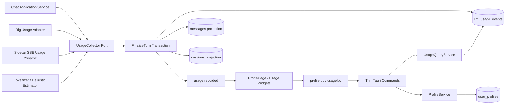

# MisakaX 个人中心与 Token 用量统计功能架构

> **用途：** 定义个人中心、活动日历、Token 趋势、Token 计量与本地个人档案的目标架构、数据语义和跨层契约。
> **受众：** 产品、设计、React、Rust、Python Sidecar、测试与后续维护者。
> **最后审阅 / Last reviewed：** 2026-08-13
> **规划基线：** `main@5569c45`（Schema v14，React 19 / Tauri 2 / Rust 2021 / Python 3.11）。
> **状态：** 设计冻结并进入实施；P0–P2 已完成（canonical 契约、Schema v15、跨运行时采集与原子终结），实时进度见 [实施计划](../planning/PERSONAL_CENTER_USAGE_ANALYTICS_IMPLEMENTATION_PLAN.md)。

---

## 1. 结论先行

本功能不应直接从 `sessions.total_*_tokens` 拼出图表。推荐建设四个边界清晰的能力域：

1. **Local Profile：** 本地个人档案负责头像、名称、系统时区快照与周起始日；首版仍是单本地用户，不引入登录系统或自定义时区选择器。
2. **Usage Metering：** Rig 与 Sidecar 都输出统一的 Token 测量结果；供应商值优先，估算值必须明确标记来源和精度。
3. **Usage Ledger：** SQLite 追加式事件账本是统计唯一事实源；消息 JSON 与会话累计仅作兼容投影，不再承担分析职责。
4. **Usage Analytics：** Rust 查询服务生成总览、活动日历和按模型趋势读模型；React 只负责呈现，不自行扫描消息或计算业务口径。

采用 **端口—适配器 + 追加式账本 + CQRS-lite 读模型 + Feature 模块化**。该组合适合当前本地单机架构，也为后续成本分析、多档案、云同步和 Dashboard 复用保留扩展点。

---

## 2. 当前代码基线与缺口

| 领域 | 已有基础 | 关键缺口 |
|---|---|---|
| 入口与页面 | `UserMenu` 已有禁用的“个人中心”；`DashboardPage` 是占位页；Zustand 负责轻量路由 | 没有 `profile` route、页面、档案读取或编辑能力 |
| 消息 Token | `messages.token_usage` 保存 JSON；`MessageItem` 有 `TokenBadge` | JSON 不适合稳定的按日期/模型聚合；旧数据可能为空或结构不完整 |
| 会话 Token | `sessions.total_input_tokens` / `total_output_tokens` 会累加 | 只有会话维度；无法可靠表达日期、模型、来源、估算状态和幂等性 |
| Rig 路径 | `rig-core` 最终响应可通过 `GetTokenUsage` 产出 input/output/total；MCP 多轮会合并 usage | 丢失 cache/reasoning 等扩展字段；非流式标题生成未计量 |
| Sidecar 路径 | Python 已有 `TokenUsage` 模型；Rust SSE accumulator 预留 `usage` | 当前 `/agent/stream` 只发 token/thinking/tool/done，**没有 usage 事件**；默认 Sidecar 路径统计通常为空 |
| 模型身份 | assistant placeholder 保存实际调用的 `effective.model_id` | 没有供应商配置/展示名快照；同名模型可能无法区分；selected/effective 关系未持久化 |
| 图表 | 已安装 `echarts ^6.1.0`，富内容已有懒加载、ResizeObserver 和表格降级样例 | 没有业务统计图封装、年度日历网格和统计查询 DTO |
| 设计系统 | 已有 Avatar、Tooltip、Tabs、主题 chart tokens 和完整壳层规范 | 没有个人中心专属规范；旧 `ui-design-report` 的蓝色渐变/浮动卡与当前 charcoal 规范冲突 |

### 2.1 不能沿用的捷径

- 不在 React 中遍历所有会话和消息计算统计；数据量增长后慢，且把业务口径复制到前端。
- 不把 `messages.token_usage` JSON 当长期分析表；JSON 结构变化、空值、重生成和删除都会制造歧义。
- 不只修 Sidecar UI 事件而不落账本；页面刷新、历史查询和重复完成事件仍会出错。
- 不用文本长度伪装成“精确 Token”；任何 fallback 都必须标记 `estimated` 与 estimator 版本。
- 不为图表再引入第二套图表库；ECharts 已存在，应提取可复用的业务图表宿主。
- 不把个人中心并入 Settings，也不替换现有 Dashboard；它是独立非 chat 页面，统计组件未来可以被 Dashboard 复用。

---

## 3. 补充后的产品需求与统计口径

### 3.1 首版范围

- 从任务列表底部用户菜单进入独立 `profile` 页面；Dashboard 继续保持独立产品入口。
- 页面上部为水平居中的头像、名称与低优先级编辑入口。
- 页面下部按顺序展示：
  1. 总 Token 使用量；
  2. 总使用天数；
  3. 当前连续使用天数；
  4. 近一年 Token 活动日历；
  5. 最近 30 个本地自然日的按模型 Token 折线图。
- 中英文、浅色/深色、键盘、屏幕阅读器、空数据、部分统计缺失均有完整状态。
- 支持清空用量历史；操作必须二次确认，且不删除聊天正文。
- 首版日期边界跟随操作系统时区；事件发生时固化本地日期与 UTC offset。系统时区后来改变时不静默重写历史。

### 3.2 指标定义

| 指标 | 权威定义 |
|---|---|
| 总 Token 使用量 | 当前 profile 下、`counts_toward_totals = true` 且 Token 已知的 measurement `total_tokens` 之和；cache/reasoning 若已包含在供应商 total 中不得重复相加 |
| 总使用天数 | 至少有一个 `counts_toward_activity = true` 用量事件的不同 `local_date` 数量；Token 未知仍可算活动 |
| 当前连续使用天数 | 从最近活动日向前连续的自然日数量；最近活动日为今天或昨天时保留 streak，否则为 0 |
| 最长连续天数 | 首版不占顶部第四张卡；在“连续使用天数”说明/Tooltip 中作为辅助值返回 |
| 活动日历强度 | 每个本地自然日的已知 `total_tokens`；按当前查询区间的 P95 做 `log1p` 归一化，得到 4 档绿色强度，避免单个异常大值压平其它日期；只要当天有已知 measurement 就至少为 1 档，不能与“无活动”混淆 |
| 最近 30 天 | 包含今天在内的 30 个本地自然日；缺失日期补 0，不按“最近 30 条事件”计算 |
| 模型系列 | 使用 `provider_config_id snapshot + effective_model_id` 作为稳定系列键，展示名为模型快照；同名不同供应商必须可区分 |

### 3.3 哪些请求进入统计

| operation kind | 计入总 Token | 计入活动天数 | 计入模型趋势 | 说明 |
|---|---:|---:|---:|---|
| `chat` | 是 | 是 | 是 | 普通对话；含已报告的中止用量 |
| `research` | 是 | 是 | 是 | DeepAgents / 子代理实际产生的全部模型调用按实际模型拆分 measurement |
| `tool_round` | 合并到所属 assistant operation | 是 | 是 | 避免同一消息 UI 与总量重复展示；内部可在 metadata 保留轮次 |
| `session_title` | 是 | 否 | 是 | 自动标题是实际 LLM 消耗，但不是独立用户活动日 |
| `model_probe` | 默认否 | 否 | 否 | 可记录为 diagnostics，首版总览排除，避免“测试连接”污染日常使用 |
| `legacy_backfill` | 有可信值时是 | 有真实消息日期时是 | 有真实日期和模型时是 | 必须标记 legacy；session residual 只计总量，不伪造活动或模型趋势 |

### 3.4 精确值、估算值与未知值

- `provider_reported`：供应商/SDK 明确返回，最高可信度。
- `tokenizer_estimated`：使用匹配模型族的 tokenizer 计算，UI 标记“含估算”。
- `heuristic_estimated`：无兼容 tokenizer 时使用可版本化启发式，UI 必须明确“估算”。
- `legacy_migrated`：从旧 `messages.token_usage` / session projection 得到的已知数值，但原始计量来源不可完全证明；UI 标记“含历史迁移数据”。
- `unavailable`：无法合理计算；Token 字段为 `NULL`，不写成 0。活动仍可记录，Tooltip 显示“Token 用量未知”。
- 总览同时返回 `exact_tokens`、`estimated_tokens`、`legacy_tokens`、`unknown_operation_count`；顶部主数字显示三类已知值之和，旁注说明数据质量。

---

## 4. 目标架构



### 4.1 架构模式

- **Ports and Adapters：** `UsageCollector` / `TokenEstimator` 是端口；Rig、Sidecar、模型族 tokenizer 是适配器。
- **Append-only Ledger：** 每次逻辑 operation 形成一个或多个不可覆盖的模型 measurement 事件；同一模型的多轮可聚合，不同模型必须拆行。修正通过 replacement/correction 事件或显式维护命令完成。
- **CQRS-lite：** 写侧保存规范化事件；读侧返回页面需要的聚合 DTO，不把持久化结构直接暴露给 React。
- **Transactional Outbox 的轻量版本：** 首版同一 SQLite 事务完成消息终结、事件插入和会话投影更新；事务成功后再发 Tauri 内存事件。
- **Facade：** `FinalizeTurnService` 统一 chat/regenerate/Sidecar/Rig 的完成落库，Command 不再各自拼接统计步骤。

### 4.2 单一权威

- Rust application/domain 层拥有“计入什么、如何幂等、如何聚合”的最终规则。
- Python 只负责从 LangGraph/LangChain 事件中提取并聚合 Sidecar 实际调用用量，不自行保存统计数据库。
- React 只消费 versioned DTO 和展示规则，不从消息文本反推 Token。

---

## 5. 模块边界与建议目录

```text
src/
  features/profile/
    ProfilePage.tsx
    ProfileHeader.tsx
    ProfileEditDialog.tsx
    useProfile.ts
  features/usage-analytics/
    UsageOverviewCards.tsx
    ActivityCalendar.tsx
    ActivityCell.tsx
    UsageTrendChart.tsx
    UsageDataTable.tsx
    usage-calendar.ts
    usage-chart-options.ts
    useUsageDashboard.ts
  lib/ipc/profile.ts
  lib/ipc/usage.ts
  locales/{zh-CN,en}/profile.json

src-tauri/src/
  commands/profile.rs
  commands/usage.rs
  db/repository/profile_repo.rs
  db/repository/usage_repo.rs
  services/profile/
    mod.rs
    avatar_storage.rs
    types.rs
  services/usage/
    mod.rs
    collector.rs
    estimator.rs
    finalize.rs
    query.rs
    types.rs

agent/app/
  usage.py                 # LangChain usage_metadata normalization / run_id dedupe
  routers/agent.py         # emits usage SSE before done
```

组件按“页面编排 / 领域视图 / 纯算法 / IPC”分层。日期补零、日历网格、色阶和 ECharts option 必须是可单测纯函数，不堆进 `ProfilePage`。

---

## 6. 持久化设计（建议 Schema v15）

### 6.1 `user_profiles`

| 字段 | 说明 |
|---|---|
| `profile_id TEXT PRIMARY KEY` | 首版生成稳定本地 UUID，不使用显示名作主键 |
| `profile_kind TEXT` | 首版固定 `local`；为未来账号同步预留 |
| `display_name TEXT NOT NULL` | 去首尾空格，1–40 Unicode 字符 |
| `avatar_storage_key TEXT NULL` | 仅相对 app-data key，不保存任意外部绝对路径 |
| `avatar_sha256 TEXT NULL` | 缓存失效和文件完整性检查 |
| `timezone_mode TEXT NOT NULL` | 首版固定 `system`；为未来自定义时区预留 |
| `timezone_id TEXT NULL` | WebView `Intl` 可获得时保存 IANA 标识；不可获得时为 NULL，不伪造 |
| `week_start INTEGER NOT NULL` | 1=Monday，0=Sunday；默认随 locale |
| `created_at / updated_at` | UTC 时间 |

当前 profile ID 可存现有 `settings` 键 `profile.current_id`。首版 UI 只有一个 profile，但事件表携带 `profile_id`，避免以后迁移所有历史行。

### 6.2 `llm_usage_events`

表粒度是“一个逻辑 operation 内、一个实际 provider/model 系列与 measurement source 的一条聚合 measurement”。普通 Rig 对话通常只有一行；Sidecar research、混合精确/估算结果或未来子代理若调用多个模型，则同一 `operation_key` 下有多行。这样既能保持消息级幂等，又不会丢失按模型趋势和数据质量。

| 字段 | 说明 |
|---|---|
| `event_id TEXT PRIMARY KEY` | UUID |
| `profile_id TEXT NOT NULL` | 统计所属档案 |
| `operation_key TEXT NOT NULL` | 逻辑分组键，如 `assistant:{message_id}`；用于消息聚合和 unknown operation 去重 |
| `measurement_key TEXT UNIQUE NOT NULL` | measurement 幂等键，如 `{operation_key}:model:{series_hash}:source:{source}`；同 operation 的不同模型/质量各自唯一 |
| `operation_kind TEXT NOT NULL` | chat/research/session_title/model_probe/legacy_backfill |
| `session_id / message_id TEXT NULL` | 使用 `ON DELETE SET NULL` 或逻辑弱引用；删除会话不默认抹去真实消耗 |
| `provider_config_id TEXT NULL` | 配置快照标识；配置删除后历史仍可读 |
| `provider_id / vendor_id TEXT NULL` | 非敏感快照 |
| `selected_model_id TEXT NULL` | 用户选择模型 |
| `effective_model_id TEXT NULL` | 实际调用模型；正常新事件必填，无法恢复模型的 legacy residual 保持 NULL |
| `model_display_name TEXT NULL` | 事件发生时的展示名快照；不得为 legacy residual 伪造模型名 |
| `input_tokens / output_tokens / total_tokens INTEGER NULL` | 未知为 NULL，均非负 |
| `cache_read_tokens / cache_creation_tokens / reasoning_tokens INTEGER NULL` | 扩展明细；不得重复计入 total |
| `measurement_source TEXT NOT NULL` | provider_reported/tokenizer_estimated/heuristic_estimated/legacy_migrated/unavailable |
| `estimator_id / estimator_version TEXT NULL` | 估算可重现、可迁移 |
| `outcome TEXT NOT NULL` | completed/aborted/failed/partial |
| `counts_toward_totals / counts_toward_activity / counts_toward_trend INTEGER NOT NULL` | 固化统计口径，避免查询层猜 operation kind 或 legacy 类型 |
| `occurred_at_utc TEXT NOT NULL` | ISO-8601 UTC |
| `local_date TEXT NOT NULL` | `YYYY-MM-DD`；首版用 Rust `chrono::Local` 在事件发生时计算 |
| `timezone_id TEXT NULL / utc_offset_minutes INTEGER NOT NULL` | IANA 名可用时保存，并始终保存实际 offset；系统时区改变不静默重写历史 |
| `metadata_json TEXT NOT NULL DEFAULT '{}'` | 仅存 provider usage 扩展和轮次计数；禁止 prompt、API key、路径和工具结果 |

推荐约束与索引：

```sql
CHECK (input_tokens IS NULL OR input_tokens >= 0)
CHECK (output_tokens IS NULL OR output_tokens >= 0)
CHECK (total_tokens IS NULL OR total_tokens >= 0)
CREATE INDEX idx_usage_profile_date
  ON llm_usage_events(profile_id, local_date, counts_toward_activity);
CREATE INDEX idx_usage_profile_model_date
  ON llm_usage_events(profile_id, counts_toward_trend, effective_model_id, local_date);
CREATE INDEX idx_usage_operation
  ON llm_usage_events(operation_key);
CREATE INDEX idx_usage_session
  ON llm_usage_events(session_id, occurred_at_utc);
```

### 6.3 兼容投影

- `messages.token_usage` 继续保存规范化 JSON，供消息尾部 TokenBadge 与旧导出格式使用。
- `sessions.total_input_tokens` / `total_output_tokens` 继续维护，以免破坏现有 DTO；它们是缓存投影，不是统计查询事实源。
- 每次完成调用通过同一事务：
  1. 更新 assistant message；
  2. 批量 `INSERT ... ON CONFLICT(measurement_key) DO NOTHING` 用量事件；
  3. 仅按本次实际插入的 measurement 合计更新会话累计；
  4. commit 后 emit `usage:recorded`。
- 重复 `stream_complete`、前端重订阅或命令重试不得重复计数。

### 6.4 删除、重生成与历史真实性

- **重生成：** 旧调用已经真实消耗 Token，账本保留；新 assistant message 产生新 operation event。因此总量反映真实消耗，而不是当前可见消息之和。
- **删除消息/会话：** 默认仅将账本弱引用置空，保留日期、模型和 Token 等非正文统计；删除确认文案应说明这一点。
- **清空统计：** 独立危险操作，删除当前 profile 的 usage events，并重建/清零 session 投影；不删除聊天正文。
- **删除 profile：** 未来支持时必须显式选择是否级联清除 usage 和 avatar。

---

## 7. Token 计量链路

### 7.1 统一领域类型

```text
UsageMeasurement
  input_tokens?: u64
  output_tokens?: u64
  total_tokens?: u64
  cache_read_tokens?: u64
  cache_creation_tokens?: u64
  reasoning_tokens?: u64
  source: MeasurementSource
  estimator?: { id, version }
  provider_metadata: safe map
```

不再维护 Rust `db::TokenUsage`、stream `TokenUsageInfo`、Sidecar `AgentTokenUsage` 三套逐渐漂移的语义；由一个 canonical 类型派生 IPC/DB DTO。

### 7.2 Rig adapter

- 继续消费 `GetTokenUsage`，保留每一轮 usage。
- MCP 多轮以同一 operation 汇总，但保留 `round_count`；只有最终一次落账。
- 扩展 provider adapter，尽可能映射 cache/reasoning 字段；缺失字段保持 NULL。
- `prompt_once` 改为返回 `CompletionOutcome { text, usage }`，使自动标题也能计量。

### 7.3 Sidecar adapter

- Python 监听 `on_chat_model_stream` chunk 的 `usage_metadata` 与 `on_chat_model_end` output/metadata。
- 以 LangChain `run_id` 去重；同一次调用的 stream/end usage 只保留最完整的一份。
- DeepAgents 多次模型调用按 run_id 分别收集，再按实际 model 聚合；若未来子代理允许不同模型，Rust 可接收多个 measurement event，而不是错误归到主模型。
- 在 `done` 前发送版本化 SSE：

```text
event: usage
data: {"schema_version":1,"measurements":[...]}
```

- Rust `map_sidecar_event` 处理 usage 并写入 accumulator；finalize 时以 operation 分组、按稳定 series key 生成 measurement key。未知字段忽略，非法负数/溢出拒绝并记录脱敏诊断。

### 7.4 fallback estimator

- `TokenEstimator` 按 provider/vendor/model family 注册；调用方不写 `if model.contains(...)`。
- 能匹配 tokenizer 的模型使用 tokenizer estimator；依赖版本固定在 manifest，并用 golden fixture 校验。
- 无可靠 tokenizer 时使用版本化启发式，仅作为最后 fallback；中英混合、代码、图片附件和工具消息必须有专门 fixture。
- Sidecar 的内部 prompt/工具/子代理调用只能在 Sidecar 内估算；Rust 不用可见正文猜测它看不到的内部上下文。
- 图片、音频等多模态计费单位由 provider reported usage 优先；首版不把文件字节数换算为“精确 Token”。

---

## 8. 查询服务与 IPC 契约

### 8.1 单次快照查询

页面首次进入调用一个组合命令，减少三次数据库锁与口径漂移：

```text
usage_get_dashboard({
  profile_id,
  activity_days: 365,
  trend_days: 30,
  max_model_series: 5
}) -> UsageDashboardV1
```

响应包含：

- `overview`：known/exact/estimated/legacy totals、total days、current/longest streak、unknown operation count；
- `daily_activity[]`：连续日期、Token、distinct operation count、measurement 质量分布；
- `model_series[]`：稳定 series key、展示名、供应商快照、30 个点及每点 unknown count；真正无调用的日期补 0，只有未知用量的点为 NULL/gap 而不是 0；
- `other_series`：超过前 5 个模型时的“其他”聚合；
- `generated_at`、`timezone_mode`、可选 `timezone_id`、当前 offset、`range`、`schema_version`。

模型系列先按区间内已知 Token 降序，再按 distinct operation count 和稳定 key 排序；因此 unknown-only 模型仍可进入榜单。“其他”必须同时合并已知值和 unknown count，不能在聚合时丢失质量信息。

### 8.2 边界约束

- `activity_days` 最大 400，`trend_days` 最大 90，`max_model_series` 最大 8。
- 日期由后端生成，不接受前端拼接 SQL fragment。
- 领域层使用 Rust `u64`，落 SQLite INTEGER 前检查 `i64` 上限；IPC 的 Token 数值使用十进制字符串，TypeScript 以 `bigint` 格式化，避免 JSON/JavaScript 超过 `Number.MAX_SAFE_INTEGER` 后静默失真。
- ECharts adapter 仅在安全范围内转为 number；若单点超出安全整数，则使用同一比例的 BigInt 缩放值绘图，Tooltip 与数据表仍展示原始十进制整数。前端不得用浮点重新累计总量。
- 查询返回原始数值；热力图色阶是展示算法，放在可测试的前端纯函数。
- `usage:recorded` 只携带 profile ID、operation key 和 `occurred_at`，不携带完整统计；页面收到后 debounce 重新取一致快照。

---

## 9. 页面与交互设计

### 9.1 页面构成

```text
UnifiedTopBar：返回 + “个人中心”
└─ ProfilePage（独立纵向滚动，max-w-6xl）
   ├─ ProfileHeader（头像 80px、名称、编辑）
   └─ UsageSection
      ├─ UsageOverviewCards（3 列 / 窄宽纵排）
      ├─ ActivityCard（每日热力图；周/月标签；Tooltip；图例）
      └─ TrendCard（最近 30 天；模型 legend；ECharts；数据表降级）
```

- “上半部分”解释为视觉明确的顶部档案区，不机械占满 50vh，避免桌面端大面积空白。
- 页面本身允许纵向滚动；卡片不使用营销页式渐变、强阴影、悬浮上移或缩放。
- Profile 是独立 `route.page = "profile"`，无左栏；Dashboard 保持原 route。

### 9.2 档案头

- Avatar 目标 80px；图片使用 app-data 管理副本，失败时显示名称首字符/默认 `U`。
- 名称水平居中，正文最大 40 字符并截断；编辑入口为小型 ghost icon/button，拥有可访问名称。
- 首版允许修改名称和选择/移除头像；头像限制 PNG/JPEG/WebP、最大 5 MiB，解码后重新编码/缩放，避免直接长期引用外部路径。
- 不展示虚假的邮箱、等级、会员或在线状态；本地单用户明确表述为“本地档案”。

### 9.3 顶部统计卡

- 固定三个等权指标：总 Token、总使用天数、连续使用天数。
- 数值视觉优先，标签与口径说明次级；总 Token 若含估算显示小型文本提示，不用高饱和警告色。
- 加载 skeleton 与最终结构同尺寸；单卡失败不伪装为 0。

### 9.4 绿色活动日历

- 近 365 天按“星期行、周列”组织，月份标签位于上方/下方且避免重叠；未来日期为空白而非灰色活动格。
- 颜色仅用于数据，不改变项目 charcoal 品牌主色：`--usage-heat-0` + `--usage-heat-1..4`，浅/深主题分别校准。
- 无活动用中性暖灰；有已知 Token 的活动日至少使用 1 档绿色（即使供应商报告 0）；只有未知 Token 的日期使用可识别的描边/纹理；已知与未知混合时按已知值着色并叠加质量标记。
- 鼠标 hover 与键盘 focus 都显示 Tooltip：日期、总 Token、输入/输出（若有）、调用次数、主要模型、估算/未知提示。
- 使用 roving tabindex + 方向键移动，避免 365 个单元同时进入 Tab 顺序；每格有完整 `aria-label`。
- 窄宽时保持最小格尺寸并允许卡片内部横向滚动；不得把格子压成不可辨认的像素。
- 若交付参考图中的“每日 / 每周 / 累计”切换，三个视图必须都有真实数据：每日=热力图，周=52 周聚合，累计=区间累计线；不显示 Coming soon 假按钮。

### 9.5 最近 30 天模型趋势

- 复用 ECharts 6 和现有懒加载/ResizeObserver 模式，抽取通用 `EChartCanvas`，不与聊天富内容组件耦合。
- X 轴为连续 30 天，Y 轴从 0 开始并用 K/M/B 格式；Tooltip 展示原始整数。
- 真正无该模型调用的日期绘制 0；仅有 unknown measurement 的日期使用断点/特殊点，不连成“零用量”，混合点显示已知部分并在 Tooltip 提示仍有未知调用。
- 每个模型一条稳定颜色线，最多 5 条，其余聚合为“其他”；颜色由 series key 稳定映射。
- 绿色只专用于活动强度；模型线使用现有 `--chart-1..5` 类别色，并配合点形/线型、图例和数据表，避免只靠颜色区分。
- 动画关闭或限制为 150ms，并遵守 `prefers-reduced-motion`；Canvas 失败时展示同数据表，而不是整卡报错。

### 9.6 状态矩阵

| 状态 | UI 行为 |
|---|---|
| 首次使用无事件 | 三指标显示 0；活动格全中性；趋势卡给出克制空态和“完成一次对话后显示” |
| 只有旧会话累计 | 显示可迁移的 legacy 已知值；无法分日部分只进入说明，不伪造日期 |
| 部分精确、部分估算 | 主数正常显示，附“含估算”；Tooltip 分开 exact/estimated |
| 含历史迁移值 | 主数计入可信旧数值，附“含历史迁移数据”；不把来源标为 provider exact |
| 存在未知调用 | 活动仍计天；Token 总量旁显示“有 N 次用量未知” |
| 查询失败 | 页面保留档案头；统计区显示就地错误与重试，不用 Toast 风暴 |
| 主题切换/窗口 resize | 图表 resize，不重取数据；热力图保留当前聚焦日期 |

---

## 10. 历史迁移、导入导出与隐私

### 10.1 v14 → v15

- 升级前沿用 `VACUUM INTO` 创建 `.pre-v15.sqlite3`，并补充恢复测试。
- 为每条能解析 `messages.token_usage` 的 assistant message 建立确定性 `legacy:message:{id}` 事件。
- `session totals - message known sums` 若为正，可建立 `legacy:session-remainder:{session_id}`；其 source 为 `legacy_migrated`，模型保持 NULL，`counts_toward_activity/trend=false`，仅进入总量和数据质量说明。
- Sidecar 过去未上报的 Token 无法精确重建；默认不对完整历史上下文做误导性估算。
- migration 必须幂等；坏 JSON 计入诊断计数，不阻塞整个数据库升级。

### 10.2 导入导出

- Export schema 版本升级后可携带 usage events 和 profile display metadata，但不携带 avatar 二进制，除非后续定义独立 bundle。
- 事件导入使用 `source_installation_id + source_event_id` 去重；不能只靠本机 UUID 猜测重复。
- 旧导出只按 legacy 规则迁移；导入来源在 metadata 标记，便于未来筛选。

### 10.3 隐私与安全

- 用量表不保存 prompt、回复正文、API key、完整 base URL、工具参数/结果、工作区路径或附件内容。
- profile avatar 只读写 app-data 受管目录；文件名由后端生成，拒绝 traversal、超限和不支持 MIME。
- 清空用量、移除头像等操作有明确影响说明；IPC 不接受任意删除路径。
- 统计查询只返回当前 profile 的本地数据，首版无网络同步。

---

## 11. 性能、可维护性与可观测性

- 年度热力图固定最多 400 个点；30 天趋势最多 8×90 点，DTO 有硬上限。
- 首版直接在索引化事件表聚合；以 100k events 下组合查询 P95 < 100ms 为门槛。未测量前不引入 daily rollup 表。
- 若将来超过门槛，再增加可重建的 `usage_daily_rollups`；账本仍是事实源。
- ECharts 仅在 TrendCard 进入 DOM 后动态加载；页面离开时 dispose，ResizeObserver 必须 disconnect。
- 记录脱敏日志：capture source、operation kind、是否估算、query duration、event insert conflict；不记录用户内容。
- DTO 与 SSE 都带 `schema_version`；新增 provider metadata 不破坏旧前端。

---

## 12. 失败模式与防护

| 风险 | 设计防护 |
|---|---|
| Sidecar stream/end 重复 usage | Python 按 run_id 去重；Rust `measurement_key` 再次幂等 |
| MCP 多轮重复累计 | collector 内按轮汇总，账本只写 assistant operation 一次 |
| 重生成后总量不一致 | 账本保留真实历史；会话投影只在新事件插入时累加 |
| 模型被重命名/删除 | 事件保存 model/provider display snapshot |
| 系统时区变化导致 streak 漂移 | 事件保存 local_date + offset + 可选 IANA snapshot；改时区不静默重写，查询响应说明当前时区 |
| 大模型一次调用压平热力图 | P95 + log1p 相对分级 |
| 同名模型折线合并 | series key 包含 provider_config snapshot + effective model；模型未知或 trend flag=false 的行不进入趋势 |
| Token total 重复包含 cache/reasoning | canonical invariant；明细不额外加到 total |
| 历史未知显示成 0 | Token nullable + unavailable source + UI 明示 |
| 页面图表加载失败 | 数据表降级；档案头和其它卡不受影响 |

---

## 13. 明确不在首版范围

- 云账号、登录/退出、跨设备 profile 同步。
- 金额成本与供应商实时价格；成本分析需要独立、带生效日期的 price catalog，不能简单以 Token×当前价格回算历史。
- 团队/组织排行、公开分享、社交化 streak 奖励。
- 用量配额、预算告警和供应商账单对账。
- 用统计页面取代全局 Dashboard；本期只做可复用组件和查询服务。
- 通过颜色或动效进行强激励；MisakaX 保持克制的桌面 Agent 气质。

---

## 14. 架构验收标准

- Sidecar 与 Rig 至少各有一条真实/fixture 流程能生成 canonical usage 并落账。
- 同一 operation（含多模型 measurements）重放 2 次后，消息、账本、session projection 均不重复累计。
- 近一年日历、30 天趋势、总天数与 streak 均来自同一账本口径并通过边界日期测试。
- 重生成、删除消息、删除会话、导入旧数据、时区变更和未知 usage 均有确定行为。
- 个人中心路由独立、无左栏、保留 UnifiedTopBar；用户菜单入口不再禁用。
- 热力图为绿色系，模型折线可区分，浅/深主题和键盘/读屏均可用。
- 页面没有新增图表依赖、没有 UI 扫描全量消息、没有 prompt/API key/路径进入统计表。
- 架构、实施计划与 `docs/design/shell-and-workspace-ui-spec.md` 保持同步。
