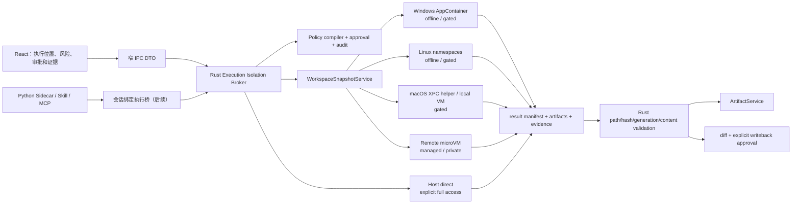

# MisakaX 执行隔离技术选型（ADR）

> **用途：** 固化 MisakaX 对 Agent、Skill、MCP、外部转换器和高风险 helper 的执行隔离决策、合同、Provider 方向与发布门槛。
> **受众：** 架构、安全、Rust/Python、构建与发布维护者。
> **最后审阅 / Last reviewed：** 2026-08-13
> **状态：** Proposed；S0 provider-neutral 合同已实现，尚无真实 strict Provider，需按执行位置通过 Spike Gate 后再转 Accepted。
> **依据：** [2026-08 Sandbox 方案复核](../research/SANDBOX_STRATEGY_REASSESSMENT_2026-08.md)；旧跨平台调研作为历史输入保留。

---

## ADR-001：统一控制面、非对称 Provider 与 Snapshot 回写

### 1. 决策

MisakaX 采用 Rust **Execution Isolation Broker**（沿用代码名 `SandboxBroker`）作为唯一执行控制面：

1. Broker 从已认证的、类型化执行意图编译不可变 `ExecutionPlan`，负责会话归属、策略、审批、Provider 精确选择、snapshot、lease、取消、审计和结果回收。
2. strict 执行默认使用 `WorkspaceDelivery::Snapshot`。Provider 不直接写真实工作区；返回的 result manifest、artifacts 和 capability evidence 经 Rust 复验，用户确认 diff 后才允许后续 application service 写回。
3. Provider 可以按平台和任务不同，不要求底层使用同一种 OS API；它们必须遵守同一上层合同并报告实际证据。
4. 默认 `NetworkMode::Deny`。联网只接受已验证的 `ProviderBrokered`；普通代理环境变量、宽 WebView CSP 或“Provider 名称听起来安全”都不构成网络隔离证据。
5. `HostDirect` 是每次显式批准的 `FullAccess` 逃生口，不属于 strict。Provider 缺失、实验 API 变化、签名/镜像失效、远程服务不可用时必须返回 `SANDBOX_UNAVAILABLE`，不得自动落到宿主 shell。
6. Artifact Store、MIME、hash、配额、解压/页数/像素上限与 renderer schema 属于内容安全面。即使输出来自 strict Provider，也必须重新经过 `ArtifactService` / `ContentSafetyPolicy`。

### 2. 本次替代的旧假设

- Windows 专用 online/offline 本地账户不再是默认 Provider；它只保留为企业强化研究。默认本地候选是无账户 AppContainer/LPAC，实验 API 只能在 Canary 和能力探测通过后使用。
- macOS 动态 Seatbelt profile、`sandbox-exec` 与私有 profile 语言不再作为正式 strict 边界。项目自带窄 helper 使用受支持的 App Sandbox + XPC；通用命令优先 remote microVM，后续可选本地 Linux VM。
- Linux Bubblewrap/namespaces 仍可作为本机离线候选，但必须单独通过能力、打包、网络和进程树 Gate；不能因为工具存在就宣称 strict。
- Docker/Podman 只在用户已安装并显式选择时作为可选 Provider；严禁暴露 daemon socket。

2026-08-01 版本的专用账户、Seatbelt 和旧 B0–B7 顺序属于被本 ADR 修订的历史设计，不再指导新生产代码。

## 3. 保证等级与核心术语

| 概念 | 值/语义 | 不变量 |
|---|---|---|
| `ExecutionGuarantee` | `strict`、`full_access` | `full_access` 只能配 `host_direct` 和逐操作批准；不能显示成“已沙箱化” |
| `ExecutionLocation` | `windows_app_container`、`linux_namespace`、`remote_micro_vm`、`mac_xpc_helper`、`mac_local_vm`、`container_opt_in`、`host_direct` | 由可信设置/策略选择，模型与 Sidecar 不传平台参数 |
| `WorkspaceDelivery` | `snapshot`、`direct_mount` | strict 固定为 snapshot；direct mount 只用于有额外证据的高级模式或 host-direct |
| `NetworkMode` | `deny`、`provider_brokered`、`explicit_host_direct` | deny 默认；explicit host direct 明示无网络隔离保证 |
| `ProviderAvailability` | `available`、`needs_setup`、`unsupported`、`experimental`、`unavailable` | 只有 available，或用户/渠道明确允许的 experimental，才可被选择 |
| `IsolationEvidence` | filesystem、network、process tree、environment、resources、credentials、audit 的逐项事实 | strict 的必需项都必须是 `verified`；UI 不补写未证明保证 |

S0 代码位于 `src-tauri/src/services/sandbox/`。当前只冻结领域合同、snapshot/result 验证、Broker 生命周期和测试 FakeProvider；没有注册真实 Provider，也没有生产执行 IPC。

## 4. 目标架构



### 4.1 依赖方向

```text
React / Python / Skill / MCP
  -> typed intent（无 host path、shell 拼接、平台 profile、凭据）
    -> Rust application service
      -> SandboxBroker + immutable policy
        -> provider port
          -> platform / remote adapter
```

供应商 SDK 只能存在于 Rust Provider adapter。Python Sidecar 不直接持有 remote Provider credential，不直接启动宿主 subprocess，也不自行判断 filesystem/network 安全。

## 5. S0 核心合同

### 5.1 执行意图与计划

- `ExecutionIntent` 绑定 session、message、source、base generation、输入 artifact ID 和期望输出类型。
- 命令只能是已登记工具 ID + 结构化 argv，或 typed converter ID；不接受可执行文件绝对路径、Shell 拼接字符串、ACL、AppContainer capability、Seatbelt profile、VM/mount 参数或网络规则。
- `ExecutionPolicy` 由 Rust 可信上下文构造。环境只允许非敏感变量名 allowlist；`KEY`、`TOKEN`、`SECRET`、凭据、SSH、云变量和 proxy 变量不能进入 strict 子进程。
- `ExecutionPlan` 绑定 snapshot ID/digest、policy、execution ID、时间和稳定 hash，用于 lease 与脱敏审计。

### 5.2 Snapshot

`WorkspaceSnapshotService` 的默认规则：

1. 只复制普通文件；不跟随 symlink、junction/reparse point 或其他特殊文件。
2. 排除 `.git`、`.misakax`、`.codex`、`.agents`、`.ssh`、云凭据目录、`.env`、私钥和常见凭据文件。
3. 对文件数、单文件和总字节数设上限；每个文件记录相对路径、大小和 SHA-256。
4. snapshot 目录必须与真实工作区互不包含；可序列化 manifest 不携带宿主绝对路径。

该实现是 S0 合同基础，不等同于已完成 TOCTOU 抵抗、打包签名或真实 Provider 安全。真实 Provider Gate 仍需针对 rename race、reparse point、文件句柄身份和平台文件系统做攻击测试。

### 5.3 Result manifest 与写回预检

- Provider 返回的 change/artifact 路径必须是跨平台安全相对路径；拒绝绝对路径、`..`、反斜杠歧义、受保护目录、敏感文件名和 Windows 保留名。
- create/modify 必须提供字节数与 SHA-256；delete 不携带替换字节。重复路径、越权删除、超限结果、hash 不符和 result root 越界均拒绝。
- result root 与 workspace/snapshot 必须互不包含；artifact 仅返回 Rust 内部路径供后续 Artifact ingress，路径不序列化。
- 写回预检要求 execution ID、manifest digest、base generation 和 approval 完全一致，并再次核对真实工作区原文件 hash；检测到用户并发编辑即返回冲突。
- S0 只生成已验证的 opaque writeback plan，暂不直接修改工作区。事务化 apply、回滚和用户 diff UI 属于后续 application-service 阶段。

### 5.4 Broker 生命周期

Broker 对指定 location 做精确查找，依次执行：

```text
preparing -> running -> collecting -> destroying -> succeeded/failed
```

无论 collect 成功与否都尝试销毁 lease；lease/result identity、Provider capability 和最终 evidence 必须与 plan 匹配。审计只记录 execution/session/provider/location/policy hash/状态/稳定错误码，不记录环境值、完整 argv、输出或用户文件内容。

## 6. Provider 决策

| 场景 | 首选方向 | strict 前置证据 |
|---|---|---|
| 跨平台通用命令、未知 Skill、需要联网 | remote Linux microVM（托管或私有） | 地区、保留期、镜像、egress、metadata/private IP、防凭据注入、kill tree、销毁、签名 manifest |
| Windows 离线受控工具/转换器 | AppContainer/LPAC + restricted token + Job Object；实验 API 仅 Canary | 标准用户、Home/Pro、文件/凭据/IPv4/IPv6/DNS/loopback/进程树、API 缺失 fail-closed |
| Linux 离线受控工具 | namespaces/Bubblewrap + seccomp/cgroup（候选） | userns/版本/签名、mount、网络 namespace、socket、进程树、发行版与打包矩阵 |
| macOS 项目自带 parser helper | 签名 App Sandbox + XPC、artifact-only I/O | entitlement、签名/notarization、无 network、无父环境/凭据、输入输出边界 |
| macOS 本机通用命令 | 本地 Linux VM（可选、后续） | Intel/Apple silicon、镜像供应链、无 writable host share、无网、销毁与资源释放 |
| 用户已安装容器运行时 | `container_opt_in` | 不挂 daemon socket；镜像/网络/mount/用户命名空间证据；明确不是默认依赖 |
| 宿主专有工具 | `host_direct` | 每次批准、范围/理由/TTL 审计；明确无 OS Sandbox |

远程 Provider 统一使用 create/stream/cancel/collect/destroy 语义。Provider credential 由 OS keychain 或企业 token broker 代持；模型 API key、Git/SSH/cloud credential 和浏览器 session 永不注入 guest。

## 7. 与富内容、Sidecar、Skills 和 MCP 的关系

- 静态 Markdown、ChartSpec、GeoJSON、raster 图片和受限浏览器 parser 不依赖 strict Provider，但继续受内容安全限制。
- 原生 converter、OCR、Office/图像外部工具、Agent/Skill/MCP 外部生成必须经 Broker；Provider 不可用则该路径 disabled + diagnostic，原件仍可下载时保留下载。
- Phase 4 Sidecar 完成前不把 S0 接到占位 `/agent/*`。后续执行桥 token 必须绑定 session、workspace generation、允许工具和 TTL，断线/重启使旧 token 失效。
- 本地 MCP server spawn 与 Skill helper 后续统一经 `ExecutionService`；远端 MCP 网络由 Network policy 管理。现有用户 PTY 终端仍是显式本机权限，不冒充 SandboxExecution。

## 8. 未采用为默认 strict 的方案

| 方案 | 结论 |
|---|---|
| Windows 专用账户 + ACL/Firewall | 企业可选强化研究；一次性 UAC、残留、企业策略和修复成本过高，不做默认 |
| macOS Seatbelt / `sandbox-exec` | deprecated / unsupported 契约；不计入正式 strict 证据 |
| 只用 Docker Desktop | 运行时/虚拟化/许可和 daemon 信任边界过大；只做 opt-in |
| Windows Sandbox | edition/虚拟化、完整 GUI VM 和工作区桥接不适合 Agent 子进程合同 |
| 只用 Wasmtime | 适合受控 WASM Skill，不透明承载通用本机工具链 |
| 路径 guard + proxy 环境变量 | 不能阻止系统调用或直接 socket；只可纵深防御 |
| 自动宿主 fallback | 明确禁止；破坏所有 strict 保证和用户信任 |

## 9. Spike 与发布 Gate

### S0：合同（当前代码完成）

- [x] provider-neutral domain types、policy validation、stable error codes。
- [x] strict snapshot：敏感目录/凭据/链接排除、hash 和配额。
- [x] result manifest/artifact 验证、approval/base generation/writeback 预检。
- [x] exact Provider registry、lifecycle、evidence gate、FakeProvider contract tests。
- [x] release 路径无真实 Provider、无 host process spawn、无 WebView Shell 权限扩张。
- [ ] 事务化 apply、持久审计、approval UI 与执行桥（后续阶段）。

### S1：Remote snapshot 垂直切片

- [ ] 使用无 secret 测试工作区完成 create/stream/cancel/collect/destroy。
- [ ] 验证地区/保留/egress/销毁、签名结果、冲突与 artifact ingress。
- [ ] 供应商中断、配额、区域不符和取消失败均 fail closed。

### S2：Windows / Linux 本机离线 Provider

- [ ] Windows AppContainer 与 Linux namespaces 分别完成文件、凭据、网络、进程树和资源攻击 fixture。
- [ ] Windows 实验 API 缺失、Linux userns/bwrap 不可用时准确诊断，不进入宿主。
- [ ] Unicode、长路径、junction/symlink、worktree、标准用户和发行/版本矩阵通过。

### S3：macOS 窄 helper / 本地 VM

- [ ] XPC helper 的签名、entitlement、artifact-only I/O、无网络与 notarization 通过。
- [ ] 可选 Linux VM 在 Intel/Apple silicon 完成镜像、无网、无 writable host share、资源与销毁测试。
- [ ] `sandbox-exec` 不计入证据。

### S4：默认启用与企业发布

- [ ] 组织 Provider、地区、镜像 digest、密钥代理、审批、持久审计、修复/销毁和独立安全评审完成。
- [ ] UI 展示事实与 capability evidence 一致；未通过的执行位置保持 unavailable。
- [ ] 安装、升级、紧急禁用、回滚、SBOM、签名和事故响应完成。

## 10. 回滚与运维原则

- Provider 故障时可由签名配置标为 unavailable；不能切换 full access。
- policy/provider 版本、镜像/runner digest 和 capability probe 写入审计；回滚保留用户文件与审计。
- snapshot/result 临时目录按 lease 清理；销毁失败进入可重试诊断队列，不静默遗留。
- host-direct 永远逐操作批准；不能由模型、Skill manifest 或“兼容模式”永久开启。

## 11. 完成定义

只有当目标执行位置的 S1/S2/S3 Gate 真实通过、应用链路不存在直接宿主 fallback、审批/审计/取消/清理/发布运维完整，且 UI 展示与 evidence 一致时，才能把对应路径标记 strict。ADR 整体转 Accepted 需要 Windows、macOS、Linux 至少各有一个可发布 strict 路径；remote 可以为某平台提供该路径，但必须明确数据位置、成本和网络语义。

## 12. 关联文档

- [Sandbox 方案复核](../research/SANDBOX_STRATEGY_REASSESSMENT_2026-08.md)
- [Sandbox 实施计划](../planning/SANDBOX_IMPLEMENTATION_PLAN.md)
- [富内容执行隔离合同](../planning/rich-content-delivery/02-architecture-design.md#8-执行隔离挂接合同)
- [Workspace/Skills 安全架构](./WORKSPACE_SKILLS_SECURITY_ARCHITECTURE.md)
- [Tauri Capability/CSP 审计](../guides/tauri-capability-csp-audit.md)
