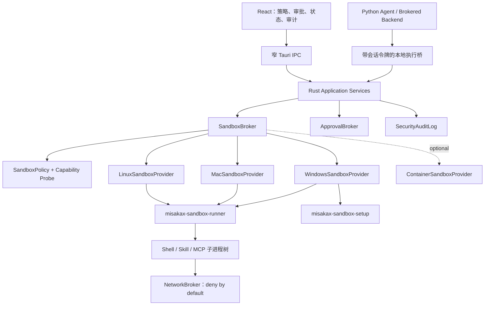

# MisakaX Sandbox 技术选型（ADR）

> **用途：** 固化 MisakaX 跨平台 Agent 沙箱的技术决策、边界、适配策略和上线门槛。
> **受众：** 架构师、安全、Rust/Python、构建与发布维护者。
> **最后审阅 / Last reviewed：** 2026-08-01
> **状态：** Proposed；需完成三个平台的 Spike Gate 后转为 Accepted。
> **依据：** [`CROSS_PLATFORM_DESKTOP_SANDBOX_RESEARCH.md`](../research/CROSS_PLATFORM_DESKTOP_SANDBOX_RESEARCH.md)。

---

## ADR-001：采用统一 Sandbox Broker 和平台适配器

### 1. 决策

MisakaX 采用**端口-适配器架构**实现沙箱：

- Rust Core 持有统一 `SandboxPolicy`、`SandboxBroker`、审批、审计、能力探测和会话生命周期。
- 独立的、窄职责 `misakax-sandbox-runner` 建立 OS 安全边界；主 Tauri 进程不直接拼接不可信 Shell 命令。
- Linux 首选 Bubblewrap + namespaces + seccomp，Landlock 作为补充/受限回退。
- macOS 首选每命令 Seatbelt profile + 独立 runner + 本地网络 Broker。
- Windows 首选一次性提权设置、专用 online/offline 沙箱账户、write-restricted token、ACL、防火墙和 Job Object。
- Docker/Podman 实现为可选 `ContainerSandboxProvider`，不作为基础安装的强依赖。
- Wasmtime 保留为未来受控 Skill 插件 Provider，不承载通用 Shell。
- 用户主动 PTY 终端由 `TerminalManager` 管理，默认标记为本机权限；Agent 自动命令必须调用 `SandboxBroker`。

### 2. 决策驱动因素

- 三平台必须可运行，但不要求底层机制相同。
- 保持现有用户项目工具链、工作区和 Tauri 桌面体验。
- 安全策略要可测试、可解释、可审计、可升级，不散落在 React/Python/命令拼接中。
- 能逐步从当前逻辑路径守卫迁移，不进行一次性重写。
- 能为 Skills、MCP Server、Shell、扫描器和未来自动化共用执行边界。

### 3. 未采用的主方案

| 方案 | 不作为主方案的原因 |
|---|---|
| 只用 Docker Desktop | 依赖虚拟化/大体积运行时；三平台安装和许可成本高；宿主工具链体验差 |
| 只用 Windows Sandbox | 不支持 Windows Home；工作区/工具桥接和多会话体验不符合桌面 Agent |
| Windows AppContainer/LPAC | 对开放式 Git/Python/Node/编译器工作流兼容性不足 |
| 只用 Anthropic Sandbox Runtime | 当前只覆盖 macOS/Linux，无法完成 Windows 要求 |
| 直接 Shell 调用 Codex CLI | 上游 CLI 协议和实现会变化；产品不能依赖用户安装或登录另一产品 |
| 只用 Wasmtime | 无法透明运行任意本机命令和现有 Skill 脚本 |
| 路径 guard + proxy 环境变量 | 可被直接系统调用绕过，不构成 OS 安全边界 |

## 4. 目标架构



### 4.1 依赖方向

```text
React UI
  -> IPC DTO
    -> Rust application service
      -> sandbox domain ports / policy
        -> platform adapters / database / runner protocol

Python Agent
  -> BrokeredWorkspaceBackend
    -> authenticated loopback bridge
      -> 同一个 Rust application service
```

平台 API、命令行参数、Windows token、Seatbelt profile 和 Bubblewrap 参数不得出现在 UI、Skills 或 Agent 编排层。

## 5. 核心契约

以下为概念接口；实现时按仓库当时锁定的 Rust 版本调整，不在规划阶段锁死第三方小版本。

```rust
pub trait SandboxProvider: Send + Sync {
    fn capabilities(&self) -> SandboxCapabilities;
    async fn prepare(&self, request: PrepareRequest) -> Result<PreparedSandbox>;
    async fn spawn(&self, request: SpawnRequest) -> Result<SandboxProcess>;
    async fn terminate_tree(&self, process_id: SandboxProcessId) -> Result<()>;
}

pub struct SandboxPolicy {
    pub mode: SandboxMode,
    pub filesystem: FilesystemPolicy,
    pub network: NetworkPolicy,
    pub environment: EnvironmentPolicy,
    pub resources: ResourcePolicy,
    pub approvals: ApprovalPolicy,
}

pub enum SandboxMode {
    ReadOnly,
    WorkspaceWrite,
    FullAccess,
}
```

必须使用结构化 argv 和 cwd，不允许把前端字符串直接传给 platform shell 做二次解析。确需 Shell 语法时，由明确的 `ShellCommand` 类型和平台 adapter 处理，并记录完整来源。

## 6. 默认策略

### 6.1 `read-only`

- 工作区和系统可读范围按平台最小映射；无任何持久写路径，仅会话临时目录可写。
- 网络关闭。
- 适合安全扫描、只读分析和未知 Skill 预览。

### 6.2 `workspace-write`（Agent 默认）

- 当前会话工作区可写。
- `.git`、`.misakax`、`.codex`、`.agents`、凭据文件和用户配置默认只读/不可见。
- 网络默认关闭；按域名和一次/会话范围审批。
- 环境变量使用 allowlist，移除云 Key、SSH、浏览器和代理凭据；`inherit_env=false`。
- 限制进程数、CPU、内存、文件大小、打开句柄和执行时长。

### 6.3 `full-access`

- 仅由用户在当前操作显式批准，展示影响范围和过期时间。
- 审计事件必须包含触发消息、命令摘要、工作区、批准时间和理由。
- 不得被 Skill manifest 或模型输出自行请求为永久默认。

## 7. 平台映射

| 策略能力 | Linux | macOS | Windows |
|---|---|---|---|
| 根只读 | Bubblewrap `ro-bind` | Seatbelt deny/write rules | write-restricted token + ACL |
| 工作区可写 | 精确 bind | profile allow path | sandbox SID ACL |
| 子路径再保护 | 重新 ro-bind/deny | 更具体 deny | deny ACL/受限 SID 策略 |
| 网络默认拒绝 | network namespace + seccomp | Seatbelt + Broker | offline 用户防火墙 |
| 域名允许 | TCP/UDS Broker | localhost/UDS Broker | online 身份 + Broker/防火墙 |
| 进程树 | PID namespace/cgroup/kill | process group/runner | Job Object |
| 权限准备 | 通常无需 root，探测 userns | 签名/系统版本验证 | 一次性 UAC setup |
| 严格失败 | 不支持 userns 时拒绝 | profile 失败时拒绝 | setup/规则不完整时拒绝 |

“兼容模式”只能在用户明确选择后使用，并在每次会话显示持续警告；它不能自动取代严格模式。

## 8. Python Sidecar 集成决策

### 8.1 首期

- 新建 `BrokeredWorkspaceBackend`，文件和 Shell 工具通过带随机会话令牌的 loopback bridge 调用 Rust。
- Rust 校验会话、工作区、工具、策略和批准，Shell 交给 Sandbox Broker。
- 停止对 `LocalShellBackend` 使用 `inherit_env=true`；除测试外不得直接作为生产 backend。
- Skill 目录以**激活视图**挂载，只包含当前允许且启用的 Skill；禁用/过期 Skill 不可见。

### 8.2 强化阶段

- 将执行 worker 与 FastAPI 控制面分离，评估把执行 worker 整体放入沙箱。
- 模型凭据由宿主侧 Model Gateway 代持；worker 获得范围受限的 loopback token，避免把 API Key 注入沙箱。
- MCP 进程启动统一接入 Sandbox Broker；远程 MCP 连接由网络策略管理。

## 9. Tauri 与终端安全决策

- 删除主 WebView 的通用 `shell:allow-execute/spawn/stdin-write/kill` 权限，终端和 Agent 使用独立窄 IPC。
- 收窄 FS/HTTP capability 和 scope，显式 deny 敏感 WebView 数据目录。
- 配置 CSP：仅允许本地打包脚本/样式，禁止远端和动态代码；开发环境例外与生产配置分离。
- 终端使用 `@xterm/xterm` + Fit addon，Rust 侧优先验证 `portable-pty 0.9.x`；依赖版本以实施时 `package.json`/`Cargo.toml` 锁定为准。
- 终端会话不复用 Sandbox Process ID；类型层面区分 `LocalTerminalSession` 和 `SandboxExecution`。

## 10. 数据与审计

至少记录：

- `execution_id`、会话、工作区、请求来源（Agent/Skill/MCP/User Terminal）。
- 策略版本、provider、能力探测结果、writable/readable/denied roots 的摘要 hash。
- 命令 argv 的安全摘要、cwd、开始/结束、退出码、终止原因和资源用量。
- 网络请求目标、策略命中、用户批准和持续时间。
- 沙箱 setup/repair/uninstall 事件和平台组件版本。

日志不得默认存储环境变量值、凭据、完整终端输出或用户文件内容；命令参数中疑似 Secret 应脱敏。

## 11. Spike Gate：ADR 转为 Accepted 的条件

三个平台都必须通过以下门槛，不能只在 Windows 开发机通过后宣称跨平台完成：

1. 工作区内创建/修改成功，工作区外写入失败。
2. `.git` 保护策略按预期失败；批准后可在限定操作中放行。
3. 读取 SSH/云凭据路径失败或不可见。
4. 直接 Socket、DNS、HTTP、Git/SSH 在 offline 策略下均失败。
5. 允许域名可用，未允许域名和重定向/解析绕过失败。
6. 子进程、后台进程和崩溃后进程树被回收。
7. Python、Node、Git、Rust 构建的代表性命令兼容。
8. 路径含空格、Unicode、符号链接/junction、Git worktree 和长路径用例通过。
9. provider 不可用时严格模式 fail closed，UI 给出可操作诊断。
10. 安装包签名、升级、修复和卸载不会遗留专用账户、无效防火墙或危险 ACL。

## 12. 已知风险与缓解

| 风险 | 缓解 |
|---|---|
| Windows setup 复杂、需 UAC | 独立 setup helper；幂等校验、修复和卸载；明确用户说明 |
| Seatbelt 接口/系统版本差异 | 支持版本矩阵、签名 helper、每版本实机测试、严格失败 |
| Bubblewrap/userns 被发行版禁用 | 预检、捆绑受审版本、Landlock 能力回退、兼容模式不静默 |
| 网络 Broker 成为高价值边界 | 最小协议、DNS/重定向校验、无凭据日志、模糊测试和独立审计 |
| 沙箱影响构建速度 | 缓存只读映射、会话复用、基准预算；不放宽安全边界换性能 |
| 第三方上游快速变化 | 内部稳定接口、固定版本/SBOM、升级安全回归，不依赖用户安装 CLI |

## 13. 关联文档

- [`CROSS_PLATFORM_DESKTOP_SANDBOX_RESEARCH.md`](../research/CROSS_PLATFORM_DESKTOP_SANDBOX_RESEARCH.md)
- [`WORKSPACE_SKILLS_SECURITY_ARCHITECTURE.md`](./WORKSPACE_SKILLS_SECURITY_ARCHITECTURE.md)
- [`SANDBOX_IMPLEMENTATION_PLAN.md`](../planning/SANDBOX_IMPLEMENTATION_PLAN.md)
- [`SKILL_SECURITY_SCANNING_RESEARCH.md`](../research/SKILL_SECURITY_SCANNING_RESEARCH.md)
