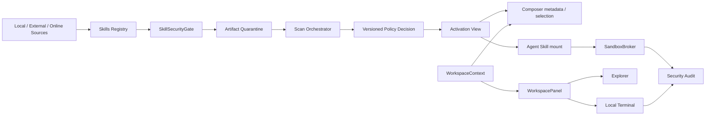
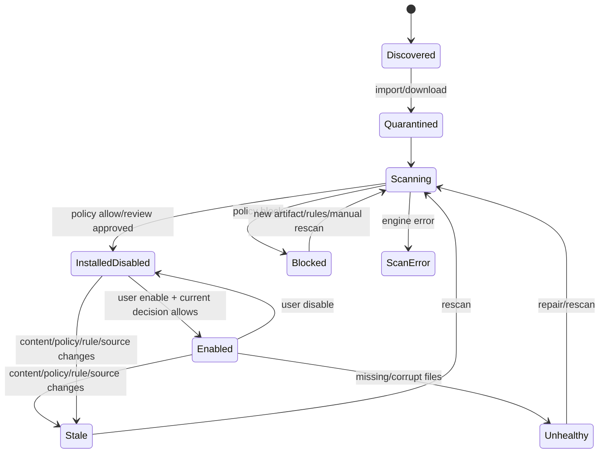

# MisakaX Skills、工作区与安全能力总体架构

> **用途：** 定义 Skills 仓库、安全检查、设置集成、Git 上下文、嵌入终端和 Agent 沙箱的统一目标架构与实施顺序。
> **受众：** 全体项目维护者、架构师、前端/Rust/Python/测试与安全工程师。
> **最后审阅 / Last reviewed：** 2026-08-01
> **规划基线：** `main@9249915`（Skills S5 / Workspace W3 已实现，后续阶段仍按本文边界推进）。
> **范围说明：** 本文是本次需求的总规划与架构设计；分项 TODO 见 `docs/planning/` 的关联计划。

---

## 1. 目标与成功标准

本轮建设不是把若干按钮堆到现有页面，而是形成四个可独立维护、通过稳定契约协作的能力域：

1. **Skills Registry：** 统一管理受管、本地外部和在线 Skills 的身份、来源、文件、启用状态和激活视图。
2. **Skill Security：** 所有进入系统的 Skill 都经过隔离、扫描、策略裁决、审计和持续复核。
3. **Workspace Runtime：** 统一工作区上下文、Git/本地项目标识、右侧 Explorer/Terminal 容器和会话生命周期。
4. **Execution Security：** Agent、Skill 和 MCP 的高风险执行通过跨平台 Sandbox Broker，用户本机终端保持清晰的独立边界。

最终成功不是“页面能打开”，而是满足：

- 禁用、未扫描、扫描过期或被阻止的 Skill 不会被自动注入、被选择、随消息发送或挂载到 Sidecar。
- Skill 详情默认只加载概要和文件树，只有选中文件才受限读取内容。
- 本地上传、在线安装和外部发现共用一条安全门，不存在旁路。
- 输入框下方始终能解释当前工作区是哪个 Git 分支，或明确是本地项目。
- 终端在当前会话工作区启动、在右侧面板运行、生命周期可控，且 WebView 不拥有通用 Shell 权限。
- Agent 自动命令在 Windows、macOS、Linux 均有真实 OS 边界；严格模式不可静默降级。
- 最后的架构整理采用渐进迁移和特征测试，不破坏已交付功能。

## 2. 现状判断

| 领域 | 已有基础 | 当前架构问题 |
|---|---|---|
| Skills | 安装、远端目录、列表、受管 Skill 开关、消息选择、基础归档检查 | 外部 Skill 总是启用；详情携带全文；启用状态未贯穿 Sidecar 挂载；风险模型过薄 |
| Settings | General/Models/MCP/Appearance/About | Skills 是独立顶层页面，不在 MCP 下方；现有设置内容宽度不足以容纳双栏文件浏览 |
| Workspace | 会话工作区、文件树、Monaco、右侧可调整面板 | 右侧只支持 Explorer；没有稳定 panel registry/模式状态；工具日志入口与终端语义冲突 |
| Git | 设计资料中有未来构想 | 代码无 Git 服务、无状态 DTO；不应在本轮扩展到提交/分支操作 |
| Terminal | WorkspaceBar 已使用 Terminal 图标打开 Tool Logs | 没有 PTY、xterm、输入/resize/kill 契约和安全边界 |
| Sandbox | 逻辑路径 guard、MCP 审批 | Shell 仍在宿主直接执行，继承环境；无 OS 隔离、网络策略和资源限制 |
| Tauri 安全 | Capability 基础配置 | 主 WebView 的 shell/fs/http 权限过宽，CSP 为空，不适合新增终端 |

## 3. 架构原则

### 3.1 依赖反转和端口-适配器

领域层定义 `SkillRepository`、`SkillScanEngine`、`SkillPolicy`、`VcsProvider`、`TerminalBackend`、`SandboxProvider` 等端口。SQLite、在线目录、Git CLI、PTY 和 OS API 是 adapter。Tauri commands 只做 DTO 校验、授权和 application service 调用。

### 3.2 单一策略所有者

启用/禁用、安全裁决、沙箱策略和审批由 Rust application/domain 层拥有。React 不自行推断“是否安全”，Python 不维护第二套启用状态；两者只消费带版本的结果。

### 3.3 查询与大内容分离

列表/详情概要 API 不返回全文或二进制。文件树是元数据查询，文件内容通过独立、分页、有上限的 read API 加载。扫描报告概要与 finding 详情也分开，避免一个 DTO 无限增长。

### 3.4 默认拒绝、可解释例外

未扫描、状态未知、provider 缺失或策略错误均不等于允许。每个拒绝必须返回稳定错误码、用户可理解原因和下一步；每个例外必须可审计、可撤销、可过期。

### 3.5 渐进迁移

使用 Facade、Adapter、feature flag 和 branch-by-abstraction 迁移现有功能。先为现状补特征测试，再切调用点；不在最后阶段进行大爆炸式重写。

## 4. 目标模块边界

```text
src/
  features/
    skills/                 # inventory/detail/files/security/install UI
    settings/               # settings shell and navigation
    workspace-context/      # Git/local badge and workspace query
    workspace-panel/        # explorer/terminal mode container
    terminal/               # xterm view and session hooks
  lib/ipc/                  # generated/central DTO wrappers and error mapping

src-tauri/src/
  domain/
    skills/                 # identity, activation, lifecycle, policy-independent model
    security/               # scan findings, decisions, approvals, audit types
    workspace/              # WorkspaceContext and VCS port
    execution/              # sandbox policy and execution request model
  application/
    skills/                 # inventory/install/enable/read-file use cases
    scans/                  # scan orchestration and policy decision
    workspace/              # context query and refresh
    terminal/               # terminal lifecycle
    sandbox/                # broker and approval orchestration
  infrastructure/
    sqlite/
    catalogs/
    scanners/
    git/
    pty/
    sandbox/{linux,macos,windows,container}/
  commands/                 # thin Tauri command adapters

agent/app/
  backends/
    brokered_workspace.py   # delegates filesystem/shell to Rust bridge
  clients/
    execution_bridge.py
  orchestration/            # LangGraph/DeepAgents composition only
```

不要求第一阶段立即完成目录重排；先让接口和依赖方向成立，最终阶段再进行机械移动。

## 5. 领域关系



核心规则：Registry 决定“对象是谁”，Security Gate 决定“当前制品能否被允许”，Activation View 决定“Agent 现在能看到什么”，Sandbox 决定“被看见后能影响什么”。任何单层都不能替代其他层。

## 6. Skills 身份与生命周期

### 6.1 稳定身份

当前用 `slug` 作为主身份，无法可靠区分同名的受管、Codex、Claude 和 Cursor Skill。目标模型引入：

```text
SkillId          稳定 UUID/内部 ID
slug             Agent Skills 名称；允许不同 source 冲突
source_kind      managed | codex | claude | cursor | online-cache
source_locator   规范化本地路径或 registry/version locator
artifact_hash    当前完整内容 hash
effective_rank   冲突时显式优先级
```

消息选择逐步迁移到 `skill_id`，保留 `slug_snapshot` 供审计和旧数据展示。冲突必须在 UI 显示来源，不能悄悄按枚举顺序覆盖。

### 6.2 状态机



`enabled` 是用户意图，不是安全结论；实际可用条件是：

```text
effective_active = enabled
                && health == healthy
                && scan_decision in {allow, allow_with_ack}
                && scan_artifact_hash == current_artifact_hash
                && no_active_revocation
```

### 6.3 激活视图

不要把 `~/.misakax/skills` 整目录直接挂载给 Python Agent。由 `SkillActivationService` 为每次会话生成只读 manifest/虚拟挂载：

- 只包含 `effective_active` 的 Skills。
- 所有路径使用 SkillId 映射并校验 canonical path。
- 会话开始和每次选择时携带 activation generation；状态变化后递增并通知前端/Sidecar。
- 旧 generation 不允许继续启动新的工具执行；正在执行的操作按策略决定终止或完成。

外部 Skill 不移动原始文件；Registry 保存路径和启用/扫描状态，激活视图只映射已允许的目录。

## 7. Skills 安全架构

### 7.1 组件

- `ArtifactStore`：隔离区、hash、原子发布、清理和配额。
- `ScanOrchestrator`：编排引擎、超时、取消、缓存、去重和状态事件。
- `BuiltinScanEngine`：现有归档校验 + 格式/MIME/Secret/规则/权限一致性。
- `DeepScanEngine`：通过稳定 JSON 协议调用固定版本的第三方扫描 helper。
- `ReputationProvider`：OSV、VirusTotal hash、registry 信号；全部可选且带来源。
- `SkillPolicyEngine`：把 findings、来源和组织策略转换为 decision。
- `SkillSecurityGate`：安装、启用、选择、挂载前唯一入口。
- `SecurityAuditLog`：扫描、批准、例外、撤销和调用记录。

### 7.2 数据模型

建议新增或演进为：

| 表/实体 | 关键字段 |
|---|---|
| `skill_sources` | `skill_id`, `slug`, `source_kind`, `source_locator`, `artifact_hash`, `enabled`, `health`, `current_scan_id` |
| `skill_artifacts` | `hash`, `size`, `source_json`, `quarantine_path`, `installed_path`, `created_at` |
| `skill_scan_runs` | `id`, `artifact_hash`, `state`, `engine_versions_json`, `policy_version`, `decision`, `max_severity`, timestamps/error |
| `skill_findings` | `scan_id`, `engine`, `rule_id`, `severity`, `category`, file/line, title/detail/remediation/fingerprint |
| `skill_approvals` | subject, decision override, actor, reason, scope, created/expires/revoked |
| `message_skill_selections` | `message_id`, `skill_id`, `slug_snapshot`, `artifact_hash_snapshot` |

迁移必须保留现有 `skills` 表和消息可读性；先 dual-read/dual-write，验证后再删除旧字段。

### 7.3 安全文件读取

详情 API 分为：

- `skills_get_summary(skill_id)`：元数据、状态、来源、风险摘要，不含正文。
- `skills_list_files(skill_id, cursor)`：路径、类型、大小、是否文本和树节点，不读正文。
- `skills_read_file(skill_id, path, offset, limit)`：仅在点击文件后读取；canonical containment、拒绝链接逃逸、文本上限、UTF-8/编码说明和分页。
- `skills_list_findings(scan_id, filter, cursor)`：finding 分页。
- `skills_get_finding(scan_id, finding_id)`：单条证据和修复建议。

二进制默认只显示 metadata/hash，不直接渲染；大文本首屏建议上限 200 KiB，并支持显式“继续加载”。

## 8. Settings 与 UI 路由架构

- `SettingsTab` 增加 `skills`，顺序固定为 `General -> Models -> MCP -> Skills -> Appearance -> About`。
- 旧 `{ page: "skills" }` 路由在一个兼容周期内重定向到 `{ page: "settings", tab: "skills" }`，然后删除。
- Skills 页面拆为 `SkillsSettingsFeature`，不依赖顶层 App route，继续复用 inventory hooks 和 domain components。
- Settings shell 支持每个 tab 声明内容宽度；Skills 使用宽布局，普通设置保持现有窄阅读宽度。
- 详细交互遵循 [`SKILLS_WORKSPACE_TERMINAL_UI_DESIGN.md`](../design/SKILLS_WORKSPACE_TERMINAL_UI_DESIGN.md)。

## 9. Workspace Context 与 Git 扩展点

首期只提供只读状态：

```ts
type WorkspaceContext = {
  workspacePath: string;
  kind: "git" | "local";
  repositoryRoot?: string;
  branch?: string;
  detachedHead?: string;
  generation: number;
};
```

`VcsProvider` 使用 Strategy 模式；首个 `GitCliProvider` 以结构化参数调用系统 Git，支持 worktree/submodule/detached HEAD，超时并限制输出。不扫描文件状态、不执行提交/切分支。

刷新触发：会话/工作区变化、窗口重新聚焦、终端命令退出、`.git/HEAD`/resolved gitdir 变化（debounce）。查询失败显示本地项目标识，不阻塞输入。

未来 Git 面板通过 `WorkspacePanelDescriptor` 注册，但本期不新增 Git 操作 UI、diff、stage、commit 或 branch menu。

## 10. Workspace Panel 与 Terminal

右侧栏从“固定 Explorer”演进为一个小型 `WorkspacePanel` 容器，而不是一次性构建复杂 IDE：

```ts
type WorkspacePanelMode = "explorer" | "terminal";

type WorkspacePanelState = {
  open: boolean;
  mode: WorkspacePanelMode;
  size: number;
  sessionId: string;
  workspaceGeneration: number;
};
```

- Explorer 和 Terminal 共用现有 `react-resizable-panels` 外壳，任一按钮打开并切换模式。
- 终端图标取代 WorkspaceBar 中当前“Tool Logs”图标的职责；Tool Logs 迁移到消息工具区域或溢出菜单，不能丢失诊断能力。
- Terminal 前端采用 xterm.js，Rust `TerminalManager` 采用跨平台 PTY adapter。
- `terminal_spawn` 只接受会话/workspace ID、rows/cols 和允许的 shell profile，不接受任意 cwd。
- PTY 启动 cwd 由后端从当前会话工作区解析，输出通过带 session ownership 的事件流发送。
- 工作区变化时提示关闭/重启旧终端，默认不悄悄把一个正在运行的 Shell 改到新目录。
- 当前实现以随机 terminal ID 绑定 window label + Chat Session + workspace generation；output 使用 base64 + 递增 seq 和有界背压，exited 以 `last_seq` 封口。Windows Job Object 与 Unix process group 负责 child/grandchild 回收，失败时拒绝 spawn 而不是降级成只杀父进程。
- 本机终端继承必要的用户开发环境，但移除 MisakaX/Sandbox/Tauri signing/内部 bridge secret；它始终标记为“本机权限”，不得复用未来 Sandbox profile 的安全文案。

## 11. Sandbox 与执行链

详见 [`SANDBOX_TECH_SELECTION.md`](./SANDBOX_TECH_SELECTION.md)。总体约束：

- Agent Shell、Skill 脚本和本地 MCP 子进程统一请求 `ExecutionService`，再由 Sandbox Broker 选择 provider。
- Python `LocalShellBackend` 替换为 `BrokeredWorkspaceBackend`，不再直接继承宿主环境执行。
- 用户终端走 `TerminalManager`，UI 明示“本机终端”；未来沙箱终端使用另一个 profile 和视觉状态。
- Network Broker、Approval Broker 和 Security Audit 是横切服务，不由每个 provider 重复实现业务策略。
- Tauri 主 WebView 删除通用 Shell 权限，启用 CSP 并收窄 FS/HTTP scope。

## 12. 事件与并发模型

推荐统一事件 envelope：

```ts
type DomainEvent<T> = {
  eventId: string;
  aggregateId: string;
  generation: number;
  occurredAt: string;
  payload: T;
};
```

关键事件：

- `skills.inventory.changed`
- `skills.activation.changed`
- `skills.scan.progress`
- `skills.scan.completed`
- `workspace.context.changed`
- `terminal.output`
- `terminal.exited`
- `sandbox.execution.changed`
- `security.approval.requested/resolved`

所有异步结果必须带 generation。UI 丢弃旧工作区、旧 Skill hash 或旧终端 session 的迟到事件；取消操作是显式命令，不以组件卸载假定后端已停止。

## 13. 错误契约

禁止让 UI 解析自然语言错误。至少定义：

- `SKILL_DISABLED`
- `SKILL_SCAN_REQUIRED`
- `SKILL_SCAN_STALE`
- `SKILL_POLICY_BLOCKED`
- `SKILL_PATH_INVALID`
- `FILE_PREVIEW_TOO_LARGE`
- `WORKSPACE_NOT_FOUND`
- `GIT_NOT_AVAILABLE`
- `TERMINAL_SESSION_NOT_FOUND`
- `TERMINAL_SESSION_OWNERSHIP_MISMATCH`
- `TERMINAL_INVALID_REQUEST`
- `TERMINAL_LIMIT_EXCEEDED`
- `TERMINAL_SPAWN_FAILED`
- `SANDBOX_UNAVAILABLE`
- `SANDBOX_SETUP_REQUIRED`
- `SANDBOX_POLICY_DENIED`

错误包含 `code`、本地化参数、是否可重试、建议动作和 correlation ID；日志保留内部 cause，前端不显示敏感路径/凭据。

## 14. 兼容和迁移策略

1. 为现有 Skills list/detail/enable/send/mount 行为补特征测试。
2. 增加新 DTO/API，旧 `skill_markdown` 继续兼容一个版本但 UI 不再调用。
3. 引入 `SkillSecurityGate`，先 audit-only，再对新安装强制，最后迁移存量并强制启用门槛。
4. 引入 stable SkillId 和 dual-write；迁移消息选择后再删除 slug-only 路径。
5. Settings 路由先重定向，再移除独立 Skills page 分支。
6. WorkspacePanel 先包裹原 Explorer，再接 Terminal，避免重写 Explorer。
7. Sandbox 先 shadow/audit，随后只对测试会话启用，再逐平台变成默认；不可用时按产品渠道和策略处理。
8. 最终架构审查仅在行为、性能和三平台安全门均有回归基线后拆分目录/服务。

## 15. 实施阶段与依赖

| 阶段 | 交付内容 | 前置 | 退出条件 |
|---|---|---|---|
| P0 基线与契约 | 特征测试、DTO/错误/事件、feature flags、安全配置盘点 | 无 | 现状行为可回归 |
| P1 Skills 闭环 | Settings 移动、懒加载文件、全来源开关、扫描门、激活视图 | P0 | 禁用/未扫描 Skill 无任何注入旁路 |
| P2 工作区体验 | Git/本地 badge、WorkspacePanel、嵌入式本机终端、CSP/IPC 收窄 | P0 | 三平台 PTY 和安全检查通过 |
| P3 沙箱 | Broker、平台 providers、Sidecar 执行桥、网络/审批/审计 | P0；与 P1/P2 接口稳定 | 三平台 Spike Gate 通过 |
| P4 安全强化 | 深度扫描、存量 rescan、沙箱默认化、恶意样本/安装包测试 | P1+P3 | 发布级安全门通过 |
| P5 架构审查 | 热点拆分、依赖清理、文档同步、性能与回归 | 其他功能完成 | 无功能回退，旧路径清零 |

P1 与 P2 可在契约稳定后并行开发；P3 的平台 spike 也可并行，但启用门必须等各自平台验证完成。

## 16. 非目标

- 本轮不实现 Git status、diff、stage、commit、push、分支管理或 PR UI。
- 不实现多终端标签、SSH 终端、共享终端或终端回放；只保留接口扩展点。
- 不建立“通过扫描即可完全信任”的安全承诺。
- 不在最后阶段更换 React/Tauri/LangGraph/SQLite 技术栈。
- 不为了目录美观进行无测试的全面重写。

## 17. 关联实施文档

- [`SKILLS_REPOSITORY_AND_SECURITY_PLAN.md`](../planning/SKILLS_REPOSITORY_AND_SECURITY_PLAN.md)
- [`WORKSPACE_CONTEXT_AND_TERMINAL_PLAN.md`](../planning/WORKSPACE_CONTEXT_AND_TERMINAL_PLAN.md)
- [`SANDBOX_IMPLEMENTATION_PLAN.md`](../planning/SANDBOX_IMPLEMENTATION_PLAN.md)
- [`ARCHITECTURE_REVIEW_AND_REFACTOR_PLAN.md`](../planning/ARCHITECTURE_REVIEW_AND_REFACTOR_PLAN.md)
- [`WORKSPACE_SECURITY_SKILLS_PROGRESS.md`](../project/WORKSPACE_SECURITY_SKILLS_PROGRESS.md)
