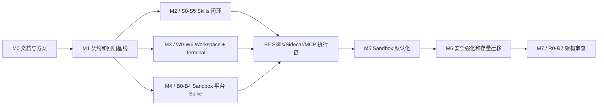

# MisakaX Skills、Workspace Terminal 与 Sandbox 总实施执行指南

> **用途：** 面向 AI Coding 和人工协作的总执行控制文件。它规定本轮改造应读取哪些文档、按什么顺序实施、如何实时维护 TODO/进度、如何测试，以及如何分阶段直接推送到私有仓库 `main` 分支。
> **受众：** 使用 Codex、Claude Code、Cursor 等 AI Coding 工具的项目维护者，以及参与 React、Rust、Python、安全和测试工作的开发者。
> **最后审阅 / Last reviewed：** 2026-08-01
> **当前基线：** `main@fa24bd7`；`origin` 指向私有仓库 `knqiufan/MisakaX`。开始实际实施时必须重新读取当前 commit、remote 和工作树，不能永久依赖本行。
> **执行属性：** 本文件是执行入口，不替代各专项 Plan、ADR、UI 规范和进度台账。具体技术要求以对应专项文档为准。

---

## 1. 使用目标

本指南解决的核心问题是：让 AI Coding 在一个跨 React、Rust、Python、SQLite、PTY、跨平台 Sandbox 和安全扫描的长期任务中，始终知道当前目标、边界、证据和下一步，避免以下失控行为：

- 只根据一次对话记忆实施，未读取最新 Plan、代码和进度。
- 跳过基线测试，直接大范围重写。
- 只完成 UI，未闭环到 Rust、Sidecar、数据库或运行时安全边界。
- 为了让测试通过而缩小目标、静默降级安全策略或保留旁路。
- 未验证就勾选 TODO、宣称阶段完成或更新进度为 100%。
- 混入计划外 Git、多终端或其他产品功能，造成范围漂移。
- 一次提交过多领域，失败后无法回滚或定位。
- 推送前未同步进度、设计规范、迁移和测试证据。
- 在 `main` 上 force push、覆盖他人/用户改动或提交无关脏文件。

本轮所有 AI Coding 任务都应从本文开始，然后根据“文档路由表”读取最小且完整的专项上下文。

## 2. 规则优先级与事实来源

发生冲突时，按以下顺序处理：

1. 当前用户明确指令和仓库中的 `AGENTS.md`/路径级规则。
2. 当前代码、锁定 manifests、数据库 migrations、实际测试和运行结果所证明的事实。
3. 本总执行指南规定的工作流和控制门。
4. 总体架构、Sandbox ADR、UI 全局规范。
5. 当前专项实施 Plan 的范围、阶段、TODO、退出门和完成定义。
6. 实施进度台账记录的当前状态、阻断和证据。
7. 历史设计、旧 Phase 文档和对话记忆。

这里的“代码是事实”不表示必须保留现有缺陷。Plan 描述的是目标状态；代码用于判断现状和迁移起点。当目标文档与当前代码不一致时，AI 必须先说明差异，确认是计划中的迁移还是文档过期，再继续工作，不能悄悄选择更容易的状态。

依赖 API 必须以实施时的 `package.json`、`src-tauri/Cargo.toml` 和 `agent/pyproject.toml` 为版本基线；不能按记忆使用“最新版本”API。

## 3. 文档地图：什么时候读取哪份文档

### 3.1 每次任务启动都必须读取

| 文档 | 作用 | 获取时机 | 阅读要求 |
|---|---|---|---|
| 仓库根 `AGENTS.md` 和路径级规则 | 技术栈、文档分类、UI 文档同步、测试和安全约束 | 每个新任务/上下文恢复后第一步 | 完整读取当前版本 |
| 本文 [`MASTER_IMPLEMENTATION_EXECUTION_GUIDE.md`](./MASTER_IMPLEMENTATION_EXECUTION_GUIDE.md) | 统一执行循环、测试、进度和 Git Push 规范 | 每个阶段开始、上下文压缩/交接后 | 至少重读当前阶段相关章节 |
| [`WORKSPACE_SECURITY_SKILLS_PROGRESS.md`](../project/WORKSPACE_SECURITY_SKILLS_PROGRESS.md) | 当前里程碑、阻断、代码基线和真实进度 | 开始实施前、每次 pull 后、提交前 | 完整检查当前状态和“下一步” |
| [`WORKSPACE_SKILLS_SECURITY_ARCHITECTURE.md`](../architecture/WORKSPACE_SKILLS_SECURITY_ARCHITECTURE.md) | 目标模块、依赖方向、状态机、事件、迁移和总阶段关系 | 第一次进入本轮任务；架构边界变化前 | 相关章节完整读取；跨域改动需全文重读 |
| 当前专项 Plan | 范围、TODO、退出门、测试和完成定义 | 写代码前、勾选 TODO 前、阶段验收前 | 必须完整读取当前 Phase，不能只看 TODO 标题 |

“获取文档”指从当前工作树重新读取文件，不是引用旧对话摘要。`git pull`、用户修改文档、切换机器、上下文压缩或中断恢复后，必须重新获取。

### 3.2 Skills 专项文档

| 文档 | 何时必须读取 | 用途 |
|---|---|---|
| [`SKILLS_REPOSITORY_AND_SECURITY_PLAN.md`](./SKILLS_REPOSITORY_AND_SECURITY_PLAN.md) | S0–S5 每阶段开始和退出时 | Skills 全来源开关、Settings 迁移、按需文件、安全门和存量迁移 TODO |
| [`SKILL_SECURITY_SCANNING_RESEARCH.md`](../research/SKILL_SECURITY_SCANNING_RESEARCH.md) | S3/S4；任何扫描规则、风险文案或第三方引擎改动前 | 威胁类别、多引擎扫描、局限和主流工具依据 |
| [`SKILLS_WORKSPACE_TERMINAL_UI_DESIGN.md`](../design/SKILLS_WORKSPACE_TERMINAL_UI_DESIGN.md) | S2 和任何 Skills React/UI 改动前 | Settings 布局、Switch、文件树、按需预览、安全报告交互 |
| 三份现有 UI 规范 | 任何 `src/**/*.tsx`/共享 CSS 改动前 | 全局桌面风格、Shell/Workspace、按钮/菜单规范 |
| [`SANDBOX_TECH_SELECTION.md`](../architecture/SANDBOX_TECH_SELECTION.md) | S4 深度扫描 helper 隔离、Skill 运行边界相关改动前 | 扫描 helper 不执行目标 Skill、运行时沙箱关系 |

三份现有 UI 规范是：

- [`frontend-ui-guidelines.md`](../design/frontend-ui-guidelines.md)
- [`shell-and-workspace-ui-spec.md`](../design/shell-and-workspace-ui-spec.md)
- [`button-menu-design-spec.md`](../design/button-menu-design-spec.md)

### 3.3 Workspace Context 与 Terminal 专项文档

| 文档 | 何时必须读取 | 用途 |
|---|---|---|
| [`WORKSPACE_CONTEXT_AND_TERMINAL_PLAN.md`](./WORKSPACE_CONTEXT_AND_TERMINAL_PLAN.md) | W0–W6 每阶段开始和退出时 | Git/local badge、WorkspacePanel、PTY、xterm、CSP 和三平台验证 |
| [`SKILLS_WORKSPACE_TERMINAL_UI_DESIGN.md`](../design/SKILLS_WORKSPACE_TERMINAL_UI_DESIGN.md) | W1/W2/W4 和所有 WorkspaceBar/composer/Terminal UI 改动前 | 只读 badge、面板模式、终端生命周期和视觉语义 |
| 三份现有 UI 规范 | 所有 React/CSS 改动前 | 现有 Shell、composer、按钮、菜单、动效和文档同步要求 |
| [`SANDBOX_TECH_SELECTION.md`](../architecture/SANDBOX_TECH_SELECTION.md) | W3/W5；终端权限、Tauri IPC/CSP 改动前 | 本机终端与 Agent Sandbox 的边界、窄 IPC 和能力收口 |
| [`CROSS_PLATFORM_DESKTOP_SANDBOX_RESEARCH.md`](../research/CROSS_PLATFORM_DESKTOP_SANDBOX_RESEARCH.md) | 评估终端/PTY 与 Sandbox 的安全影响时 | xterm/WebView 风险和三平台执行边界 |

### 3.4 Sandbox 专项文档

| 文档 | 何时必须读取 | 用途 |
|---|---|---|
| [`SANDBOX_IMPLEMENTATION_PLAN.md`](./SANDBOX_IMPLEMENTATION_PLAN.md) | B0–B7 每阶段开始和退出时 | 平台 Spike、Broker、provider、Sidecar、Network/Approval、发布 Gate |
| [`CROSS_PLATFORM_DESKTOP_SANDBOX_RESEARCH.md`](../research/CROSS_PLATFORM_DESKTOP_SANDBOX_RESEARCH.md) | B0、平台 provider 设计变化、重新选型前 | Windows/macOS/Linux 原语、候选比较、威胁和网络结论 |
| [`SANDBOX_TECH_SELECTION.md`](../architecture/SANDBOX_TECH_SELECTION.md) | 每个 provider/Broker/策略改动前 | ADR 决策、核心接口、默认策略、平台映射和 Spike Gate |
| [`SKILL_SECURITY_SCANNING_RESEARCH.md`](../research/SKILL_SECURITY_SCANNING_RESEARCH.md) | B5/B6 中 Skill 执行、安全门和审计联动前 | 扫描与运行时隔离的边界 |
| Workspace/Terminal Plan | B5/B6 修改 Tauri 能力、进程和用户终端边界时 | 防止 Sandbox 和本机 PTY 生命周期/权限混用 |

### 3.5 最终架构审查专项文档

| 文档 | 何时必须读取 | 用途 |
|---|---|---|
| [`ARCHITECTURE_REVIEW_AND_REFACTOR_PLAN.md`](./ARCHITECTURE_REVIEW_AND_REFACTOR_PLAN.md) | R0–R7 每阶段开始和退出时 | 启动门、热点、渐进拆解、回归和旧路径清理 |
| 总体架构 | 每个结构性变更前 | 检查目标依赖方向和领域边界 |
| 所有已实施专项 Plan 的“完成定义” | R0 启动门和 R6 安全复审时 | 证明其他功能已经稳定，防止提前重构 |
| 进度台账 | 每一批重构前后 | 验证基线、证据、遗留阻断和状态没有失真 |

### 3.6 只在需要时获取的资料

- 具体依赖 API 不确定时，先查锁定版本的官方文档或上游源码。
- 需要新增依赖时，先检查当前 manifests、许可证、维护情况、三平台支持和打包影响。
- 需要回顾旧架构选择时，再读取历史 `docs/architecture/`、旧 Phase 计划；历史文档不得覆盖本轮新架构。
- 不要把所有研究资料无差别塞入每次 AI 上下文；按上述路由读取完整的相关文件即可。

## 4. 总体实施顺序和依赖门



执行原则：

- M1 是所有功能实施的共同前置；没有特征测试和稳定契约，不能直接大改。
- Skills 与 Workspace 的接口稳定工作可交错进行，但一个 AI 会话默认只推进一个专项 Phase。
- B0–B4 平台 Spike 可在 UI 之前开始；B5 切换生产执行链必须等待所依赖接口和平台保证。
- R0–R7 严格最后。若 Skills、Terminal 或 Sandbox 任一完成定义未证明，架构审查只能补基线，不能开始结构重排。
- 不得为了提前进入下一里程碑而把未验证 TODO 标记为 deferred；延期必须有明确原因、风险、目标阶段和用户认可。

## 5. 每个 Phase 必须执行的统一闭环

无论执行 S、W、B 还是 R 计划，每个 Phase 都必须完整走完以下步骤。

### Step 1：恢复上下文和读取计划

1. 运行只读预检：

   ```powershell
   git status --short
   git branch --show-current
   git log -5 --oneline
   git fetch origin
   ```

2. 确认当前分支是 `main`。发现用户或其他工具的未提交修改时，先识别归属；不得 reset、覆盖或混入本阶段提交。
3. 读取 AGENTS/路径规则、本文、进度台账、总体架构、当前专项 Plan 的完整当前 Phase，以及文档路由表要求的设计/研究/ADR。
4. 检查 `origin/main` 是否有新提交。若远端已变化，先安全同步并重新读取受影响文件；不得在旧基线上继续。
5. 用 5–10 行写出本阶段的：目标、非目标、涉及模块、关键不变量、退出门、预期测试和预计提交边界。

### Step 2：把 Plan TODO 映射为可验证工作单元

1. 逐条核对当前 Phase TODO，不允许只选择容易项。
2. 为每条 TODO 确定：代码位置、预期行为、验证证据、依赖 TODO 和回滚方式。
3. TODO 太大时可在原 Plan 下增加子 TODO，但不能删除或改写原目标来缩小范围。
4. 发现 Plan 与代码不一致时，在进度台账记录“计划假设 / 当前证据 / 决策”，必要时更新架构/ADR 后再实施。
5. 一次只把一个逻辑工作单元设为进行中；避免跨 Rust、React、Python 同时留下多个半成品。

### Step 3：增量实施并实时更新

1. 先写或补失败测试/特征测试，再改实现；无法先测的 UI/平台 spike 要先写验收步骤。
2. 每完成一个可独立验证的 TODO，立即运行最小相关测试。
3. 测试通过且证据充分后，才把原 Plan 中对应项从 `- [ ]` 改为 `- [x]`。
4. 同时更新进度台账：当前阶段、完成项摘要、测试证据、阻断、下一步和代码基线候选。
5. 部分完成不得勾选；保留 `[ ]` 并追加 `PARTIAL:` 说明已完成/未完成边界。
6. 阻断项保留 `[ ]` 并追加 `BLOCKED:`、证据、影响和解除条件。不能因为遇到困难就删除 TODO。
7. 实施过程中用户改变范围时，先更新 Plan/进度和退出门，再继续代码。

### Step 4：阶段测试与完成审计

1. 运行当前 TODO 的单元/集成测试。
2. 运行当前 Phase 规定的阶段测试和构建。
3. 若涉及安全边界，运行对应攻击/旁路/权限测试，不能只跑 happy path。
4. 若涉及 UI，验证视觉、键盘、i18n、窄窗口、loading/error 和文档同步。
5. 若涉及 migration，验证 forward、失败恢复、旧数据和 rollback/备份策略。
6. 逐项对照：Plan 范围、每条 TODO、退出门、完成定义、用户要求。证据缺失视为未完成。
7. 更新所有相关文档的 Last reviewed；UI 改动按 AGENTS 要求同步最小集合的全局 UI 规范。

### Step 5：提交并分阶段推送到 `main`

1. 确认只包含本阶段相关文件，显式 stage 文件，不使用会吞入无关改动的盲目 `git add .`。
2. 检查：

   ```powershell
   git status --short
   git diff --check
   git diff --cached --stat
   git diff --cached
   ```

3. 使用能够说明阶段的 commit，例如：

   ```text
   test(skills): establish S0 behavior baseline
   feat(skills): add activation view and external toggles
   feat(workspace): add read-only git context badge
   feat(terminal): add owned PTY session manager
   feat(sandbox): add linux bubblewrap provider
   refactor(core): separate skill application services
   docs(progress): record B2 platform gate evidence
   ```

4. 提交前必须让 Plan TODO 和进度台账与代码处于同一个 commit，避免远端只有代码没有状态。
5. 提交后重新获取远端：

   ```powershell
   git fetch origin
   git rev-list --left-right --count origin/main...HEAD
   ```

6. 若 `origin/main` 有本地未包含的新提交，停止直接 push，先安全整合并重跑受影响测试。禁止 force push。
7. 直接推送私有仓库主分支：

   ```powershell
   git push origin HEAD:main
   ```

8. 推送后验证远端 `main` 已指向当前 commit，并把 commit hash 写入进度台账的阶段证据。
9. 推送成功不等于 Phase 完成。只有退出门全部通过时才能把里程碑状态改为完成；否则准确标为进行中并写下一步。

## 6. Skills Plan 执行流程（S0–S5）

### 6.1 阅读计划

每次开始 S Phase，依次读取：总体架构 §6–8、进度台账 B-01–B-04、完整 Skills Plan 当前 Phase。S2 额外读取 UI 设计和三份 UI 规范；S3/S4 额外读取扫描调研；涉及 helper/sandbox 时读取 Sandbox ADR。

当前基线 Skills Plan 有 73 条 TODO。数字仅用于漏项检查，不能作为完成百分比的唯一依据。

### 6.2 按 TODO 实施

| Phase | 实施主线 | 不可跳过的控制点 |
|---|---|---|
| S0 | 特征测试、稳定 DTO/error/event、feature flags | 明确复现“disabled 但整目录仍挂载”的缺陷，不用 UI 测试冒充运行时闭环 |
| S1 | stable SkillId、全来源开关、activation generation/view | disabled/未扫描 Skill 在 UI、message 和 Python mount 三处都不可见；并发状态变化需拒绝旧 generation |
| S2 | Settings > Skills、summary/tree/read-file、按需预览 | 首屏正文 0 byte；路径/链接/大小/编码安全；实现后同步三份 UI 规范 |
| S3 | quarantine、scan/finding/policy/approval、强制 Gate | 三种来源同一入口；扫描失败不是 passed；扫描器绝不执行目标 Skill |
| S4 | 深度扫描 helper、OSV/VT/LLM 可选信号 | 固定版本、许可证/SBOM、三平台打包 PoC、隐私默认关闭、内部 Finding 隔离第三方类型 |
| S5 | 存量迁移、dual-write/旧 route/全文 API 清理 | 历史消息/旧安装可读；旧整目录 mount 和生产旁路真正删除 |

### 6.3 实时进度和 TODO

- 每个 S TODO 完成后，先附 Rust/React/Python/安全证据，再勾选。
- 每次启用语义变化都更新进度台账中的 B-01/B-02；只有 activation view 证据完成后才解除阻断。
- S2 UI 改动同步 UI 设计与三份全局规范；S3/S4 扫描结论变化同步安全调研/架构或 ADR。
- 每个 S Phase 推送后，把 commit、migration 版本、feature flag 状态和测试命令写入进度台账。

### 6.4 必要测试

- Rust：状态机、repo/migration、路径、hash、gate、commands 无旁路、并发 generation。
- React：Settings route、Switch、tabs、文件 lazy read、旧请求丢弃、chips 清理、i18n/a11y。
- Python：activation view、disabled/stale/changed、generation 和 broker/mount error。
- 安全：ZIP/path/junction/symlink、Prompt Injection、Secret、下载执行、混淆和 DoS corpus。
- 阶段构建：`npm run build`、`cargo check`；S1/S3/S5 运行跨层 E2E，S5 运行完整 suite。
- 使用仓库中实际存在的 test target；先用 `rg --files`/测试清单定位，不臆造文件名。Rust 日常不运行 `cargo clean`。

### 6.5 分阶段 Git Push

S0–S5 每个 Phase 至少一个独立、可构建的 commit 并直接 push `main`。较大的 S1/S3 可拆成“契约/migration”“service”“UI/Sidecar”“gate evidence”多个 commit，但每次 push 都必须保持旧功能可用、feature flag 状态明确、进度准确。数据库 migration 和消费代码不得跨越一个会导致 `main` 不可启动的推送边界。

## 7. Workspace Context 与 Terminal Plan 执行流程（W0–W6）

### 7.1 阅读计划

每次开始 W Phase，读取总体架构 §9–13、进度台账 B-05、完整 Workspace/Terminal Plan 当前 Phase。W1/W2/W4 读取 UI 设计和全局 UI 规范；W3/W5 读取 Sandbox ADR 和沙箱调研中的终端/WebView 边界。

当前基线 Workspace/Terminal Plan 有 67 条 TODO。

### 7.2 按 TODO 实施

| Phase | 实施主线 | 不可跳过的控制点 |
|---|---|---|
| W0 | Tool Logs/Explorer 特征测试、capability/CSP 盘点、DTO/flags | 先确定 Tool Logs 新入口，不能替换图标后丢失诊断功能 |
| W1 | 只读 WorkspaceContext、GitCliProvider、composer badge | 只读结构化 argv、超时/输出上限；不实现 status/commit/checkout |
| W2 | WorkspacePanel `explorer/terminal` 模式 | 不重写 Explorer；panel store 不吞并 Explorer/Terminal 领域状态 |
| W3 | Rust PTY/TerminalManager/窄 IPC | 后端解析 cwd；随机 owner-bound session；进程树和背压；WebView 不能传任意 executable/path |
| W4 | xterm UI、resize/input/output/exit 生命周期 | 本地 bundle、无 innerHTML、无自动链接执行、明确“本机权限”、StrictMode 不重复 spawn |
| W5 | 删除通用 Shell 权限、收窄 FS/HTTP、生产 CSP | 这是上线 Gate；不能为兼容终端保留宽泛 WebView Shell 权限 |
| W6 | Windows/macOS/Linux 实机、打包和性能验证 | 未实测的平台不得标完成；离线 bundle、Unicode/IME/TUI/cleanup 都需证据 |

### 7.3 实时进度和 TODO

- Git badge 完成只解除只读 context 项，不得顺便把未来 Git UI 标为完成。
- Terminal 每个 session lifecycle TODO 必须附进程/ownership/退出证据；仅看到 xterm prompt 不代表 W3/W4 完成。
- W5 每收窄一项 capability，记录受影响调用点和验证结果；若暂留权限，在进度台账作为安全阻断。
- W6 对每个平台分别记录 OS 版本、安装包类型、Shell、测试结果和已知差异。

### 7.4 必要测试

- Git：普通分支、detached、worktree、submodule、无 Git、超时、Unicode/空格路径和快速工作区切换。
- Panel/UI：Explorer 状态保持、mode/open/resize、Tool Logs 新入口、键盘、窄窗口、主题和 i18n。
- PTY：input/output/resize、UTF-8 分片、TUI、输出洪水、owner 篡改、cwd 竞态、child/grandchild cleanup。
- Web 安全：CSP、OSC/title/link/XSS、窗口 capability 隔离和无远端动态脚本。
- 三平台构建/实机：Windows ConPTY/Job、macOS PTY/签名、Linux PTY/打包。
- 阶段构建：前端 `npm run build`，Rust `cargo check` 和相关 tests；W5/W6 运行完整前端/Rust suite 与 release bundle 检查。

### 7.5 分阶段 Git Push

W0–W6 按 Phase push `main`。W3 可以拆为 PTY adapter、TerminalManager、IPC 三个可测试提交；W4 单独提交 UI；W5 单独提交 security hardening，便于审计与回滚。W3/W4 未完成时 feature flag 默认关闭，不能把半成品终端暴露给稳定入口。

## 8. Sandbox Plan 执行流程（B0–B7）

### 8.1 阅读计划

每次开始 B Phase，完整读取 Sandbox Plan 当前 Phase、Sandbox ADR 对应章节、沙箱调研的平台章节和总体架构 §11–14。B5/B6 再读取 Skills 安全调研、Skills activation 和 Workspace/Terminal 边界。

当前基线 Sandbox Plan 有 102 条 TODO，是安全敏感度最高的计划。任何 AI 都不得只凭单平台编译通过宣称“跨平台 Sandbox 完成”。

### 8.2 按 TODO 实施

| Phase | 实施主线 | 不可跳过的控制点 |
|---|---|---|
| B0 | 统一 attack fixture、runner protocol、Linux/macOS/Windows Spike | Windows 必须证明强网络边界；环境变量 proxy 不算通过 |
| B1 | Domain/Policy/Broker/Fake Provider | release 无真实 provider 时返回 unavailable，绝不 fallback 宿主 Shell |
| B2 | Linux Bubblewrap/namespaces/seccomp/network | system/bundled bwrap 信任、userns 能力、nested path、direct socket、进程树 |
| B3 | macOS Seatbelt/runner/signing/network | profile 失败严格拒绝；验证签名、notarization、支持版本和 bookmark/path 语义 |
| B4 | Windows setup/runner/users/token/ACL/firewall/Job | UAC 仅 setup；幂等 repair/remove；offline firewall；无危险 ACL/账户残留 |
| B5 | Brokered Python backend、Skills/MCP/scan helper 执行链 | 删除生产 LocalShellBackend host fallback 和 `inherit_env=true`；token 不泄漏给 child |
| B6 | NetworkBroker、ApprovalBroker、Audit | DNS/redirect/rebinding/private endpoint；最短批准；Secret redaction；direct socket 仍失败 |
| B7 | 默认化、签名/SBOM、CI attack suite、运维和事故响应 | 每个平台独立签字；不可用即 unavailable，不能自动 full access |

### 8.3 实时进度和 TODO

- 每个 provider 使用同一 contract/attack fixture，并在进度台账按平台单独记录。
- ADR 只有在三个目标平台 Spike Gate 均有证据后才可从 Proposed 改为 Accepted。
- 部分平台完成时，里程碑保持进行中；UI 显示真实 capability，不以最强平台文案覆盖弱/未完成平台。
- 任何 fallback、兼容模式或权限例外必须同步 Plan、ADR、进度和用户可见保证。
- setup/runner/network 变更都必须记录 threat review、测试、签名/打包和回滚证据。

### 8.4 必要测试

- 统一攻击测试：工作区内外写、保护子路径、敏感读取、symlink/junction、direct socket/DNS/IPv6、后台进程、资源炸弹。
- Provider contract tests：capability、prepare/spawn/terminate、严格失败、policy hash、runner protocol、取消和 ownership。
- Linux：支持发行版、userns/bwrap/seccomp/network namespace、AppImage/deb/rpm。
- macOS：当前支持版本、Seatbelt profile、签名/notarization、process group 和网络 Broker。
- Windows：标准用户/UAC、restricted token、ACL、offline/online 用户、防火墙、Job Object、Home/Pro 约束、repair/uninstall。
- Python/MCP/Skills：Brokered Backend、token rotation、Sidecar restart、approval streaming、activation view 和无 host fallback。
- B7 前运行完整前端/Rust/Python suite、三平台 attack suite、安装升级卸载和独立安全审查。

### 8.5 分阶段 Git Push

B0 的 fixture/protocol、B1 domain、B2/B3/B4 provider、B5 bridge、B6 broker、B7 rollout 分别提交并 push `main`。平台 provider 可以各自推送稳定的 feature-flagged 实现，但不能提前启用默认。Windows setup/ACL/firewall 相关提交应保持小且可审计；每次 push 前必须验证 repair/remove 或明确仍处于实验 flag 下。

## 9. 最终架构审查 Plan 执行流程（R0–R7）

### 9.1 阅读计划和启动审计

进入 R0 前，完整读取架构重构 Plan、总体架构、进度台账，以及 Skills/Workspace/Sandbox 三份 Plan 的完成定义。逐项确认功能、安全、迁移和三平台证据；任何一个完成定义未被证明，R0 只能补测试/观测，不能重排目录。

当前基线架构重构 Plan 有 75 条 TODO。

### 9.2 按 TODO 实施

| Phase | 实施主线 | 不可跳过的控制点 |
|---|---|---|
| R0 | 架构/运行时快照、复杂度、trace、flags/兼容层台账 | 没有基线不重构；按证据排序，不按文件长度冲动拆分 |
| R1 | DTO/error/event/取消和背压契约统一 | 契约变更与目录移动分开提交 |
| R2 | Rust commands/application/domain/infrastructure 分层 | 每抽一个 seam 使用 fake port 和特征测试证明行为不变 |
| R3 | React feature/store/IPC 边界 | 保持 DOM/ARIA/视觉/快捷键；WorkspacePanel 不变成巨型 store |
| R4 | Python orchestration/backend/bridge 边界 | 不复制 Rust policy；不恢复 LocalShellBackend fallback |
| R5 | 数据、dual-write、旧字段/API/config 清理 | 删除前做一致性查询、升级/rollback/crash migration 测试 |
| R6 | 安全、性能、三平台全面复审 | 任何安全/性能回退都回滚该批，不放宽策略修测试 |
| R7 | 文档、feature flags、compatibility/dead code 收尾 | `rg` 证明旧生产路径清零，历史文档与真实结构一致 |

### 9.3 实时进度和 TODO

- 一个重构 commit 只能改变一个依赖边界；不得混入新产品功能。
- 每批在进度台账记录“行为不变证据”、前后性能、测试和回滚点。
- 旧 API/flag 只有在使用计数和 `rg`/contract 证明无生产调用后才能勾选删除 TODO。
- 若重构发现安全缺陷，停止当前纯重构批次，单独修复并测试，再恢复 R Phase。

### 9.4 必要测试

- 每批相关 unit/integration/E2E；R6 重跑全量 Skill corpus、Sandbox attack、Terminal XSS/ownership 和 migration suite。
- 比较重构前后启动、内存、bundle、详情、扫描、terminal 和 Agent command P50/P95。
- 检查 Tauri capabilities/CSP/policy 没有放宽，日志没有新增 Secret/文件内容。
- 三平台 release build 与安装/升级/卸载再次验证。

### 9.5 分阶段 Git Push

R0–R7 每个 Phase、必要时每个单一 seam 都形成独立 commit 并 push `main`。纯机械移动和语义改动必须分开。每批都应能用一次普通 revert 恢复；不得依赖 force push 或手工修复生产数据库。

## 10. TODO 与进度实时维护规范

### 10.1 TODO 状态

只使用以下规则，保持 Markdown 工具兼容：

- `- [ ]`：未完成，或证据不足。
- `- [x]`：实现完成且当前要求范围的测试/验证已经通过。
- `- [ ] ... — PARTIAL: ...`：有可复用进展，但仍未达到 TODO 全部语义。
- `- [ ] ... — BLOCKED: ...`：存在具体阻断；必须写证据、影响和解除条件。
- `- [ ] ... — DEFERRED(target): ...`：经用户/架构决定延期；写目标阶段和原因。

禁止：

- 因为代码已写但未测试而勾选。
- 只通过窄单测就勾选要求三平台/E2E/安全保证的 TODO。
- 删除失败 TODO、修改措辞缩小目标，或用“后续优化”隐藏原要求。
- 以 TODO 数量完成比例替代退出门和完成定义。

### 10.2 进度台账最小记录

每个阶段至少记录：

```markdown
### <日期> <Phase> <标题>

- 状态：进行中 / 已完成 / 阻断
- 基线：<start commit>
- 推送：<end commit / pending>
- 完成 TODO：<Plan 链接和编号/摘要>
- 未完成：<明确边界>
- 代码证据：<关键文件/API/migration>
- 测试证据：<命令、结果、平台>
- 安全/性能证据：<适用时>
- 文档同步：<修改文件>
- 风险/阻断：<编号、解除条件>
- 下一步：<唯一优先动作>
```

进度文档的代码基线只能在 commit/push 后更新为实际 hash；未提交工作写 `working tree`，不能预填一个不存在的 commit。

## 11. 测试规范

### 11.1 测试金字塔

1. TODO 级：最小 unit/component test，快速反馈。
2. 服务级：Rust repo/service/command、Python backend/bridge、React feature/integration。
3. 跨层级：React -> Tauri -> SQLite/Sidecar，覆盖实际 DTO、事件和 generation。
4. 安全级：旁路、权限、路径、网络、进程树、XSS、恶意样本。
5. 平台/发布级：Windows/macOS/Linux 实机和最终安装包。

低层通过不能证明高层完成。要求跨平台的 TODO 必须有三个目标平台的证据，或保持未完成。

### 11.2 常用命令基线

实施时以实际 scripts/test files 为准，常用命令包括：

```powershell
# Frontend
npm test -- <target-or-pattern>
npm test
npm run build

# Rust（在 src-tauri/）
cargo fmt --check
cargo check
cargo test <filter-or-target>
cargo nextest run --all-features --profile ci  # 已安装 nextest 时，完整门优先
cargo test                                     # nextest 不可用时完整回退

# Python（在 agent/，使用项目 Python 3.11 环境）
python -m ruff check .
python -m pytest <target>
python -m pytest
```

规范：

- 先 targeted，阶段退出再 full；不要每改一行就跑全部，也不要只跑 targeted 后宣称完成。
- Rust 保留增量编译，不例行 `cargo clean`。
- 新增依赖后同时验证 lockfile、license、offline/release build 和三平台打包影响。
- 测试失败先判断是实现、测试假设、环境还是既有失败；不得删测试或放宽安全断言来制造绿色。
- 无法访问某个平台/硬件时，明确记录未验证，保持对应 Gate 未完成。
- UI 功能除自动测试外，必须进行实际渲染/交互检查；截图或人工记录不能替代数据和安全测试。

## 12. 直接推送 `main` 的 Git 规范

用户已明确该仓库为私人仓库，本轮阶段成果直接推送 `main`，不要求 PR 或功能分支。但直接主分支不等于降低质量门。

### 12.1 开始阶段

```powershell
git switch main
git fetch origin
git pull --ff-only origin main
git status --short
```

若工作树已有修改：

- 识别是否是用户/其他任务改动。
- 不使用 `git reset --hard`、`git checkout --` 或自动 stash 覆盖。
- 与当前阶段不重叠时保留并显式 stage 本阶段文件；重叠时停止并先协调/拆分。

### 12.2 提交粒度

- 一个 commit 对应一个可解释、可测试、可回滚的逻辑切片。
- Plan/进度/规范更新与其实现同 commit，或紧随一个明确 docs commit；远端状态不得长期失真。
- migration 与消费代码保持兼容的推送顺序，任何远端 commit 都应可启动/升级。
- 不提交临时凭据、扫描样本中的真实 Secret、大型构建产物、用户配置和本机路径。

### 12.3 Push Gate

推送前全部满足：

- [ ] 当前阶段相关测试通过。
- [ ] `npm run build`/`cargo check`/Python 检查按影响范围通过。
- [ ] 安全敏感改动的旁路测试通过。
- [ ] Plan TODO、进度、Last reviewed、UI 规范已同步。
- [ ] `git diff --check` 通过。
- [ ] staged diff 无用户/无关改动和 Secret。
- [ ] `origin/main` 未产生未整合的新提交。
- [ ] commit message 表明领域和阶段。
- [ ] 不需要 force push。

### 12.4 推送后

```powershell
git push origin HEAD:main
git fetch origin
git log -1 --oneline origin/main
```

确认远端 commit 后更新交付信息。Push 失败时不反复 force；读取错误，重新同步，解决冲突并重跑受影响测试。

## 13. 实施规范

### 13.1 架构和模块

- 遵循 ports/adapters：业务状态机和策略不依赖 Tauri、SQLite、PTY 或平台 API。
- React/Tauri/Python 不各自维护第二套启用、安全或沙箱裁决。
- Tauri commands 薄化为 DTO、scope/ownership 校验和 application service 调用。
- 大内容查询与概要分离；所有异步结果使用 generation/sequence 处理迟到事件。
- 平台差异封装在 adapter；UI 不判断 Bubblewrap/Seatbelt/token 细节。
- 使用 feature flag 渐进迁移；flag 默认值、生产状态和删除条件必须记录。

### 13.2 安全

- 默认拒绝、严格失败、最小权限；不能静默从 Sandbox fallback 到宿主 Shell。
- 禁用/未扫描/过期 Skill 不进入启动元数据、选择器、消息或 Sidecar mount。
- 前端不拥有通用 Shell；终端使用 owner-bound 窄 IPC 和生产 CSP。
- 扫描器不执行目标 Skill；云扫描/文件上传默认关闭并有隐私告知。
- Secrets 不进入日志、审计、终端事件、测试 fixture 或 sandbox child 环境。
- full access 必须用户显式批准、短时、可审计，不能由 Skill/模型永久请求。

### 13.3 数据和迁移

- migration 前建立真实旧数据 fixture；验证 forward、重复启动、失败恢复和备份/rollback。
- stable SkillId/dual-write 清理遵循先写新、dual-read、迁移验证、停止旧写、删除旧字段。
- 不删除用户的外部 Skill 原目录、工作区或审计数据，除非用户明确操作。
- content hash、policy/rule version 和 approval scope 是安全决策证据，不可只存最终布尔值。

### 13.4 UI/UX

- 所有 React/CSS 修改前读取三份全局 UI 规范；实现后自动同步最小相关章节和 Last reviewed。
- 保持桌面 Agent 风格、现有 token、无网页式缩放/弹跳。
- 状态必须图标 + 文本 + 可访问语义，不能只靠颜色。
- loading/error/empty/disabled/pending/窄窗口/键盘/i18n 是完成的一部分。
- 不渲染没有实现的未来 Git/terminal 空壳入口。

### 13.5 代码和依赖

- React 19 function components/hooks、TypeScript strict、named exports。
- Rust 2021，使用 manifests 当前版本；异步任务有 owner/cancel/shutdown。
- Python 3.11，orchestration 与 broker/backend 分离，不复制 Rust policy。
- 新依赖需要写选择理由、许可证、精确/兼容版本、打包和替代方案；安全关键依赖固定版本并维护 SBOM。
- 保留用户现有脏工作树和无关修改；使用小 patch，不做无关格式化。

## 14. AI 防偏移与上下文恢复协议

### 14.1 每次开始前的自检

AI 必须回答并在内部工作计划中保持：

1. 当前是哪一个 Plan/Phase？
2. 本次只处理哪些 TODO？
3. 哪些明确非目标不能实现？
4. 当前代码和进度证据是什么？
5. 完成需要哪些测试和平台证据？
6. 本次 commit/push 的边界是什么？

任何一项答不出时先读取文档/代码，不开始改动。

### 14.2 上下文压缩、中断或交接后

不要从头重做，也不要相信摘要中的“可能已完成”。依次：

1. `git status --short`、最近 commit、remote main。
2. 重读本文、进度台账当前阶段、专项 Plan 当前 Phase。
3. 检查实际 diff、测试输出、TODO 和远端 commit。
4. 把已证明、未证明、冲突和下一步重新列出。
5. 从唯一下一动作继续。

### 14.3 防止范围漂移

- 用户新增要求先归入现有领域/Phase，更新范围和 TODO 后实施。
- 发现“顺手可以做”的功能，记录到进度/债务，不直接实现。
- 需要 materially 不同的架构、权限、依赖或数据破坏时，停止并请求用户决定。
- 研究和 PoC 产物不能直接当生产实现；必须经过对应 Gate。
- 测试绿色但未覆盖用户完整要求时继续工作，不结束任务。

## 15. 异常、阻断和决策协议

### 15.1 何时可以自主调整

- 不改变目标/权限/数据语义的小型实现细节。
- 可逆、测试覆盖、符合已有架构的模块拆分或命名。
- 为完成原 TODO 必需的测试、诊断和窄接口。

### 15.2 何时必须暂停并记录/请求决定

- 需要放宽 Sandbox、CSP、Tauri capability 或扫描策略。
- 需要管理员权限、创建系统账户/防火墙/ACL 或删除用户数据。
- 第三方扫描器许可证/体积/隐私不满足规划，需要更换路线。
- 数据 migration 不可逆或旧数据无法可靠识别。
- Plan 与用户新要求实质冲突。
- 无法获得目标平台证据，却要进入默认启用/发布阶段。

暂停时提供：阻断事实、已尝试、影响范围、2–3 个可选方案、推荐项、等待的具体决定。不要把“任务很难”当阻断。

## 16. 阶段交付模板

每次阶段 push 后，AI 的交付说明至少包含：

```markdown
完成：<Plan / Phase / 范围>

- 行为结果：<用户可感知或安全闭环>
- 关键实现：<模块/API/migration>
- TODO：<已勾选，仍未完成/阻断>
- 测试：<实际运行命令和结果>
- 平台：<Windows/macOS/Linux 证据；未验证要明确>
- 文档：<已同步文件>
- Git：<commit hash，已 push origin/main>
- 风险：<已知限制和回滚方式>
- 下一步：<唯一推荐 Phase/TODO>
```

禁止只写“已完成并测试通过”，不列命令、范围和未验证平台。

## 17. 完成审计

在宣称整个项目改造完成前，按用户原始需求逐项建立证据表：

| 原始要求 | 需要的最终证据 |
|---|---|
| 已安装 Skills 启用/禁用 | 全来源持久状态；UI/自动注入/选择/message/Sidecar mount/运行时全部闭环测试 |
| 详情不自动加载 SKILL.md | 首屏 API/性能证据为 0 正文；文件树和受限单文件读取/E2E |
| 本地/在线 Skills 安全检查 | 三入口 Security Gate、quarantine、findings/policy、变更失效、恶意样本和隐私测试 |
| Skills 位于 Settings > MCP 下方 | route/nav/deep-link/布局/键盘/规范同步证据 |
| composer 下 Git/本地标识 | branch/detached/worktree/non-git/失败退化和工作区切换测试 |
| 右侧嵌入终端 | 当前 cwd、PTY 三平台、owner/resize/cleanup、Tool Logs 新入口、CSP/窄 IPC |
| 跨平台 Sandbox | Windows/macOS/Linux 各自 filesystem/network/process Gate；无 host fallback；设置/修复/卸载 |
| 最终架构审查无功能影响 | R0 基线、逐批回归、R6 安全/性能对比、旧路径清零和可回滚 commit |
| 分阶段 main 推送 | 每个 Phase 的 commit、测试、进度记录和远端 main 验证 |

证据只能来自当前文件、测试输出、实际运行、平台构建、数据库状态和远端 Git。意图、代码看起来合理、单一窄测试或旧对话摘要均不足以证明完成。

所有专项 Plan 的 TODO、退出门、完成定义和原始要求都被证明，并且没有未说明的阻断/未验证平台后，才能把总进度标为完成。

## 18. 推荐的首次执行入口

当前文档阶段完成后，建议实际编码从以下顺序开始：

1. 执行 Skills S0 和 Workspace W0 的共同特征测试/契约基线，避免后续两边重复定义错误和事件。
2. 尽早启动 Sandbox B0，优先验证 Windows strong network/setup 方案，降低最高技术不确定性。
3. 完成 Skills S1，先关闭 disabled Skill 仍被全目录挂载的已知安全缺口。
4. 再推进 S2 与 W1/W2，交付 Settings Skills 和只读 workspace badge/panel 骨架。
5. 之后分别推进扫描 Gate、PTY/CSP 和平台 Sandbox；达到依赖条件后切换 B5 生产执行链。
6. 所有功能、安全和三平台 Gate 完成后，最后进入 R0。

每次只从进度台账的“下一步”领取一个 Phase/逻辑切片；完成、测试、更新 TODO、提交并 push `main` 后，再领取下一项。
