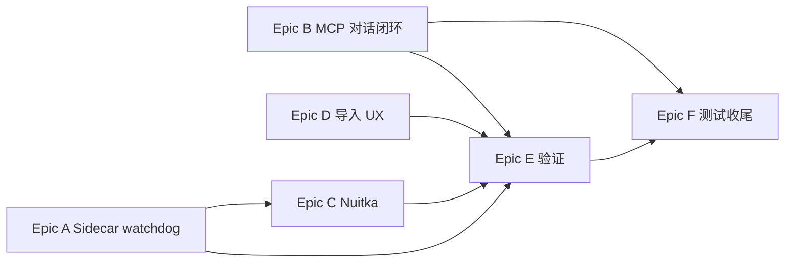

# Phase 3 剩余工作 — 详细 TODO

> **用途：** Phase 3 未完成项的可执行清单（从 [`PHASE_3_DETAILED_PLAN.md`](./PHASE_3_DETAILED_PLAN.md) 审计拆分）。  
> **受众：** 维护者、协作者、AI 辅助开发。  
> **审计基准：** 2026-07-06 代码库（Rust 47 `.rs`、DB Schema v6、Vitest 18、Rust tests 27）  
> **前置：** Phase 0–2 ✅；Phase 3 主体代码已合并，**M2 里程碑未交付**  
> **完成后：** 更新本文勾选状态 → 执行 [`PHASE_3_DETAILED_PLAN.md` §11](./PHASE_3_DETAILED_PLAN.md#11-phase-3-完整验证清单) → 进入 [Phase 4](./PHASE_4_DETAILED_PLAN.md)

---

## 1. Phase 3 交付定义（Definition of Done）

全部满足后方可标记 Phase 3 / M2 完成：

| # | 条件 |
|---|------|
| D1 | Sidecar 就绪后进程被 kill，**≤5s 内自动重启**，连续失败 **3 次** 后进入 Error 且不再自动重试（AC-2、V2、V3） |
| D2 | 对话中连接 MCP Server 后，用户消息可触发 **工具调用全链路**：审批 → 执行 → `ToolCallBlock` 展示 → **重启后会话仍可见** tool_calls（AC-9、AC-10、V12、V16–V19） |
| D3 | `python build_nuitka.py` 产出可独立运行的 Sidecar 二进制，`curl /health` 200；体积/启动时间**写入文档**（AC-15、V27–V30） |
| D4 | 会话导入/导出 E2E 通过；导入后 SessionPanel **自动刷新**（AC-14、V26） |
| D5 | MCP stdio（filesystem）与 HTTP/SSE **至少各 1 次**人工冒烟通过（AC-5、AC-6、V10–V11） |
| D6 | [`PHASE_3_DETAILED_PLAN.md` §11](./PHASE_3_DETAILED_PLAN.md#11-phase-3-完整验证清单) V1–V30 逐项执行并记录结果 |

**预估剩余工时：** 18–24h（含 E2E 验证与修 bug 缓冲）

---

## 2. 缺口总览

| 验收项 | 状态 | 所属 Epic |
|--------|------|-----------|
| AC-1 预热 3s 内就绪 | 🟡 | A（可选优化） |
| AC-2 Sidecar 运行时自动重启 | ❌ | **A** |
| AC-5 stdio MCP E2E | ⚪ | **E** |
| AC-6 HTTP/SSE MCP E2E | ⚪ | **E** |
| AC-9 对话内 Tool Call UI | 🟡 | **B** |
| AC-10 对话内权限审批 | 🟡 | **B** |
| AC-14 导入/导出 | 🟡 | **D** |
| AC-15 Nuitka 打包 | ❌ | **C** |
| TODO-FINAL 全量验证 | ❌ | **E** |

**已交付（无需重复开发）：** AC-3/4/7/8/11/12/13；Sidecar 端点、SidecarClient、MCP Manager/Commands、McpSettings、Session 置顶/归档/分组/搜索、ToolCallBlock/ToolApprovalDialog 组件、Schema v3–v5。

---

## 3. 推荐执行顺序



| 顺序 | Epic | 说明 |
|------|------|------|
| 1 | **A** | Sidecar 可靠性是 M2 底座；与 B 可并行，但应先做 |
| 2 | **B** | Phase 3 最大功能缺口；阻塞 AC-9/10 与 V12/V16–19 |
| 3 | **C** | 可与 B 并行；打包成功后可选改 `SidecarManager` spawn 逻辑 |
| 4 | **D** | 小改动，可在 B 等待 LLM 测试间隙完成 |
| 5 | **E + F** | 全量验证 + 补测试 + 更新 DEVELOPMENT_STATUS |

---

## Epic A：Sidecar 运行时可靠性

> **对应：** 原任务 3.2 · AC-2 · V1–V3 · V5  
> **现状：** `SidecarManager` 仅有**启动阶段**最多 3 次重试（`sidecar.rs:141–194`）；`preheat()` 返回 Ready 后**无 watchdog**；原设计中的 `health_loop()`（§3.2.3）未实现。

### P3-TODO-A1 · Sidecar 运行时 watchdog 循环

| 项 | 内容 |
|----|------|
| **优先级** | P0 |
| **预估** | 3–4h |
| **文件** | `src-tauri/src/sidecar.rs`（主改）、`src-tauri/tests/sidecar_tests.rs`（更新） |

**实现要点：**

1. `start_process` 成功进入 `Ready` 后，额外 `tokio::spawn` 启动 **watchdog 任务**（建议间隔 5s，可配置常量）。
2. 检测逻辑（满足其一即视为失效）：
   - 托管 `Child` 已 exit（`try_wait()`）
   - `GET /health` 失败或超时
3. 失效时：`set_status(Restarting)` → `stop_process()` → 调用现有 `start_process` 逻辑；维护 **运行时** `runtime_restart_count`（与启动重试计数分离）。
4. 运行时重启 **最多 3 次**；超限 → `Error` + 停止 watchdog，**不再自动重启**（对齐 V3）。
5. `shutdown()` / `Drop` 时 cancel watchdog（复用 `shutdown_tx` watch channel）。
6. 单次重启目标：**≤5s** 内恢复 Ready（AC-2）。

**验收：**

- [ ] 应用运行中 `taskkill` Sidecar 进程 → Badge：Ready → Restarting → Ready（≤5s）
- [ ] 连续 kill 4 次 → 第 4 次后 Badge 保持 Error，不再自动重启
- [ ] 手动点击 Error Badge 重启仍可恢复（V4，已有）
- [ ] `auto_start_sidecar: false` 时不 spawn、Badge 为 stopped（V5）

---

### P3-TODO-A2 · Sidecar 启动健康检查调优（可选）

| 项 | 内容 |
|----|------|
| **优先级** | P2 |
| **预估** | 0.5–1h |
| **文件** | `src-tauri/src/sidecar.rs` |
| **依赖** | 无 |

**说明：** 当前 `wait_for_healthy` 为 20×500ms（最坏 10s）。若实机 V1 未满足 AC-1「3 秒内就绪」：

- [ ] 将首次探测间隔改为 200–300ms，或总超时改为 ~6s 内优先返回
- [ ] 记录典型 dev 环境 Ready 耗时到验证记录

---

### P3-TODO-A3 · 修复/扩展 Sidecar 单元测试

| 项 | 内容 |
|----|------|
| **优先级** | P2 |
| **预估** | 1h |
| **文件** | `src-tauri/tests/sidecar_tests.rs` |

**说明：** 现有测试引用已不存在的 `SidecarManager::start()` API，需对齐当前 `SidecarManager::new` + 内部逻辑。

- [ ] 移除或改写 stale 测试
- [ ] 新增纯逻辑测试：`health_check_url`、状态枚举序列化（若提取 helper）
- [ ] （可选）mock 子进程 exit 的 watchdog 计数测试

---

## Epic B：Rig 对话内 MCP 工具闭环

> **对应：** 原任务 3.8.4、3.9.4、3.10（对话路径）· AC-9/10 · V12、V16–V19  
> **现状：**
> - `chat.rs` 仅 `McpToolBridge::tool_descriptions()` 注入 system prompt
> - `McpToolBridge::call_tool` 已实现但**对话流未调用**
> - 前端 `use-stream-listener.ts` 已监听 `stream:tool_call` / `stream:tool_result`，**Rust 未 emit**
> - `MessageRepo` **无** `update_tool_calls`；流式 tool 状态**不会持久化**

### P3-TODO-B1 · 抽取 MCP 审批逻辑为可复用模块

| 项 | 内容 |
|----|------|
| **优先级** | P0 |
| **预估** | 1.5h |
| **文件** | 新建 `src-tauri/src/services/mcp/approval.rs` 或扩展 `mcp_bridge.rs`；改 `commands/mcp.rs` |

**任务：**

- [ ] 将 `mcp_call_tool` 中的 `request_user_approval` + policy 查询抽成 `McpApprovalService`（或 `mcp_bridge` 方法）
- [ ] 签名示例：`async fn ensure_tool_allowed(app, state, server_id, tool_name, args) -> Result<bool, String>`
- [ ] `mcp_call_tool` command 改为调用共享模块（行为不变）
- [ ] 为共享模块添加单元测试（policy allow/deny/ask 三分支）

---

### P3-TODO-B2 · 定义流式 Tool Event Payload（Rust）

| 项 | 内容 |
|----|------|
| **优先级** | P0 |
| **预估** | 0.5h |
| **文件** | `src-tauri/src/services/llm/streaming.rs` |
| **依赖** | 无 |

**任务：** 在 `streaming.rs` 增加与前端 `use-stream-listener.ts` **字段一致**的结构体：

```rust
// 对齐前端 StreamToolCallEvent / StreamToolResultEvent
pub struct StreamToolCallPayload { /* session_id, message_id, tool_call_id, server_id, server_name, tool_name, arguments, status */ }
pub struct StreamToolResultPayload { /* session_id, message_id, tool_call_id, result, error, status */ }
```

- [ ] 提供 `emit_tool_call` / `emit_tool_result` helper（内部 `app.emit("stream:tool_call", …)`）

---

### P3-TODO-B3 · MessageRepo 持久化 tool_calls

| 项 | 内容 |
|----|------|
| **优先级** | P0 |
| **预估** | 1h |
| **文件** | `src-tauri/src/db/repository/message_repo.rs`、`src-tauri/tests/message_repo_tests.rs` |

**任务：**

- [ ] 新增 `update_tool_calls(conn, msg_id, tool_calls_json: &str)`
- [ ] 可选：扩展 `update_assistant_content` 增加 `tool_calls` 参数，在 `chat.rs` finalize 时一并写入
- [ ] 确保 `import_sessions` / export 已含 `tool_calls` 字段（export 路径已有列，验证 round-trip）
- [ ] 单元测试：写入 JSON → 读出 → 反序列化

---

### P3-TODO-B4 · Rig 对话 Tool 执行循环（核心）

| 项 | 内容 |
|----|------|
| **优先级** | P0 |
| **预估** | 5–7h |
| **文件** | `src-tauri/src/commands/chat.rs`、`services/llm/backend.rs` 或新建 `services/mcp/tool_loop.rs`、`services/mcp_bridge.rs` |
| **依赖** | B1、B2、B3 |

**设计约束（Phase 3 范围）：**

- 继续使用 **Rig 直调**（非 Sidecar）；与 Phase 4 DeepAgents 工具协议解耦
- 工具发现依赖已连接 MCP Server；无 Server 时行为与现在相同（纯文本对话）
- 审批 UX 复用现有 `mcp:tool_call_request` + `ToolApprovalDialog`（ChatView 已监听）

**建议实现步骤：**

1. **解析 LLM 输出中的工具请求**  
   - 当前 prompt 引导模型输出 JSON block（见 `mcp_bridge.rs` `tool_descriptions`）  
   - 在 `StreamSession` 完成一轮文本流后，尝试从 accumulated content 解析 tool call（JSON / fenced code block）  
   - 解析失败则视为普通 assistant 回复结束

2. **Tool 执行循环**（伪代码级）  
   ```
   loop (max N rounds, e.g. 5):
     stream LLM reply
     if no tool call parsed: break
     emit stream:tool_call (status pending → running)
     approval = ensure_tool_allowed(...)
     if denied: emit stream:tool_result (denied); break
     result = mcp_bridge.call_tool(...)
     emit stream:tool_result (complete)
     append tool result to chat history (user/tool message)
     continue loop for model to consume result
   ```

3. **持久化**  
   - 循环结束后将 `Vec<ToolCallRecord>` 序列化为 JSON 写入 `messages.tool_calls`  
   - finalize assistant `content` 为最后一轮可见文本（或保留 tool 摘要，与 UI 设计一致）

4. **与 abort 协作**  
   - `stop_generation` 时中断 tool loop，标记 running tool 为 error/aborted

**验收：**

- [ ] 配置 filesystem MCP + 连接成功后，对话「读取 package.json 前 10 行」类请求触发 ToolCallBlock
- [ ] 首次调用弹出 ToolApprovalDialog；「始终允许」后同工具不再弹窗
- [ ] 刷新会话 / 重开应用后 tool_calls 仍显示（DB 持久化）
- [ ] V12、V16–V19 人工通过

---

### P3-TODO-B5 · 前端 IPC 类型与 get_messages 反序列化

| 项 | 内容 |
|----|------|
| **优先级** | P1 |
| **预估** | 1h |
| **文件** | `src/lib/ipc/types.ts`、`src/lib/ipc/chat.ts` 或 messages 映射层 |
| **依赖** | B3 |

**任务：**

- [ ] 确认 `get_messages` 返回的 `Message.tool_calls`（DB JSON 字符串）在前端 parse 为 `ToolCall[]`
- [ ] `loadMessages` 后 MessageItem 能渲染历史 tool_calls
- [ ] 补充 Vitest：`chat-store` tool_calls 持久化加载

---

## Epic C：Nuitka Sidecar 打包验收

> **对应：** 原任务 3.15 · AC-15 · V27–V30  
> **现状：** `agent/run.py`、`agent/build_nuitka.py` 已有；仓库无 `agent/dist/`；`SidecarManager` 固定 spawn `python -m uvicorn …`

### P3-TODO-C1 · 本地执行 Nuitka 打包

| 项 | 内容 |
|----|------|
| **优先级** | P1 |
| **预估** | 1.5–2h |
| **文件** | `agent/build_nuitka.py`（按需修参数） |

**步骤：**

```bash
cd agent
pip install nuitka
python build_nuitka.py --clean
```

- [ ] 构建 exit 0，产物位于 `agent/dist/misaka-agent.exe`（Windows）或等价名
- [ ] 独立运行：`misaka-agent.exe`（或指定 `--port 9527`）
- [ ] `curl http://127.0.0.1:9527/health` → 200 + 结构化 JSON

---

### P3-TODO-C2 · 记录打包指标

| 项 | 内容 |
|----|------|
| **优先级** | P1 |
| **预估** | 0.5h |
| **文件** | 本文 §6 验证记录表，或 `docs/guides/sidecar-nuitka-build.md`（若需长期保留） |

- [ ] 记录：文件大小（MB）、冷启动到 /health 200 的秒数、Python 版本、Nuitka 版本
- [ ] 若体积 >80MB，记录可选 `--nofollow-import-to` 优化项（不必 Phase 3 全做）

---

### P3-TODO-C3 · SidecarManager 优先 spawn 打包二进制（可选）

| 项 | 内容 |
|----|------|
| **优先级** | P2 |
| **预估** | 1–2h |
| **文件** | `src-tauri/src/sidecar.rs` |
| **依赖** | C1 |

**任务：**

- [ ] 在 `agent/dist/` 或 exe 同级目录探测 `misaka-agent(.exe)`
- [ ] 存在则 spawn 二进制；否则回退 `python -m uvicorn`（dev 模式）
- [ ] dev / release 行为文档化

---

## Epic D：会话导入 UX 补全

> **对应：** 原任务 3.14 · AC-14 · V26  
> **现状：** 导出：SessionItem 右键 + About 批量导出 ✅；导入：仅 `AboutSettings` ✅ 但导入后 **SessionPanel 未刷新**

### P3-TODO-D1 · 导入后会话列表刷新

| 项 | 内容 |
|----|------|
| **优先级** | P2 |
| **预估** | 0.5h |
| **文件** | `src/pages/settings/AboutSettings.tsx`、`src/stores/chat-store.ts` 或 SessionPanel refresh 回调 |

- [ ] `importSessions` 成功后触发 SessionPanel reload（Zustand action / event / navigate chat）
- [ ] Toast 显示 imported/skipped 计数（已有，确认仍生效）

---

### P3-TODO-D2 · SessionPanel 导入入口（可选，对齐原计划）

| 项 | 内容 |
|----|------|
| **优先级** | P3 |
| **预估** | 1h |
| **文件** | `src/components/chat/session/SessionPanel.tsx`、`src/locales/*/chat.json` |

**说明：** 原计划 §6.3.4 在 Settings 导入已满足 AC-14 功能面；若希望会话栏也可导入：

- [ ] SessionPanel 底部或菜单增加「导入会话」
- [ ] 复用 AboutSettings 的 dialog + `sessionsIpc.importSessions` 逻辑（抽 shared hook 避免重复）

---

### P3-TODO-D3 · 导入预览（可选）

| 项 | 内容 |
|----|------|
| **优先级** | P3 |
| **预估** | 1–2h |
| **文件** | 新建 preview command 或前端读文件 JSON 摘要 |

原计划 §6.3.4 提到「预览 → 确认导入」。当前为直接导入。

- [ ] （可选）导入前展示 session 数量 / 标题列表确认 Dialog

---

## Epic E：端到端验证与冒烟

> **对应：** §11 V1–V30 · AC-5/6 · TODO-FINAL

### P3-TODO-E1 · Sidecar 验证 V1–V5

| 项 | 内容 |
|----|------|
| **优先级** | P1 |
| **预估** | 0.5h |
| **依赖** | Epic A 完成 |

使用 [`PHASE_3_DETAILED_PLAN.md` §11.1](./PHASE_3_DETAILED_PLAN.md#111-sidecar-预热验证) 逐项勾选并记录日期/环境。

---

### P3-TODO-E2 · MCP 冒烟 V10–V11

| 项 | 内容 |
|----|------|
| **优先级** | P1 |
| **预估** | 1h |

**stdio 示例：**

```json
// ~/.misakax/mcp.json
{
  "mcpServers": {
    "filesystem": {
      "command": "npx",
      "args": ["-y", "@modelcontextprotocol/server-filesystem", "D:/code/Misaka-Tauri"],
      "autoConnect": true
    }
  }
}
```

- [ ] V10：Settings → MCP 连接成功，工具列表非空
- [ ] V11：配置一远程 Streamable HTTP MCP（若有测试实例）；否则记录「暂无远程实例，跳过」

---

### P3-TODO-E3 · 对话 Tool 验证 V12、V16–V19

| 项 | 内容 |
|----|------|
| **优先级** | P0（验收） |
| **预估** | 1h |
| **依赖** | Epic B 完成 |

- [ ] 按 §11.3–11.4 执行并记录

---

### P3-TODO-E4 · 会话与 Nuitka 验证 V21–V30

| 项 | 内容 |
|----|------|
| **优先级** | P1 |
| **预估** | 1h |
| **依赖** | Epic C、D |

- [ ] V21–V25 回归（应已通过，确认无回归）
- [ ] V26 导入 E2E
- [ ] V27–V30 Nuitka

---

### P3-TODO-E5 · TODO-FINAL 收尾

| 项 | 内容 |
|----|------|
| **优先级** | P0（关门） |
| **预估** | 1h |

- [ ] 更新 [`DEVELOPMENT_STATUS.md`](../project/DEVELOPMENT_STATUS.md)：Phase 3 → ✅，M2 → ✅
- [ ] 更新 [`PHASE_3_DETAILED_PLAN.md`](./PHASE_3_DETAILED_PLAN.md) 审计状态为「已交付」
- [ ] 将本文所有 `- [ ]` 勾选为完成或移至归档节
- [ ] 确认 Phase 4 前置条件（Sidecar 协议、MCP 桥接、Tool UI）就绪

---

## Epic F：测试与质量

### P3-TODO-F1 · Rust 集成测试 — Sidecar watchdog

| 项 | 内容 |
|----|------|
| **优先级** | P2 |
| **预估** | 1–2h |
| **依赖** | A1 |

- [ ] 尽可能覆盖 runtime restart 计数逻辑（可提取纯函数便于测试）

---

### P3-TODO-F2 · Rust 集成测试 — Tool loop

| 项 | 内容 |
|----|------|
| **优先级** | P2 |
| **预估** | 2h |
| **依赖** | B4 |

- [ ] mock MCP manager + 假 LLM 输出 JSON tool call → 验证 emit 事件序列与 DB 写入

---

### P3-TODO-F3 · 前端 Vitest — tool stream

| 项 | 内容 |
|----|------|
| **优先级** | P2 |
| **预估** | 1h |
| **依赖** | B4、B5 |

- [ ] 扩展 `use-stream-listener` / `chat-store` 测试：模拟 `stream:tool_call` + `stream:tool_result`

---

## 6. 验证执行记录表

> 完成 Epic E 时填写。复制到 PR 或 commit 说明。

| ID | 日期 | 执行人 | 环境 | 结果 | 备注 |
|----|------|--------|------|------|------|
| V1 | | | Win/macOS/Linux | ☐ Pass ☐ Fail | |
| V2 | | | | ☐ Pass ☐ Fail | |
| V3 | | | | ☐ Pass ☐ Fail | |
| V4 | | | | ☐ Pass ☐ Fail | |
| V5 | | | | ☐ Pass ☐ Fail | |
| V6–V9 | | | | ☐ Pass ☐ Fail | |
| V10 | | | | ☐ Pass ☐ Fail ☐ Skip | |
| V11 | | | | ☐ Pass ☐ Fail ☐ Skip | |
| V12 | | | | ☐ Pass ☐ Fail | |
| V13–V15 | | | | ☐ Pass ☐ Fail | |
| V16–V20 | | | | ☐ Pass ☐ Fail | |
| V21–V26 | | | | ☐ Pass ☐ Fail | |
| V27–V30 | | | | ☐ Pass ☐ Fail | |

**Nuitka 指标（V30）：**

| 指标 | 值 |
|------|-----|
| 产物路径 | |
| 体积 (MB) | |
| 冷启动到 /health (s) | |
| Nuitka 版本 | |

---

## 7. TODO 索引（按 ID）

| ID | 标题 | 优先级 | 预估 |
|----|------|--------|------|
| P3-TODO-A1 | Sidecar 运行时 watchdog | P0 | 3–4h |
| P3-TODO-A2 | 启动健康检查调优 | P2 | 0.5–1h |
| P3-TODO-A3 | Sidecar 单元测试修复 | P2 | 1h |
| P3-TODO-B1 | MCP 审批逻辑抽取 | P0 | 1.5h |
| P3-TODO-B2 | 流式 Tool Event Payload | P0 | 0.5h |
| P3-TODO-B3 | MessageRepo tool_calls 持久化 | P0 | 1h |
| P3-TODO-B4 | Rig 对话 Tool 执行循环 | P0 | 5–7h |
| P3-TODO-B5 | 前端 tool_calls 反序列化 | P1 | 1h |
| P3-TODO-C1 | Nuitka 本地打包 | P1 | 1.5–2h |
| P3-TODO-C2 | 打包指标记录 | P1 | 0.5h |
| P3-TODO-C3 | Sidecar spawn 二进制 | P2 | 1–2h |
| P3-TODO-D1 | 导入后刷新会话列表 | P2 | 0.5h |
| P3-TODO-D2 | SessionPanel 导入入口 | P3 | 1h |
| P3-TODO-D3 | 导入预览 | P3 | 1–2h |
| P3-TODO-E1–E5 | E2E 验证与 FINAL | P0–P1 | 4–5h |
| P3-TODO-F1–F3 | 自动化测试 | P2 | 4–5h |

---

## 8. 相关文档

| 文档 | 关系 |
|------|------|
| [`PHASE_3_DETAILED_PLAN.md`](./PHASE_3_DETAILED_PLAN.md) | Phase 3 完整方案与背景设计 |
| [`PHASE_4_DETAILED_PLAN.md`](./PHASE_4_DETAILED_PLAN.md) | Phase 3 完成后进入 |
| [`DEVELOPMENT_STATUS.md`](../project/DEVELOPMENT_STATUS.md) | 项目总进度 |

---

**最后审阅 / Last reviewed:** 2026-07-06
