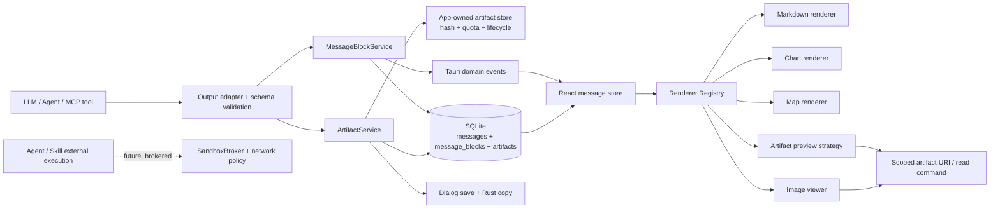

# 富内容与产物交付总体实施方案

> **用途：** 定义聊天富内容能力的目标架构、实施顺序、边界和验收标准。
> **受众：** 产品、架构、全栈开发和安全维护者。
> **最后审阅 / Last reviewed：** 2026-08-09
> **状态：** R0–R4 已实现并通过远程 CI；R5、R6 仍作为后续计划。本文件保留总体基线与验收方向。

---

## 1. 目标与范围

用户与 Agent 对话时，助手回复除 Markdown 外还应能在聊天流内显示并操作：

1. 统计图：柱状、折线、面积、散点、饼/环、条形、指标卡及可访问的数据表替代。
2. 地图：首期显示结构化点、线、面、GeoJSON 和视口；后续支持受控瓦片与交互。
3. 生成文件：在应用内预览支持的格式，并将原始文件保存到用户指定位置。
4. 全模态模型图片：展示、放大和下载模型生成的图片。
5. 保持已有 Markdown、代码、表格、Mermaid、数学公式、工具调用、流式显示、会话分页/导入导出行为不回退。

首期不做任意网页嵌入、任意 JavaScript 图表、远程 Office 在线查看器、云端文件托管或通用文件管理器。这些选项会扩大 WebView、网络和隐私攻击面，不能作为“在线查看”的默认实现。

## 2. 当前基线与主要缺口

| 层 | 已有能力 | 富内容缺口 |
|---|---|---|
| React | `Streamdown` 已渲染 Markdown、Mermaid、数学公式；`MessageItem` 已展示用户图片附件 | 助手消息只有 `content: string`；没有可插拔块渲染、产物工具栏、文件预览或图片输出状态 |
| 流式事件 | `stream_token`、`stream_thinking`、`stream_complete`、工具事件 | 只能推送文本增量；没有块完成、产物就绪、预览失败等事件 |
| Rust/SQLite | `messages` 保存正文、附件 JSON、思考和工具调用；自定义 `fs_*` command 已有工作区 root containment | 没有产物身份、内容哈希、生命周期、预览派生物、授权下载、保留策略和块顺序 |
| 模型链路 | Rig 具备图片输入；Sidecar 已预留流式协议 | 未把模型/工具的图表、地图、文件、图片标准化为可验证的输出契约 |
| 安全 | 主 WebView 已取消通用 FS/HTTP/Shell 权限，CSP 为本地严格策略 | 需要为受控本地产物增加窄 URI/asset 范围；不能重新打开宽权限 |

以上判断来自当前 `src/lib/ipc/types.ts`、`use-stream-listener.ts`、`services/llm/backend.rs`、`MessageItem.tsx`、`fs_explorer.rs`、`tauri.conf.json` 的实际代码；详细证据见 [08-research-sources.md](./08-research-sources.md)。

## 3. 总体决策

### 3.1 用“内容块”替代 Markdown 指令和中间件链

采用版本化的 `ContentBlock` 判别联合，而不是让模型在 Markdown 中嵌入自定义 HTML、代码围栏约定或任意 JSON。每个 assistant 消息按顺序包含 `markdown`、`chart`、`map`、`artifact`、`image`、`notice` 等块；未知版本或未知类型必须安全降级为提示卡和原始元数据下载，不执行内容。

前端采用 **Renderer Registry（注册表）** 按块类型寻找渲染器；每个渲染器只接收已验证 DTO。相比 middleware，中间件更适合处理请求/响应横切流程，不能自然表达“消息中第 N 个独立可持久化对象”的生命周期、重试、无障碍替代和懒加载。

### 3.2 用受控 ArtifactService 管理所有二进制与文件

图像、生成文件、预览缩略图、PDF 页面位图等不进入 `messages.content`，也不把完整 Base64 长期塞进消息 JSON。Rust 侧的 `ArtifactService` 负责：接收、配额与 MIME 侦测、内容哈希、原子落盘、预览任务、读取授权、导出保存、清理和审计。消息只持久化 `artifact_id` 和不可变摘要。

### 3.3 首期选择“安全数据渲染”，不执行模型生成代码

- 图表接收受限的、无函数的规范化数据/编码，而不是原生 ECharts `Option` 或 HTML/JavaScript。
- 地图首期接收 GeoJSON/marker 的数据子集；瓦片来源只能引用管理员/用户已配置的 `tile_source_id`，不能由模型给出任意 URL。
- 文件预览按 MIME Strategy 选择本地解析器；不调用在线 Office Viewer，也不把用户文件上传到第三方。
- 图片仅放行 raster MIME（PNG/JPEG/WebP/GIF）；SVG/HTML 等活跃内容默认作为下载文件，不内联到主聊天 WebView。

### 3.4 把“显示安全”与“执行 Sandbox”分层

受控文件存储、WebView URI 范围、CSP、内容 schema 和解析资源限制是本功能必需的 **内容安全面**。完整 OS Sandbox 是执行面：当 Agent、Skill 或 MCP 运行外部命令、复杂转换器或不可信二进制时，后续必须接入现有 `SandboxBroker`。二者不能互相替代。

## 4. 目标架构

## 5. 推荐实施顺序

| 阶段 | 可见交付 | 关键依赖 | 是否阻塞完整 Sandbox |
|---|---|---|---|
| R0 | 统一 DTO、Schema、迁移、feature flag、安全测试基线 | 现有聊天回归测试 | 否 |
| R1 | 文件/图片产物的可靠保存、展示元数据、下载 | ArtifactService、窄 IPC/URI | 否 |
| R2 | PDF、文本、表格等本地预览与失败回退 | 解析器 Strategy、资源限制 | 否；高风险转换器后接 Sandbox |
| R3 | 受限图表块、数据表替代、导出 | Renderer Registry、ECharts adapter | 否 |
| R4 | 静态 GeoJSON 地图；受控瓦片试点 | Map renderer、地图数据策略 | 否；远程瓦片需网络/CSP policy |
| R5 | Sidecar/Agent/MCP 规范化产出、权限与审计 | Phase 4 对话迁移、MCP loop | 部分依赖现有 Sandbox 计划 |
| R6 | 安全加固、跨平台验证、清理和发布 | R0–R5、Sandbox 平台能力 | 是，涉及外部执行时 |

详细工作包与退出条件在 [01-phased-module-practice-plan.md](./01-phased-module-practice-plan.md)。

## 6. 文件系统与 Sandbox 结论

### 6.1 是否需要文件系统能力

需要，但必须限定为 **Rust Core 的应用专属产物目录** 与 **用户显式选择的导出路径**：

- Rust 可使用 `std::fs`/`tokio::fs`，并通过自定义 command 验证 `artifact_id`、会话归属、大小、哈希、允许 MIME 和保存目标。
- React 不安装 `@tauri-apps/plugin-fs`，不获得 `$HOME`、工作区或任意路径 read/write scope。
- WebView 展示通过 scoped `asset:` 或自定义 `misakax-artifact:` URI；路径不能来自模型或前端字符串。
- 工作区中由 Agent 创建的文件先快照/复制入产物目录，再作为 Artifact 引用；不得向 WebView 暴露工作区原始路径。

### 6.2 是否需要 Sandbox

不需要把完整 OS Sandbox 作为上述静态展示的上线门槛；它不能解决 HTML/XSS、错误 MIME、解压炸弹或 WebView 权限问题。需要在计划中新增以下衔接：

- R0 建立 `ContentSafetyPolicy`，包含文件大小、类型、解析时间/页数、像素、嵌套压缩和 URI 授权。
- R2 对 CPU/内存密集或原生二进制转换器采用独立受限 worker；在 Sandbox Provider 可用前，不可用时应拒绝预览并保留下载。
- R5/R6 将 Agent/Skill/MCP 的外部生成过程接入 `SandboxBroker`；网络地图瓦片走受控 provider/broker，不让 WebView 任意直连。

完整矩阵与理由见 [05-filesystem-and-sandbox-research.md](./05-filesystem-and-sandbox-research.md)。

## 7. 成功标准

1. 旧消息和纯 Markdown 消息渲染无变化，新块在流式与历史加载中顺序稳定。
2. 所有可下载产物有 ID、原文件名、MIME、字节数、SHA-256、创建来源和保留状态；导出后校验哈希一致。
3. 主 WebView 不拥有通用文件系统、HTTP 或 Shell 权限；错误 ID、路径猜测和任意 `file:` URL 均不能读取产物。
4. 图表和地图只渲染结构化数据；模型输出的脚本、远程 iframe、任意 tile URL 和内联 SVG 不能执行。
5. 每个图表提供可访问摘要和表格数据；地图提供要素列表/坐标文本；所有操作可键盘触达。
6. 大文件、未知 MIME、损坏文件、解析超时、磁盘不足、过期引用均以可理解的本地化错误降级，不导致会话丢失或崩溃。
7. Agent/MCP 产物的来源、用户导出和策略拒绝均进入结构化审计；涉及外部程序时符合既有 Sandbox 策略。

## 8. 风险与非目标

| 风险 | 策略 |
|---|---|
| 模型返回伪造/恶意结构 | 只接收工具/adapter 产出的 schema；Rust 再验证；未知块 fail closed |
| Base64/大 JSON 使 SQLite、导出和滚动变慢 | 二进制离库；块/预览懒加载；内容哈希去重与配额 |
| 文件解析器遭遇畸形文件或资源耗尽 | 类型 allowlist、魔数检测、页/行/像素/时间上限；必要时 worker + Sandbox |
| 地图瓦片带来隐私、密钥和 CSP 扩张 | 静态 GeoJSON 优先；受控 tile source、Rust broker、缓存和 attribution |
| 组件注册表沦为散乱 if/else | 明确渲染器端口、能力声明、契约测试与 feature flag |
| 直接修改既有 `content` 造成历史损坏 | 新表/dual-read/dual-write，迁移完成后再切换读路径 |

## 9. 决策门

开始 R1 前必须确认：受控 URI 选择（窄 `asset:` scope 或自定义协议）和产物存储保留策略。

开始 R2 前必须确认：首期预览 MIME allowlist、单文件/会话/总量配额及 PDF/Office 解析方案许可证。

开始 R4 前必须确认：是否有合法的地图数据/瓦片服务、隐私提示、attribution、缓存上限和在线/离线行为。

开始 R5 前必须确认：Sidecar 已从 501 占位迁移至真实对话链路；外部执行是否已满足 Sandbox Provider 的对应平台 gate。
