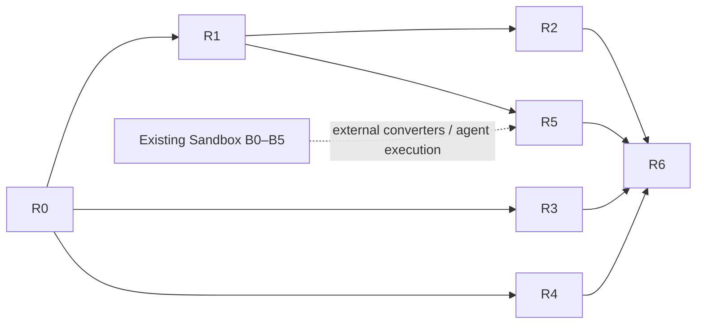

# 富内容与产物交付：分模块分阶段实践方案

> **用途：** 将总体方案拆为可独立验收、可回滚的实施工作包。
> **受众：** 实施开发者、测试和 AI Coding Agent。
> **最后审阅 / Last reviewed：** 2026-08-09
> **状态：** R0–R4 已按阶段门禁完成；R5、R6 保持后续规划。实现和 CI 证据见 [实施过程记录](./06-implementation-log.md) 与 [R0–R4 交接](./09-r0-r4-handoff.md)。

---

## 0. 全局实施规则

- 每一阶段先补特征/契约测试，再添加 DTO、迁移和调用点；不要先大规模移动现有聊天文件。
- 任何数据库迁移必须向前兼容：旧 `messages.content` 仍可读，导入/导出在过渡期不得静默丢失块或附件。
- `artifact_id` 是唯一跨层引用；前端、模型、工具和 URI 不传宿主绝对路径。
- 所有二进制、解析、下载、预览均通过 Rust application service；React 只请求 metadata、一次性预览 URL 或显式 download/export command。
- 每一个新事件携带 `message_id`、`block_id`、`generation`/`revision`；前端丢弃已重生成、已删除或不属于当前会话的迟到事件。
- 每个阶段完成后先通过代码审查和全部相关本地测试，再更新 [实施过程记录](./06-implementation-log.md)、提交并非强制推送当前阶段；只有远程仓库 required CI 全绿且所需 reviewer 已批准，才能启动下一阶段。完整门禁见 [AI Coding 执行说明 §7](./07-ai-coding-execution-guide.md#7-阶段完成门禁代码审查本地验证git-与远程-ci)。
- 涉及 UI 时同步项目 `docs/design/` 规范；远程 CI 失败或不可查询时，当前阶段保持未完成，按执行说明处理。

## R0：契约、安全基线与可迁移数据模型

### 目标

在不改变现有用户界面的前提下，定义统一内容块和产物领域模型，为后续模块提供稳定边界。

### 工作包

1. 在 Rust 领域层定义 `ContentBlock`、`ArtifactRecord`、`ArtifactOrigin`、`PreviewStatus`、`ContentSafetyPolicy` 和稳定错误码。
2. 在 `src/lib/ipc/` 定义同构 TypeScript DTO；用判别联合和 exhaustive switch，禁止以 `any`/字符串约定解析块。
3. 新增数据库迁移：`message_blocks`（message、顺序、类型、schema version、payload JSON、状态）和 `artifacts`（身份、元数据、哈希、存储 key、来源、保留信息），并为 message/artifact 建索引。
4. 在导入/导出模型加入 `blocks` 和 `artifact_manifest`，旧数据仍从 `content` 和 `attachments` 恢复为兼容块。
5. 新增 feature flag：默认关闭新块写入/渲染；实现 dual-read，暂不删除旧字段。
6. 建立安全测试样本：路径穿越、错误 MIME、伪造扩展名、超限 payload、未知块类型、过期/越权 artifact ID。

### 建议代码落点

| 层 | 建议新增/调整位置 |
|---|---|
| Rust domain/application | `src-tauri/src/services/content/`、`services/artifacts/`，后续稳定后再按现有架构计划移动 |
| DB | `src-tauri/src/db/migrations.rs`、`db/models.rs`、`db/repository/message_repo.rs`，新增 block/artifact repository |
| IPC | `src/lib/ipc/types.ts`、新增 `src/lib/ipc/artifacts.ts`；保持 `chat.ts` 兼容包装 |
| 测试 | `src/__tests__/rich-content-*`、`src-tauri/tests/rich_content_*` |

### 验收与回滚

- 旧会话、搜索、重新生成、导入/导出、纯 Markdown 流式测试全绿。
- 插入未知块不崩溃，展示受控“暂不支持”状态；任何非法 artifact ID 被拒绝。
- feature flag 关闭时只走旧消息读写路径；迁移可保留数据且无二进制 blob 写入 `messages.content`。

## R1：ArtifactService、图片输出与可靠下载

### 目标

先形成最小闭环：Agent/工具可产生受控图片或文件，消息显示产物卡，用户可保存下载。

### 工作包

1. 实现应用专属 artifact store：临时文件写入、magic bytes/MIME 检查、SHA-256、原子 rename、大小/总量配额、引用计数或保留时间。
2. 实现 `artifact_register`、`artifact_get_metadata`、`artifact_export`、`artifact_delete_or_expire` application use case；导出只能通过 `dialog:allow-save` 选择目标后由 Rust copy，不能让 WebView 写路径。
3. 选择窄资源通道：优先评估仅暴露 artifact root 的 `asset:` scope；如需按 session/revision 鉴权或 range 请求，改为异步 `misakax-artifact:` URI protocol。无论哪种方案都不得接受任意绝对路径。
4. 增加 `image` 与通用 `artifact` 块；助手图片支持 PNG/JPEG/WebP/GIF 的缩略图、原始尺寸查看、另存为和错误占位。
5. 图片由 provider adapter 或受控工具注册后再写块；不把模型返回的 URL 直接赋给 ``，也不内联 SVG。
6. 实现清理/磁盘满/哈希不匹配/文件缺失的稳定错误反馈和审计事件。

### 测试重点

- 导出的字节数/哈希与库存档一致；取消保存不产生垃圾文件。
- SVG、HTML、伪造 `image/png`、超像素/超大图片不能进入主聊天预览。
- 一条会话不能读取另一条会话的未公开预览 URI；已删除/过期 ID 不可复用。
- 现有用户图片输入附件仍可显示、可随历史重放给模型。

## R2：文件预览模块

### 目标

支持常见生成文件的就地查看与下载，并且“无法安全预览”始终可退化为下载。

### 首期 MIME allowlist

| 格式 | 展示方式 | 说明 |
|---|---|---|
| `text/plain`、Markdown、JSON、CSV | 虚拟化文本/表格预览 | 限制行数、单行长度、总字符数；支持原始下载 |
| PDF | 本地 PDF.js viewer/受控页面 | 限制页数、文件大小与渲染并发；不使用 `file:` |
| XLSX | 本地二进制解析为受限表格 | 首期只读、sheet 切换和表格虚拟化；公式不执行 |
| DOCX | 本地转换为安全文档片段或仅文本预览 | 不加载远程资源、宏或嵌入对象；效果不等同 Word |
| 其他/压缩包/可执行文件 | metadata + 下载 | 默认不预览 |

### 工作包

1. 定义 `Previewer` Strategy：`canPreview(metadata)`、`prepare(artifact)`、`getViewModel()`、`dispose()`；注册表按 MIME + magic bytes 选择，而非后缀。
2. 预览任务与主聊天列表分离：点击后懒加载，显示可取消进度；取消/离开会话时中止并释放对象 URL/worker。
3. 对 CSV/XLSX/DOCX/PDF 应用页数、行列、解压、时间、内存与并发限制；输出只保留受限 preview derivative，不保存任意解析脚本。
4. R2 初期禁用 HTML、SVG、Office 宏、嵌入对象、任意 iframe 和远端图片；若未来支持，必须先完成独立 renderer sandbox 设计评审。
5. 预览面板可在聊天卡内展开，也可使用受限的二级 `Dialog`；不新建拥有主窗口 capability 的通用远程 webview。

### 退出门

- 受支持格式可预览，任意失败均可下载原件。
- 损坏、加密、超限、压缩炸弹、超时文件不使主进程/聊天列表崩溃。
- UI 清楚区分“预览副本”“原文件”“仅下载”；不承诺编辑或完全保真。

## R3：统计图模块

### 目标

以结构化数据渲染可靠、可访问的统计图，并与 Markdown 表格互补。

### 工作包

1. 定义 `ChartSpec v1`，只包含图表类型、标题/说明、维度、数值数据、编码、排序、单位、色板语义和可选注释；禁止函数、任意 HTML formatter、任意外部资源 URL。
2. 新增 `chart` 块的 schema validator 与 `ChartRenderer`；渲染器把 `ChartSpec` 编译为 ECharts option，而不是把 provider 原样 option 透传。
3. 首期实现 line/bar/area/scatter/pie/metric 六类，控制 series/point/label 上限，超限自动转为聚合/表格提示。
4. 必须加载 ECharts ARIA 组件，给每张图提供简短文本摘要、隐藏/展开的数据表、键盘可达的导出和重置视图。
5. 图片导出在客户端从已验证 SVG/canvas 生成；数据导出走 ArtifactService 创建 CSV，而非直接拼页面 DOM。
6. 通过“生成图表”工具/adapter 写入 spec；模型无法直接在 Markdown 中构造带脚本的图。

### 验收

- 同一 spec 在重新打开、导入会话、深浅主题和窗口大小变化后语义一致。
- 色盲、屏幕阅读器、键盘用户可得到与视觉图等价的关键数据。
- 过大/非法 spec 或图表库加载失败时降级到数据表/notice，不影响整条消息。

## R4：地图模块

### 目标

先实现不扩张网络权限的地图数据展示，再谨慎加入受控在线瓦片。

### 工作包

1. 定义 `MapSpec v1`：GeoJSON FeatureCollection、marker、bounds、初始视角、只读 label/属性和 attribution；禁止 JS 表达式、任意 HTML popup、`file:` 与模型给出的 tile URL。
2. 实现 `MapRenderer`，动态加载 MapLibre GL JS，并以 WebGL unavailable/地图数据错误/超要素数为可恢复状态。
3. R4a 仅使用本地 GeoJSON + 明确的基础底图策略；保存地图的静态视图/数据导出通过 ArtifactService。
4. R4b 如产品确认在线瓦片，创建 `TileSourceRegistry`（ID、许可、attribution、允许域、密钥来源、缓存与离线策略），请求经 Rust broker/custom URI 代理；不把宽 `https:` 加入主 WebView CSP。
5. 补充坐标文本、要素列表和“复制坐标/导出 GeoJSON”替代交互；定位用户当前位置必须单独征得用户权限，不由模型触发。

### 验收

- 地图数据没有网络时仍能给出正确要素信息或降级提示。
- 未登记瓦片源、任意 URL、过大 GeoJSON、跨会话 URI 都被拒绝。
- 每张地图都有 attribution、文本等价信息和键盘控制说明。

## R5：Agent、Sidecar、MCP 和执行安全整合

### 目标

让所有生成路径以同一规范写入块/产物，不让 provider 差异泄漏进前端。

### 工作包

1. 在 Rust provider 和 Python Sidecar 建立 `RichOutputAdapter`：将多家模型的文本、图像、工具结果转换为 canonical blocks；所有产物先注册后引用。
2. 为 Agent 提供窄工具：`present_chart`、`present_map`、`create_artifact`、`attach_image`；工具入参是 schema，不能接收 URI、宿主路径、HTML 或代码。
3. 扩展 SSE/Tauri 事件为 block lifecycle：`stream:block_started`、`stream:block_ready`、`stream:block_failed`；保留现有 token/thinking/complete 事件兼容。
4. MCP 工具结果先经过 Artifact ingress policy、来源标记和用户权限；未经批准的 MCP 不能直接注册可展示资源。
5. 对需要运行转换器/生成器的 Agent、Skill、MCP 路径接入 `SandboxBroker` 的 `workspace-write`/`read-only` policy；未完成的 OS provider 不得自动退回宿主执行。

### 退出门

- Rig fallback 与 Sidecar 主链均能生成同一种 canonical block。
- 取消、重生成、MCP 拒绝、Sidecar 重启和流结束异常不会留下孤立 artifact 或错配 block。
- 每个产物可追踪来源（模型/Agent/Skill/MCP/用户）、会话和触发消息。

## R6：性能、安全加固与发布

### 工作包

1. 做大小、内存、GPU、地图 tile、PDF 页、XLSX 解压与消息虚拟列表基准；为超限确立产品可见阈值。
2. 三平台验证 custom/asset URI、文件名 Unicode、长路径、保存对话框、WebView2/WebKitGTK、GPU/WebGL 退化和清理任务。
3. 完成安全回归：XSS、恶意 SVG/HTML、路径 traversal/symlink、MIME confusion、zip bomb、URI auth、CSP/capability diff、超时/取消和跨会话访问。
4. 对需要外部执行的 preview/generator，按既有 Sandbox B0–B7 平台 gate 验证；无 strict provider 时明确禁用该可执行路径。
5. 完成保留策略、手动“清理产物”、隐私/地图 attribution 文案、可观测性和 release notes。

## 依赖与并行性

R3 和 R4 可以在 R0 完成后并行；R2 必须复用 R1 的存储和授权；R5 的非执行部分可先做 adapter/事件，涉及外部进程的部分等待对应 Sandbox gate。
