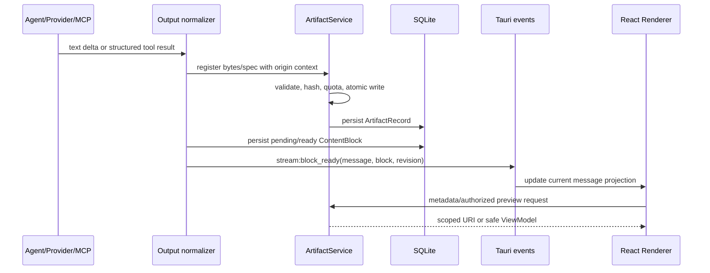

# 富内容与产物交付架构设计

> **用途：** 规定领域模型、模块边界、协议、持久化与安全边界，供代码实现和架构评审使用。
> **受众：** React、Rust、Python Sidecar、MCP 与安全维护者。
> **最后审阅 / Last reviewed：** 2026-08-08
> **状态：** Proposed。

---

## 1. 架构原则

1. **数据优先，不执行内容。** 模型生成的图表/地图/文件描述均是数据；主 WebView 不执行模型提供的 JavaScript、HTML、CSS、URL handler 或 shell 命令。
2. **产物离开消息正文。** SQLite 消息持久化引用和小型结构化 payload；字节存放在应用拥有的文件树，使用哈希、配额和原子写入保证一致性。
3. **端口-适配器。** 核心领域不依赖 React、Tauri URI、ECharts、MapLibre、PDF.js、LangChain 或特定 provider；这些实现都在 adapter 层。
4. **单一权威。** Rust 是 artifact 身份、授权、MIME、存储、预览状态、保留策略与审计的唯一所有者。React 是投影，Sidecar 是请求方，不维护第二套状态。
5. **向前兼容。** 块包含 `schema_version`；未知类型不执行、可诊断、可下载原 payload。旧消息仍能由 `content` 合成为单一 Markdown 块。
6. **最小暴露。** 主 WebView 无通用 FS/HTTP/Shell；可显示字节只能来自受控 artifact URI 或明确的 IPC 读取结果。

## 2. 领域模型与消息契约

### 2.1 Canonical ContentBlock

概念模型如下，实际字段名沿用仓库 Rust/TypeScript snake_case 约定并在实现时保持两端一致：

```ts
type ContentBlock = {
  id: string;                 // UUID；消息内稳定身份
  schemaVersion: 1;
  kind: "markdown" | "chart" | "map" | "artifact" | "image" | "notice";
  status: "pending" | "ready" | "failed" | "unsupported";
  payload: unknown;           // 按 kind 由 Rust schema 验证后的 JSON
  fallback: BlockFallback;    // 无法渲染时的安全文本/下载指引
};

type BlockFallback = {
  title: string;
  messageKey: string;
  params?: Record<string, string>;
  artifactId?: string;
};
```

块在同一消息中通过单调 `position` 排序，不能依赖消息渲染时的数组 append 顺序。`status` 是显示状态，不代表文件可访问性；可访问性仍由 artifact/session/revision 授权决定。

### 2.2 类型 payload

| kind | 最小 payload | 禁止项 |
|---|---|---|
| `markdown` | `text` | 内嵌新富内容协议、信任 HTML |
| `chart` | `ChartSpecV1`、文本摘要、可选数据 artifact ID | JS function、HTML formatter、外部脚本/URL |
| `map` | `MapSpecV1`、attribution、GeoJSON/data artifact ID | 任意 tile URL、HTML popup、位置权限触发 |
| `artifact` | `artifact_id`、展示名、preview hint | 宿主路径、预先签名的外部 URL |
| `image` | `artifact_id`、width/height/alt source | SVG/HTML 直显、base64 长期重复存储 |
| `notice` | i18n message key/params、severity | 后端自然语言错误解析 |

`ChartSpecV1` 与 `MapSpecV1` 是本项目规范，而不是第三方库的原始配置。编译器把受限 spec 映射到 ECharts/MapLibre；第三方库升级时不改变消息历史语义。

### 2.3 ArtifactRecord

```text
ArtifactRecord
  artifact_id              UUID
  owner_session_id         会话授权边界
  origin_message_id        创建消息（可为空，供用户导入）
  origin_kind              model | agent | mcp | skill | user | preview
  display_name             安全化后的显示名
  media_type               magic bytes + allowlist 结果
  byte_size / sha256       完整性和审计
  storage_key              仅 Rust 解释，不是路径
  preview_state            none | queued | ready | failed | unsupported
  preview_artifact_id      派生预览；可为空
  retention_state          active | expired | deleted
  created_at / expires_at
```

数据库建议将 `message_blocks` 和 `artifacts` 分表。小型 block payload 允许 JSON 文本存储；二进制一律不入 SQLite。为 `message_id + position`、`session_id + retention_state`、`sha256`、`origin_message_id` 加索引。专用 `artifact_references` 表在一个产物可被多个消息或导出记录引用时再引入，避免初期过度建模。

## 3. 模块与依赖方向

```text
src-tauri/src/
  services/
    content/
      types.rs                 # ContentBlock、ChartSpec、MapSpec、validator port
      block_service.rs         # append/finalize/read block application use cases
      normalizer.rs            # provider/tool output -> canonical block adapter
    artifacts/
      types.rs                 # ArtifactRecord、policy、error
      ingress.rs               # byte stream -> magic/MIME/hash/quota/atomic storage
      repository.rs            # metadata persistence port
      export.rs                # dialog target + verified copy
      preview.rs               # Previewer Strategy orchestration
      uri.rs                   # asset/custom URI authorization adapter
      cleanup.rs               # retention and orphan cleanup
  commands/
    artifacts.rs               # thin DTO adapters only
  db/repository/
    artifact_repo.rs
    message_block_repo.rs

src/
  features/chat-content/
    types.ts                   # canonical frontend DTO
    renderer-registry.ts       # kind -> renderer registration
    MessageContentBlocks.tsx   # ordered dispatcher, ErrorBoundary per block
    renderers/{markdown,chart,map,artifact,image,notice}/
    hooks/{useArtifactPreview,useArtifactExport}.ts
  lib/ipc/artifacts.ts

agent/app/
  rich_output/
    schemas.py                 # provider-neutral Pydantic models
    tools.py                   # narrow present_* / create_artifact tools
    adapter.py                 # Sidecar event -> canonical output request
```

React 只能依赖 `lib/ipc` 和经过懒加载的 renderer adapter；`chart`、`map`、PDF/Office parser 不得进入 Chat 首屏包。Rust 的 command 只反序列化 DTO、验证 caller/session 后调用 application service；不得把安全判断散在 command 或前端。

## 4. 设计模式与适用位置

| 模式 | 用途 | 必须避免 |
|---|---|---|
| Registry | `BlockRendererRegistry`、`PreviewerRegistry`、provider normalizer 选择 | 巨型 `switch` 跨文件复制；运行时加载不受信任插件 |
| Strategy | MIME 预览、导出格式、地图 tile provider、保留策略 | 以文件扩展名作为唯一策略依据 |
| Adapter | OpenAI/Anthropic/Gemini/Rig/Sidecar/MCP 输出转 canonical blocks | 让前端知道每家 provider 的字段 |
| Facade/Application Service | `ArtifactService` 对存储、哈希、下载、审计暴露窄操作 | React 直接读写 artifact tree |
| State machine | block 和 preview lifecycle、流式完成、取消、清理 | 用布尔值组合表达互斥状态 |
| Policy object | `ContentSafetyPolicy`、URI authorization、tile source policy | 由模型/前端传平台参数、路径或 CSP 规则 |
| Observer/Event envelope | 流式块状态向 React 投影 | 只靠组件卸载取消后端任务 |

“中间件”只用于可观测性、脱敏、审计等请求横切关注点；不承担决定“一个消息块该如何渲染”的职责。

## 5. 数据与流式时序

### 5.1 生成并展示一个产物



文本仍沿用 `stream_token`。富内容绝不混入文本 token；流末 `stream_complete` 要带最终 block revision 或由前端以 `get_message_blocks` 回读权威记录，避免事件丢失导致历史不一致。

### 5.2 取消、重生成和失败

- `pending` block 只能由拥有同一 stream generation 的 ready/failed 事件推进。
- 停止生成：取消未提交的临时文件；已原子提交但未被消息引用的产物标记 orphan，异步清理。
- 重新生成：新 assistant message 获得新 block/artifact 归属；旧消息可继续查看，禁止就地覆盖历史产物。
- preview 失败：保持原 artifact 可下载，写入 `preview_state=failed` 和稳定错误码，不把错误字符串覆盖原消息正文。

## 6. 存储、URI 与导出边界

### 6.1 存储布局

逻辑 key 可按内容哈希和 artifact ID 分层，例如 `objects/sha256/ab/cd/<hash>` 与 `metadata` 分离；不要从未净化的文件名拼目录。写入流程为“临时目录 → 流式限制/MIME 检查/哈希 → 原子 rename → SQLite 事务关联”；失败时回收临时文件。

应用目录应位于 MisakaX data root 下的单独 `artifacts/` 子目录，并从工作区、Skills、配置、日志和 WebView data 目录中隔离。数据库备份/会话导出应明确是否仅导出 manifest、连同内容导出还是提示用户另行打包。

### 6.2 资源传递方案

实现 Spike 要在两种窄方案中选一，记录测试证据：

1. **Scoped `asset:` protocol：** 仅允许应用 artifact subtree，配置显式 allow/deny；适合可公开读取的本地预览。Tauri 的 asset scope 必须精确匹配静态路径，不能扩为 `$HOME/**/*`。
2. **自定义 `misakax-artifact:` protocol：** URI 仅含 opaque artifact ID + revision，由 Rust 校验 WebView/session/状态并返回正确 MIME 与 range 响应；适合细粒度授权和缓存控制。

不论采用哪种，都不可将 `convertFileSrc` 的输入暴露给模型/React。图片、PDF viewer 和下载一律走该通道；禁止 `file:`、裸绝对路径及“临时把整个工作区加到 scope”。

### 6.3 导出

`artifact_export(artifact_id)` 获取用户保存目标后，由 Rust 以 no-follow/规范化目标策略复制并重算/校验 hash。名称用平台安全的文件名，冲突采用用户确认或可预测的“(n)”后缀；不覆盖既有用户文件。导出是副本，不改变 artifact 的引用或保留状态。

## 7. 内容安全策略

`ContentSafetyPolicy` 是独立于 OS Sandbox 的第一道策略，至少配置：

| 分类 | 必需限制 |
|---|---|
| 输入与存储 | 单文件、单消息、会话、应用总大小；文件数；流中 chunk；写入时间 |
| 类型 | magic bytes 与 declared MIME 一致；allowlist；危险/未知类型仅下载 |
| 图像 | 像素数、宽高、动画帧/时间、解码内存；SVG 不直显 |
| 文档 | PDF 页数、XLSX 解压大小/工作表/单元格、DOCX 关系与嵌入对象、文本行列上限 |
| 图表/地图 | schema 深度、series/points/features、字符串长度、坐标范围、禁止可执行回调 |
| URI | ID/revision 归属、TTL、session/window scope、MIME 响应头、无路径泄露 |
| 运行 | 解析并发、超时、取消、worker 资源与审计；不可保证时仅下载 |

对原生转换器、外部命令和不可信 helper，`ContentSafetyPolicy` 的拒绝不能以普通 `subprocess`/shell 回退；必须转交既有 `SandboxBroker` 或禁用该预览器。

## 8. 兼容与迁移

1. 新 schema 先 dual-write：assistant 文本继续写 `messages.content`，同时可写一个 `markdown` block。
2. 读取顺序：有 `message_blocks` 则按块渲染；无则由 legacy adapter 构造 markdown/现有图片附件兼容视图。
3. 导出加入新字段但仍保留旧 content；导入优先接受已验证 blocks，否则走 legacy parser。
4. 历史图片附件不移动二进制数据的情况下保持显示；在用户主动打开/导出或后台可控迁移时才复制入 artifact store，避免一次升级大量 I/O。
5. 新 renderer、previewer、map tiles、Sidecar rich tool 分别 feature flag；关闭后显示 fallback，而不是删除数据。

## 9. 架构验收清单

- [ ] Rust、TypeScript、Python 的 schema fixtures 双向一致，未知字段/版本策略明确。
- [ ] 无块消息、旧附件、流式文本、工具调用、搜索、分页、导入导出回归通过。
- [ ] 二进制不写入 `messages.content`，且没有前端任意路径读取入口。
- [ ] 渲染器、预览器、provider adapter 可独立注册/测试，未触发包级循环依赖。
- [ ] `ContentSafetyPolicy`、URI、MIME、配额和清理逻辑在 Rust 单一位置可审计。
- [ ] 所有外部执行路径要么走 SandboxBroker，要么在 strict 模式下明确不可用。
