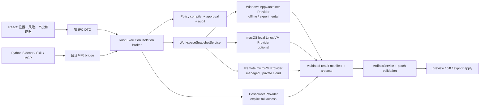

# MisakaX Sandbox 方案复核：无专用账户的本地隔离与远程执行组合

> **用途：** 复核现有 Sandbox ADR 中 Windows 专用账户 / macOS Seatbelt runner 的可行性，给 MisakaX 的 Agent、Skill、MCP、外部转换器和高风险预览任务提出可分阶段落地的执行隔离方案。
> **受众：** 架构、安全、Rust / Python、桌面端和发布维护者。
> **最后审阅 / Last reviewed：** 2026-08-13
> **调研基线：** Tauri 2.x + Rust 2021 + React 19 + Python 3.11；当前 Sandbox ADR 为 Proposed。
> **决策状态：** 本报告的控制面、snapshot、非对称 Provider 与 evidence 建议已于 2026-08-13 纳入 [`SANDBOX_TECH_SELECTION.md`](../architecture/SANDBOX_TECH_SELECTION.md)；真实 Provider 仍须分别通过 Spike Gate，ADR 继续为 Proposed。

---

## 1. 执行结论

现有 ADR 中“由 Rust 统一持有策略、审批、审计和生命周期”的方向是正确的；需要修订的是它把平台隔离实现收敛为“Windows 专用账户 + macOS 动态 Seatbelt profile”的部分。

推荐采用 **统一 Execution Isolation Broker（沿用 `SandboxBroker` 名称）+ 非对称 Provider + 快照回写**：

1. **不要把 Windows 专用 online/offline 沙箱账户设为默认方案。** 它能借助用户 SID 和防火墙构成较强网络边界，但首次 UAC、账户/ACL/防火墙残留、企业策略冲突和可修复性都会成为桌面产品摩擦。Windows 的 AppContainer 已是面向普通 Win32 应用的内核隔离机制，不是第二个可登录用户。当前 Windows 11 还提供了 `Experimental_CreateProcessInSandbox`：可由一个编译后的策略启动 AppContainer、低完整性、文件读写白名单、UI 限制和网络策略；它应作为 Windows 本地 Provider 的优先 Spike 方向，但由于 API 明确是 experimental，不能立即写进稳定版安全承诺。
2. **停止把 macOS 动态生成 Seatbelt profile / `sandbox-exec` 作为正式安全边界。** Apple 的公开 App Sandbox/XPC 路线是受支持的应用级能力系统；`sandbox-exec` 及 `sandbox.h` 已被 Apple 标为 deprecated / no longer supported，动态 profile 语言也不是稳定公开产品契约。App Sandbox + XPC 很适合项目自带的窄 helper 和不可信文件解析，但它不能无缝承载任意用户本机的 Git、Node、Python、Xcode 和编译器。
3. **把“工作区复制到隔离执行位置、收回已验证变更、用户确认后写回”设为 strict 模式的共同语义。** 这样本机 AppContainer、macOS Linux VM、远程 microVM 都不必直接获得用户真实工作区的可写挂载；也避免远程服务、容器或 macOS helper 接触 `.git`、SSH、凭据、`.misakax`、`.codex`、`.agents` 等敏感状态。
4. **macOS 的 strict 通用命令优先使用 remote Linux microVM；本地 Linux VM 是隐私优先的后续选项。** 两者都不需要创建系统用户或每命令登录。远程模式会有一次明确的服务认证 / 组织配置和数据出境同意；本地 VM 会有一次镜像下载、磁盘占用和签名 entitlement 成本。二者是透明而真实的取舍，不能伪装成“零成本本机沙箱”。
5. **默认 offline；联网是独立能力。** Windows 本地模式在没有 `internetClient` capability 时不能访问网络。若要安装依赖或访问 Git / HTTP，首期应切到具有服务端 egress 策略的 remote Provider；后续仅在 Windows 实验 API 的“代理确实不可绕过”攻击测试通过后，才启用本地 brokered network。`HTTP_PROXY` 环境变量不能被当作网络隔离。
6. **静态富内容不受本次执行隔离阻塞。** Artifact Store、`ContentSafetyPolicy`、窄 artifact URI、MIME / 页数 / 像素 / 解压预算仍是展示安全面；只有调用外部转换器、复杂原生 parser、Agent / Skill / MCP 子进程、网络瓦片或地理编码时才进入本报告的 execution isolation 路径。

本报告的推荐不是“所有平台一定运行同一种沙箱”，而是让用户在界面上清楚选择同一种高层保证：

| 产品模式 | 可用平台 | 初次交互 | 实际保证 | 推荐用途 |
|---|---|---|---|---|
| **本机安全（离线）** | Windows 优先 | 无第二账户、无日常 UAC；创建 AppContainer profile 为内部行为 | AppContainer 文件 / 凭据 / 进程隔离；无网络；工具兼容性需逐项验证 | 离线分析、受控工具链、解析 / 转换 worker |
| **云端安全** | Windows / macOS / Linux | 一次服务登录、API key 或企业 SSO；明确地区与数据传输 | 独立 Linux VM / 强隔离容器 + 服务端 egress policy | 默认 strict Agent、依赖安装、未知 Skill、无人值守任务 |
| **私有云安全** | Windows / macOS / Linux | 管理员配置组织端点 | 客户自己的 KVM microVM / 托管隔离服务 | 合规、内网、数据主权客户 |
| **本机安全 VM（实验性）** | macOS | 一次镜像下载 / 存储预算；无系统用户登录 | Linux guest 与宿主隔离；仅 Linux 工具链 | 离线且重视隐私的开发者 |
| **本机直接执行** | 全平台 | 每次明确批准 | **无 OS Sandbox 保证**，仅现有路径 / 审计 / 限额 | 用户主动终端、必须使用宿主专有工具的逃生口 |

严禁把最后一种模式标成“受保护”或在 provider 异常时自动选择它。

## 2. 原 ADR 中的术语究竟代表什么

### 2.1 `SandboxBroker` 不是一个沙箱程序

`SandboxBroker` 是 Rust 主进程内的**控制面**，不是 Windows 账户、macOS profile 或 Docker daemon。它负责把不可信的“执行意图”转换成一个不可变的、可审计的 `ExecutionPlan`：

```text
React / Python Sidecar / Skill / MCP
  -> 结构化执行请求（不含平台参数或原始 host path）
  -> Rust Execution Isolation Broker
       - 会话、调用者、工作区 generation、审批、配额
       - 策略编译、provider 选择、能力探测、审计、取消
       - 工作区 snapshot / artifact ingress / patch apply
  -> Local 或 Remote Provider
  -> 隔离 runner / VM / remote session
```

因此“统一策略、平台 Provider”的正确含义是：所有平台共享同一份**意图和安全不变量**，但不要求底层都是同一个 OS API。

| 统一层必须做的事 | Provider 只负责的事 |
|---|---|
| 绑定 chat session、工作区 generation、调用者和短期 lease | 启动 / 停止目标环境 |
| 从可信数据生成 readable / writable / denied roots 或 snapshot manifest | 将上层策略映射为 AppContainer、VM、远程会话等机制 |
| 对联网、直接写回、完整权限做用户审批 | 返回它实际证明的能力和拒绝原因 |
| 固定结构化 argv、cwd、环境 allowlist、资源限额、取消语义 | 收集进程树 / 资源使用和退出信息 |
| 把产物重新送过 ArtifactService / ContentSafetyPolicy | 不拥有模型 API key、宿主凭据或无范围 bridge token |
| 记录脱敏审计；provider 不可用时 fail closed | 绝不自行放宽策略或回退为宿主 shell |

### 2.2 必须新增的抽象：执行位置和工作区交付方式

旧 ADR 的 `SandboxMode = ReadOnly | WorkspaceWrite | FullAccess` 不足以表达远程和 macOS 的真实边界。建议补充如下概念（命名可随 Rust 模块风格调整）：

| 概念 | 建议值 | 作用 |
|---|---|---|
| `ExecutionLocation` | `windows_appcontainer`、`remote_microvm`、`mac_local_vm`、`container_opt_in`、`host_direct` | 决定隔离原语和用户可见位置 |
| `WorkspaceDelivery` | `snapshot`、`direct_mount` | strict 默认 `snapshot`；`direct_mount` 是具备额外证据后的高级能力 |
| `NetworkMode` | `deny`、`provider_brokered`、`explicit_host_direct` | `deny` 为默认；不把普通代理变量视为 `provider_brokered` |
| `IsolationEvidence` | 文件、网络、进程树、环境、资源、凭据、审计的逐项事实 | UI 只显示 provider 实际通过能力探测后的保证 |
| `ProviderAvailability` | `available`、`needs_setup`、`unsupported`、`experimental`、`unavailable` | 区分“可选装”“实验性”“不能安全运行”，不把失败隐藏成 fallback |

### 2.3 Snapshot-and-patch 是跨平台关键，不是性能优化

strict 执行不直接写真实工作区，过程如下：

1. Rust 解析真实工作区，依据规则生成内容 snapshot。默认排除 `.git`、`.misakax`、`.codex`、`.agents`、凭据 / 密钥模式、应用配置和不在允许范围内的符号链接；对包含敏感文件的规则命中给出可解释诊断。
2. snapshot 进入 provider 专属临时目录、VM 磁盘或远程对象存储。provider 只看到这一份副本和一组不含 secret 的环境变量。
3. 命令在副本中执行，结果由受信任的 sync helper 产出**受限文件变更 manifest**与独立 artifacts，而不是让模型指定宿主路径或直接执行 `git apply`。
4. Rust 用 canonical path、大小 / 文件数、哈希、符号链接、删除范围、base generation 再次验证 manifest；若原工作区已变化，进入冲突 UI。
5. 用户查看摘要 / diff 并批准后，Rust 才在真实工作区执行受约束的写入。产物仍经 `ArtifactService` 保存和导出。

代价是大仓库复制、watch / hot reload 和“立刻在真实目录看到改动”的体验会变差；好处是它让远程、macOS VM 和 Windows AppContainer 获得相同的文件语义，避免把宿主工作区或 `.git` 凭据暴露给不可信代码。`direct_mount` 只能作为后续的显式高级模式，绝不能是 strict 的隐式实现。

## 3. 对当前 Windows 专用账户方案的复核

### 3.1 原方案解决了什么，又为何不适合作为默认路径

专用 `Offline` / `Online` 账户配合 ACL、write-restricted token、Windows 防火墙和 Job Object 的优点是真实：防火墙可以按用户身份实施出站限制，独立 profile 也降低了凭据继承。但它的安装和运维成本同样真实：

- 第一次启用需要 UAC；企业策略可能阻止创建用户、修改 ACL 或下发 firewall rule。
- 必须存储或管理沙箱身份的凭据，且升级、修复、卸载都要确保账户、ACL、DPAPI 数据和规则没有残留。
- 在共享设备、受管设备和审计软件较强的环境中，创建隐藏系统账户很容易被理解为越权行为。
- 它不是每次命令都要求用户登录；问题在于**一次性系统级变更本身**，而不是交互次数。

这条路径应从“默认 Windows Provider”改为“企业可选的强化 Provider”。只有有明确的强本地联网需求、组织允许安装 helper、并且 AppContainer / remote 不能满足时才评估。

### 3.2 AppContainer / LPAC：无第二账户的本地候选

Microsoft 对 AppContainer 的说明明确其 token 具有独立 Package SID / Capability SID、低完整性级别，并且对文件、注册表、凭据、设备和网络默认隔离；访问受保护资源必须同时满足用户 / 组 SID 与 AppContainer SID 的 ACL。`CreateAppContainerProfile` 创建的是**每用户、每应用的 profile**和相关存储位置，不是一个用户可以登录的 Windows account。[M1]

这意味着正常产品流程可以是：

```text
首次“本机安全（Windows 离线）”执行
  -> Rust runner 为本产品 / 会话 identity 创建或打开 AppContainer profile
  -> 不授予 internetClient / privateNetworkClientServer capability
  -> 将 snapshot 目录作为唯一可写位置；最小化只读工具目录
  -> 用 Job Object 限制子进程、CPU、内存、输出、时长并 kill-on-close
  -> 删除会话临时数据；按 retention 清理 profile
```

它不会要求用户登录另一个账户；在标准用户环境通常也不应需要 UAC。后一句是设计预期而非发布承诺，必须在 Windows Home / Pro、受管设备和标准用户的 B0 Spike 中验证并记录错误码。

`CreateRestrictedToken` 仍有价值，但作为**纵深防御**而非主隔离：它可以移除 privileges、把 SID 标成 deny-only，并添加 restricting SID；Windows 对受限 token 执行两次 access check，且若使用调用者自身的受限 primary token，普通应用可以调用 `CreateProcessAsUser` 而不需要 `SE_ASSIGNPRIMARYTOKEN_NAME`。[M2] 这足以实现无专用账户的低权限 runner，但它本身无法给出 AppContainer 那样简洁的 capability / 网络模型。

Job Object 继续应保留：Windows 官方说明它按整体管理进程组、可施加工作集 / CPU / 时间等限制，默认将 `CreateProcess` 创建的子进程纳入 job，并可使用 `JOB_OBJECT_LIMIT_KILL_ON_JOB_CLOSE` 回收树。[M3]

### 3.3 Windows 11 `CreateProcessInSandbox`：优先 Spike，不作为立即稳定依赖

微软在 2026-06 发布的 `Experimental_CreateProcessInSandbox` / `Experimental_CreateProcessAsUserInSandbox` 能从 FlatBuffer sandbox specification 直接创建“可组合 sandbox”。当 `app_container = true` 时，它文档化了：

- AppContainer 默认拒绝大多数系统资源；不授予 capability 时无网络；文件只通过显式 `fs_read_only` / `fs_read_write` Bound File System policy 暴露。
- identity 是 AppContainer profile 名；同一 identity 才共享 profile / 权限，不是本地登录账户。
- 可以使用低完整性、Win32k 禁用（适合无 UI worker）、Job UI restrictions、命名 capability 和网络 proxy policy。
- 运行时最低要求是 Windows 11，但 API **experimental、无公开 header、要求动态加载 `processmodel.dll`**；策略 schema 当前只接受 `0.1.0`。[M4]

本机调研环境的只读探测结果：`C:\Windows\System32\processmodel.dll` 存在且导出了两个实验函数，文件版本为 `10.0.26100.8737`；环境报告的 OS build 为 `26200`。这只证明当前开发机可做 Spike，不能推断其他 Windows 11 build 或正式支持线一定可用。

推荐策略：

| 层级 | 方案 | 发布定位 |
|---|---|---|
| W0 | `Experimental_CreateProcessInSandbox` + snapshot + 无 capability 网络 | 仅开发 / Canary；运行时 capability probe，详细攻击测试 |
| W1 | 稳定 AppContainer / LPAC API + 受限 token + Job Object | 若 W0 未转正时的有限离线 Provider；只支持经过兼容矩阵验证的工具 |
| W2 | 专用账户 + WFP / Firewall | 企业可选强化路径；非默认，需单独 UAC / 卸载契约 |
| W3 | 远程 microVM | 需要联网、未知工具、无人值守或 W0 / W1 不可用时的 strict 选项 |

不要把 `network_policy.proxy` 文档描述直接当成“不可绕过的网络 broker”结论。B0 必须测试 IPv4 / IPv6、DNS、localhost、named pipe、raw socket、QUIC、环境代理绕过和 child / grandchild；Windows Filtering Platform 是实现强网络过滤的系统平台，但仅有 WFP API 的存在不代表本产品已经完成安全规则。[M5]

## 4. 对当前 macOS Seatbelt runner 方案的复核

### 4.1 没有“需要用户登录”的 Seatbelt 流程，但不等于适合采用

原方案中的“独立签名 runner + 每命令生成 Seatbelt profile + local Network Broker”通常不会要求用户创建账户、输入密码或在每次命令授权；代码签名和 runner 都随应用包分发。然而，这并不能解决它的核心风险：`sandbox-exec` / `sandbox.h` 已被 Apple 标为 deprecated / no longer supported，Seatbelt profile 语言不是面向第三方长期支持的稳定公开契约。[A1]

结论：**不应承诺为正式的 macOS strict Provider**。可以在开发工具中保留作研究对照，但不应以它通过的测试来宣称跨版本安全保证，更不能把它作为触发富内容 converter 的唯一防线。

### 4.2 受支持的 App Sandbox + XPC：适合窄 helper，不适合透明的任意工具链

Apple 的公开 App Sandbox 通过 code-signing entitlements 限制文件、网络和硬件访问。[A2] Apple 还明确指出：

- 在 sandboxed app 内由 `Process` 创建的 child **继承父 sandbox**；若 helper 需要不同 entitlements，应使用 XPC Service。[A3]
- 用户通过标准 Open / Save panel 选择的文件或文件夹可以获得 security-scoped access；访问可通过 bookmark 在后续运行恢复。这个过程是“选择工作区”的常规 UI，不是管理员授权或另一个账户登录。[A4]
- sandboxed app 不能用 user-selected file entitlement 在 app bundle、container 或 app group 之外执行程序；嵌入的 command-line tool 必须继承主 app sandbox。[A4][A5]

因此它的适用面如下：

| 场景 | App Sandbox + XPC 是否合适 | 原因 |
|---|---|---|
| PDF / Office / 图像等项目自带 parser helper | 是 | helper 可随应用签名、只接收 artifact bytes、只写 app container；无需任意本机工具 |
| 受限富内容转换器 | 是，优先 | 可将输入、CPU / 时间、产物路径收窄；仍需 parser 本身资源限额 |
| Git、Node、Python、用户安装的 CLI | 否，不能作为透明 strict 通用后端 | 可执行文件与依赖通常位于 app bundle / container 外，现有开放式开发工具链和 App Sandbox 语义冲突 |
| 主 Tauri app 全面 App Sandbox 化 | 可以调研，但不是 Agent Shell 的单独解法 | 会影响 workspace access、Sidecar、签名 / notarization、终端和 helper；属于整个产品分发架构迁移 |

这条路线没有额外的登录账户或每命令 UAC，但会带来用户首次选择工作区、bookmark 失效处理、产品签名、entitlement 最小化和 App Store / 非 App Store 分发一致性工程。它应该成为 **Mac 文件解析 / 产物处理 helper** 方案，而非通用 Agent Shell 方案。

### 4.3 macOS 本地 Linux VM：可行但应是可选隐私模式

Apple Virtualization framework 可在 macOS 11+ 上运行 Linux VM；Apple 示例明确要求 guest kernel / initrd 与 Intel 或 Apple silicon 的 CPU 架构匹配，并演示了 vCPU、RAM、虚拟存储和虚拟设备的配置。[A6] 使用 framework 需要应用签名带有 `com.apple.security.virtualization` entitlement。[A7]

这条路线的用户体验是：应用包在发布时已签名 entitlement；用户不需要创建或登录系统账户，也不需要每次命令输入管理员密码。实际首次成本是下载并校验 Linux image、预留磁盘 / 内存、等待首次 boot；应在设置里明确显示大小、版本、hash、是否允许网络和删除按钮。

建议的 VM 约束：

- VM 内只运行产品签名的 Linux image 和 runner；默认**不配置网络设备**，不把宿主 SSH / Git / cloud / 浏览器凭据挂入 guest。
- 使用 snapshot delivery 把工作区副本放进 guest 虚拟盘；不要用 writable VirtioFS 直接共享真实工作区。
- 数据只通过受认证的 host-guest channel 或受控 artifact / patch 通道返回；禁止 guest 获得任意 host path。
- 这只保证 Linux 生态的工具链。Xcode、macOS SDK、iOS 签名、使用 Darwin ABI 的 native 构建仍不能在 Linux guest 中完成；它们应走远程 macOS build 服务或用户明确批准的 host-direct。

本地 VM 是 macOS strict 的长期可选路径，不是当前 MVP：需要启动时间、镜像供应链、Intel / Apple silicon、升级、磁盘加密、休眠、资源限制和三版 macOS 实机测试。

## 5. 远程 Provider 调研与取舍

远程隔离不是免费替代品：它把本机逃逸风险换成数据传输、认证、地区、供应商可用性和成本。它必须始终显式显示执行区域、传输的 snapshot 范围、保留期、网络允许项和服务身份；不得静默上传整个 workspace 或用户 home。

| Provider 方向 | 隔离 / 能力证据 | 用户与运维成本 | 对 MisakaX 的定位 |
|---|---|---|---|
| **自托管 Firecracker microVM** | KVM Linux microVM、最小设备模型、jailer；Firecracker 官方定位为多租户安全隔离并支持资源 rate limit。[R1] | 需要 Linux KVM 集群、镜像、调度、eBPF / firewall、监控与安全运维 | **企业 / 私有云首选**；安全边界和数据位置最可控 |
| **Azure Container Apps Dynamic Sessions** | 官方说明 session 具备 Hyper-V isolation、可选网络控制、短生命周期；支持内置 code interpreter 和自定义 container。[R2] | Azure tenant、区域、身份、镜像仓库、费用与企业网络配置 | **企业托管首选**；适合 Python / Node / 受控自定义 image |
| **E2B** | 官方 SDK 文档将 Sandbox 描述为按需的快速 Linux VM；具备命令、文件、模板、生命周期能力。[R3] | SaaS API key、地区 / 保留期 / 供应商审查 | **开发期托管试点**；最快验证 remote contract，不作为唯一生产依赖 |
| **Daytona** | 官方文档描述 sandbox 有独立 kernel、filesystem、network stack、vCPU / RAM / disk，提供 SDK / API、快照和可选 BYO compute。[R4] | 商业账户 / API key 或私有部署评估 | 可作为托管 / 企业候选，先做采购和协议审查 |
| **Cloudflare Sandbox SDK** | Workers Paid plan 上运行独立 Linux container，支持命令、文件、后台进程和 outbound HTTP 控制；其 1.0 仍为 preview。[R5] | Worker 架构、账户、区域和容器语义 | 数据分析 / Web worker 类工作负载可试点；**不作为 strict 通用构建的首选** |
| **Docker / Podman 本地容器** | Docker rootless 可减少 daemon / container 的 root 权限，但仍需要用户安装运行时和平台虚拟化 / daemon 管理。[R6] | 首次安装、磁盘、WSL2 / 虚拟化、企业许可 / 安全基线 | 只做“用户已安装时”的可选 Provider；绝不挂 daemon socket |

### 5.1 推荐的 remote contract

不要在 Python Sidecar 中直接调用某家云 SDK。Rust broker 应对所有 remote provider 使用一致的协议：

```text
create_execution(immutable plan, encrypted snapshot reference)
  -> provider returns execution_id, actual region, evidence, lease expiry
stream argv output / structured diagnostics
  -> cancellation terminates remote process tree and revokes lease
collect signed result manifest + artifacts
  -> Rust verifies hash, policy, path and base generation
destroy execution / expire temporary storage
```

认证建议由 host 保存 provider credential 的引用（OS keychain / 企业 token broker），而不是注入 sandbox 进程环境；模型 API key、Git credential、SSH agent 和浏览器 session 永不进入 remote guest。若供应商只提供 container 而无法证明 egress 规则、进程回收、临时数据删除和区域控制，就只能标为 `restricted-compat`，而不能标 strict。

### 5.2 为什么不把 GitHub Codespaces、Windows Sandbox 或 Docker Desktop 当默认远程 / 本机答案

- **GitHub Codespaces** 是用户显式登录的云开发环境，不是可由桌面应用无感控制、具有独立最小权限合同的通用隔离 API；其仓库、账户和成本语义不适合成为 MisakaX 的透明执行后端。
- **Windows Sandbox** 依赖 Windows edition / virtualization，启动完整 GUI VM、工作区和工具桥接体验都重；适合用户手动调查恶意样本，不适合默认 Agent 子进程协议。
- **Docker Desktop** / Podman machine 对开发者很有价值，但把用户已有 daemon、镜像和 mount policy 纳入安全信任边界会降低产品可预测性。特别是 daemon socket 一旦可见，容器边界即失效。

## 6. 建议的目标架构



### 6.1 不变量

1. 模型、React、Skill manifest 和 Sidecar 都不能传入 profile 文本、ACL、AppContainer capability、VM 参数、网络规则、host 路径或 shell 字符串拼接。
2. Rust 只接受结构化 argv；Shell 语法必须是显式 `ShellCommand` 类型、受审批且由 provider 的可信 runner 解释。
3. 严格模式使用 snapshot；真实工作区写回属于单独的用户操作，且须验证 base generation。
4. 默认不联网；若允许网络，批准对象是规范化的域名 / 协议 / 端口 / TTL / 执行来源，而不是“给这个命令无限网络”。
5. 所有 provider 都必须返回其**实际**能力。probe 失败、镜像 hash 不符、远程地区不符、runner 签名失效、实验 API 不存在时，严格模式返回稳定 `SANDBOX_UNAVAILABLE`，不调用宿主 `subprocess`。
6. 解析器、图片 / 文档预览的内容安全限制不因运行在沙箱中而取消；输出进入 Artifact Store 前仍需做 MIME、hash、配额、压缩和路径检查。

### 6.2 用户界面建议

不要显示“选择 Sandbox Provider”的工程术语，而显示执行地点和实际承诺：

| 文案示例 | 必须显示的信息 |
|---|---|
| `本机安全（离线）` | Windows AppContainer、无网络、仅副本目录、当前工具兼容性、不会直接改真实项目 |
| `云端安全` | 服务 / 组织、地区、上传范围、保留期、允许域名、费用 / 配额、可随时销毁 |
| `本机安全 VM（实验性）` | Linux image 大小、磁盘和内存预算、无 macOS / Xcode 工具支持、网络状态 |
| `本机直接执行` | 明确红色风险：当前用户权限、可能访问本机文件 / 网络；本次操作理由和到期时间 |

“账户设置”只在用户选择企业强化 Windows provider 或远程服务时出现；普通 Windows AppContainer profile、Mac XPC helper、签名 entitlement 不能暴露为要求用户理解或操作的账户流程。

## 7. 对富内容计划的直接影响

| 富内容场景 | 是否需要本报告的 strict provider | 推荐执行位置 |
|---|---|---|
| Markdown、ChartSpec、静态 GeoJSON、PNG / JPEG / WebP / GIF | 否 | 主 WebView 的既有内容安全面；不执行模型代码 |
| PDF.js、SheetJS、DOCX 文本提取等纯浏览器解析 | 通常否，但要有配额和攻击 fixture | Worker / renderer；资源不可保证时降级下载 |
| 项目自带的 macOS parser helper | 是，若处理不可信复杂格式 | App Sandbox + XPC 窄 helper，输入 / 输出都在 app container |
| 原生 converter、OCR、Office / 图像外部工具 | 是 | Windows AppContainer offline，或 remote microVM；不可用则仅下载 |
| Agent / Skill / MCP 创建任意文件 | 是 | snapshot execution + manifest / artifact 回收 |
| 网络瓦片、地理编码、第三方生成服务 | 是 | remote provider 或已验证的 brokered network；绝不开放 WebView `https:` |

这维持富内容文档中“显示安全与 OS 执行隔离分层”的结论，但将 macOS 和 Windows 的执行实现替换为可维护的方案。

## 8. 实施顺序与决策门

### Phase S0：先修订模型，不触碰生产执行路径（ADR/合同已于 2026-08-13 完成）

- 把现有 `SandboxBroker` 重新定义为 `Execution Isolation Broker` 的控制面；增加 `ExecutionLocation`、`WorkspaceDelivery` 和 `IsolationEvidence`。
- 创建 `FakeProvider`、审计事件、结构化请求 / 结果 manifest 和 snapshot / apply 的纯 Rust contract tests。
- 把 `host_direct` 显式建模为 full-access，不允许 provider error 自动选中。
- 更新现有 ADR 的状态 / 假设前，不删除历史设计；本报告作为 ADR 修订依据。

### Phase S1：先做 remote + snapshot 的垂直切片

- 选择一个开发期 remote provider（E2B 或组织已有 Azure）实现 `create / stream / cancel / collect / destroy`。
- 使用一个无 secret 的 test workspace，验证 source snapshot、命令取消、结果 manifest、冲突、artifacts 和彻底销毁。
- UI 展示地区、上传摘要、保留期、网络规则和实际 evidence；默认不发送用户 workspace。

这一步先解决 macOS strict 与跨平台语义，避免让 Windows 方案反过来决定所有产品架构。

### Phase S2：Windows 无账户本地 Provider Spike

- 在 Windows 11 分支动态探测 `Experimental_CreateProcessInSandbox`，以 opaque FFI wrapper 隔离实验 ABI；禁止将 FlatBuffer spec 暴露给模型或前端。
- 以 `app_container=true`、无网络 capability、snapshot `fs_read_write`、只读工具路径、无 GUI、Job 限额的最小 policy 验证文件 / 凭据 / 网络 / 进程树攻击夹具。
- 同时验证普通 AppContainer / LPAC + restricted token 的稳定 API fallback；记录具体可运行的 Git、Python、Node、Rust、包管理器版本，而不是泛称“兼容工具链”。
- 仅在 Windows Home / Pro、标准用户、无管理员、企业策略异常、Unicode / junction / worktree 条件下均可解释时，开放 `本机安全（离线）` 预览。

### Phase S3：macOS 窄 helper 与本地 VM Spike

- 为富内容原生 helper 做一个 App Sandbox + XPC PoC：验证 artifact-only IO、无 network client entitlement、拒绝父进程环境 / 凭据、签名和 notarization。
- 不把 `sandbox-exec` 加入正式 runner；若拿它作对比，只记录为 unsupported research artifact。
- 为 Virtualization.framework 做 Linux VM PoC：Intel 和 Apple silicon 各至少一台实机，验证签名 entitlement、镜像 supply chain、无网络 boot、snapshot 传输、kill tree、资源释放和 artifact / patch 返回。
- 对 macOS / Xcode 目标构建明确选择 remote macOS build 服务或 host-direct 批准，不假装 Linux VM 可以替代。

### Phase S4：企业强化与默认启用

- 对需要本地联网的 Windows 客户，再做 WFP / firewall / 专用账户方案的独立 threat review、安装 / 修复 / 卸载事务和管理员 UX；不要把它混入 S2。
- 对 Azure / 私有 Firecracker 提供组织级 provider、数据地区、镜像 digest、密钥代理、审批和审计接入。
- 各平台按 evidence 而非“代码编译成功”进入 strict；未通过的保持 `unavailable`。

## 9. 必须通过的 Spike Gate

### 9.1 Windows

- 标准用户首次创建 / 重用 AppContainer profile 不要求创建可登录的本地账户；若出现 elevation 或企业拦截，UI 显示准确诊断。
- 不能读取用户 home、浏览器 / SSH / cloud credentials、`.git` / `.misakax` / `.codex` / `.agents`；junction、符号链接和 rename race 不可绕过。
- 无 capability 的 IPv4、IPv6、DNS、localhost、QUIC、named pipe / loopback 边界均按预期拒绝；允许网络时证明不会被 raw socket 绕过。
- child、grandchild、background process、breakaway、异常退出都被 Job / provider 回收。
- 实验 API 缺失或 schema / DLL 改变时停在 `experimental-unavailable`，不进入 host shell。

### 9.2 macOS

- XPC helper 的 code signature、entitlements、输入 / 输出目录、环境和网络权限可审计；helper 不获得真实工作区或 user-selected folder 以外的权限。
- security-scoped bookmark 的首次选择、持久化、失效 / 用户撤销和重选 UX 正确；没有不必要的 Automation、Accessibility 或管理员授权提示。
- Linux VM 在 Intel 和 Apple silicon、支持的 macOS 版本上都能启动和销毁；guest 无网络和无 writable host share 的测试通过。
- `sandbox-exec` 不计入任何 strict 证据或 release gate。

### 9.3 Remote

- 指定地区和数据保留期可验证；默认任务结束后 snapshot、临时 credentials、process 和 artifacts 均删除或按产品保留策略过期。
- 出站 allowlist、DNS / redirect / private IP / metadata endpoint、防凭据注入、取消 / kill tree 和资源上限有 provider 证据与攻击测试。
- 结果 manifest、二进制 artifacts、diff 和冲突都先由 Rust 验证，再触碰真实工作区。
- 供应商不可用、网络中断、区域不匹配或费用 / 配额耗尽时展示可操作错误；不自动回退宿主执行。

## 10. 推荐的 ADR 修订方向

在 S1、S2、S3 至少完成一个可重复 Spike 后，建议把现有 ADR 从“单一跨平台 OS runner 方案”修订为以下决策：

> MisakaX 采用统一的 Rust Execution Isolation Broker；其 strict contract 由 snapshot delivery、受信任 patch / artifact ingress、默认拒绝网络、最小环境、进程回收、审批、审计和 capability evidence 组成。Provider 可以按平台不同：Windows 使用无账户 AppContainer 路线（实验 API 仅在验证后启用），macOS 对通用命令使用 remote microVM 或可选本地 Linux VM；macOS App Sandbox + XPC 只用于项目自带的窄 helper。专用 Windows sandbox account、Docker / Podman、Seatbelt、Wasm 均为限定用途的可选 provider 或研究项，不是默认的跨平台承诺。

这比“每个平台都必须有本地任意 Shell 的严格原生沙箱”更诚实、更可测试，也能让用户明确理解隐私、成本和兼容性取舍。

## 11. 资料与证据

| ID | 一手来源 | 本报告使用的事实 |
|---|---|---|
| M1 | [Microsoft: Launch an AppContainer](https://learn.microsoft.com/en-us/windows/win32/secauthz/implementing-an-appcontainer) | AppContainer / LPAC 的 SID、capability、低完整性、profile、网络 / 文件访问和 Win32 启动方式 |
| M2 | [Microsoft: Restricted Tokens](https://learn.microsoft.com/en-us/windows/win32/secauthz/restricted-tokens) | restricting SID 的双重 access check；受限调用者 token 可由普通应用启动 restricted process |
| M3 | [Microsoft: Job Objects](https://learn.microsoft.com/en-us/windows/win32/procthread/job-objects) | 进程树归属、资源限额、`KILL_ON_JOB_CLOSE` 语义 |
| M4 | [Microsoft: Create Process In Sandbox APIs](https://learn.microsoft.com/en-us/windows/win32/secauthz/createprocessinsandbox) | Windows 11 experimental API、AppContainer / BFS / identity / network policy / 无公开 header 限制 |
| M5 | [Microsoft: Windows Filtering Platform](https://learn.microsoft.com/en-us/windows/win32/fwp/windows-filtering-platform-start-page) | WFP 是网络过滤应用平台，不等同于已实现的产品 firewall policy |
| A1 | [Apple Developer Forums: replacement for sandbox-exec](https://developer.apple.com/forums/thread/661939) | Apple 工程师公开答复中确认 `sandbox-exec` deprecated、`sandbox.h` no longer supported；论坛来源只作弃用风险佐证，不作为唯一安全依据 |
| A2 | [Apple: App Sandbox overview](https://developer.apple.com/documentation/security/app_sandbox) | entitlements 限制系统资源和用户数据 |
| A3 | [Apple: `Process`](https://developer.apple.com/documentation/foundation/process) | sandboxed app 的子进程继承父 sandbox；不同 entitlements 应使用 XPC Service |
| A4 | [Apple: Accessing files from the macOS App Sandbox](https://developer.apple.com/documentation/security/accessing-files-from-the-macos-app-sandbox) | user-selected 文件 / 文件夹、security-scoped access / bookmark、外部可执行文件限制 |
| A5 | [Apple: Protecting user data with App Sandbox](https://developer.apple.com/documentation/security/protecting-user-data-with-app-sandbox) | embedded command-line tool 继承 app sandbox；现有 app 采用 App Sandbox 的限制 |
| A6 | [Apple: Running Linux in a Virtual Machine](https://developer.apple.com/documentation/virtualization/running-linux-in-a-virtual-machine) | macOS 11+ Linux VM、Intel / Apple silicon guest 架构、CPU / memory / storage / device 配置 |
| A7 | [Apple: Virtualization entitlement](https://developer.apple.com/documentation/bundleresources/entitlements/com.apple.security.virtualization) | 使用 Virtualization framework 需要的签名 entitlement |
| R1 | [Firecracker](https://firecracker-microvm.github.io/) | KVM microVM、最小设备模型、jailer、资源 rate limits、Linux host / guest 限制 |
| R2 | [Azure Container Apps Dynamic Sessions](https://learn.microsoft.com/en-us/azure/container-apps/sessions) | Hyper-V isolation、session pool、短生命周期、code interpreter / custom container、区域与计费 |
| R3 | [E2B documentation](https://e2b.dev/docs) | Linux VM sandbox、模板、命令 / 文件 / lifecycle SDK 表面 |
| R4 | [Daytona documentation](https://www.daytona.io/docs) | 独立 kernel / filesystem / network stack 的 sandbox、SDK、snapshot、BYO compute |
| R5 | [Cloudflare Sandbox SDK](https://developers.cloudflare.com/sandbox/) | Workers Paid plan、独立 Linux container、outbound HTTP 控制、Sandbox SDK 1.0 preview 状态 |
| R6 | [Docker: Rootless mode](https://docs.docker.com/engine/security/rootless/) | rootless 降低 daemon 权限但仍有 runtime / user namespace 前置条件 |

调研访问日期均为 2026-08-12。供应商功能、区域、价格、preview / experimental 状态变化较快；进入实施前必须重新核验对应版本、服务条款、数据处理协议和受支持 OS build。
