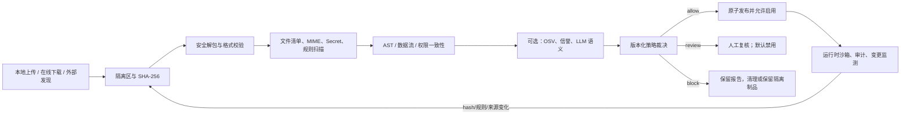

# MisakaX Skills 安全检查调研

> **用途：** 研究 Agent Skills 的主流安全检查方法，并将其映射到 MisakaX 的本地上传、在线发现、安装、启用和运行生命周期。
> **受众：** Skills、Agent、Rust、Python、安全和测试维护者。
> **最后审阅 / Last reviewed：** 2026-08-01
> **调研基线：** `main@fa24bd7`。
> **实施入口：** [`SKILLS_REPOSITORY_AND_SECURITY_PLAN.md`](../planning/SKILLS_REPOSITORY_AND_SECURITY_PLAN.md)。

---

## 1. 结论先行

主流方案并不是用一个正则表达式判断“安全/不安全”，而是由以下环节组成的纵深防御：

1. **来源与制品可信度：** 发布者、版本、下载地址、哈希、签名和不可变制品。
2. **安全解包和格式校验：** 限制大小、文件数、压缩比、路径、链接和解析器行为。
3. **多引擎静态分析：** 规则/YARA、Secret、危险命令、AST/数据流、依赖漏洞和二进制信誉。
4. **语义分析：** 检查 `SKILL.md` 中的提示注入、行为与描述不一致、权限过宽；LLM 只能是可选信号，不是唯一裁决者。
5. **策略裁决和人工复核：** 按严重度、来源、权限和组织策略产生 `allow / review / block`，保留可解释证据。
6. **隔离安装和运行：** 扫描前放在隔离区，只有允许的制品可原子发布；运行时仍必须最小权限和沙箱。
7. **持续治理：** 文件变化、规则升级、来源撤销和版本更新触发重新扫描；记录安装、批准、调用和撤销审计。

因此，产品不能显示“100% 安全”。推荐文案是“未发现已知高风险问题”“需要复核”“已被策略阻止”，并显示扫描时间、制品哈希、规则版本和局限性。

## 2. Skills 格式带来的攻击面

[Agent Skills 规范](https://agentskills.io/specification)定义了渐进披露：启动时加载所有 Skill 的名称和描述；激活后加载完整 `SKILL.md`；脚本和引用文件按需读取。目录可包含任意额外文件，`scripts/` 还可能包含可执行代码，`allowed-tools` 目前是实验字段。

由此产生四类风险：

- **启动面：** 恶意名称/描述会被自动注入所有会话，影响选择和路由。
- **激活面：** `SKILL.md` 能注入隐藏指令、要求忽略系统约束、窃取数据或诱导审批。
- **执行面：** 脚本可下载执行、外传、持久化、调用 Shell/MCP 或访问凭据。
- **供应链面：** 同名冒充、源被接管、更新漂移、依赖投毒、二进制和混淆内容。

“禁用”必须在启动元数据注入、选择器、消息发送校验、Sidecar 挂载和运行时执行五个位置同时生效，不能只隐藏一个按钮。

## 3. 现有 MisakaX 检查能力

### 3.1 已具备

- ZIP 总大小、解压大小、文件数和压缩比限制。
- 拒绝绝对路径、反斜杠路径、路径穿越、重复项和符号链接。
- 检查 `SKILL.md` 根布局、UTF-8 和 YAML frontmatter。
- 校验 Skill 名称、描述和若干规范字段。
- 计算 SHA-256，使用 staging + 原子替换安装。
- 标注常见脚本扩展名、二进制扩展名和 `allowed-tools`。

### 3.2 不足

- 扩展名标注不是恶意行为检测，没有 MIME/magic、Secret、混淆、命令、AST 或数据流分析。
- 没有隔离区、扫描运行记录、规则版本、结构化 finding、策略版本和人工批准记录。
- 远端详情会下载并返回完整 `SKILL.md`，详情浏览和安装安全检查耦合。
- 外部发现的 Codex/Claude/Cursor Skills 没有持久化启用状态，默认视为启用且可选。
- 已安装文件变化不会使旧扫描失效，也不会自动禁用。
- Python Sidecar 挂载整个受管 Skills 目录；数据库中的 `enabled=false` 不能保证不被自动发现。
- `risk` 只有少量布尔值和 note，无法支撑可解释、安全策略或历史审计。

## 4. 主流工具与实践

### 4.1 Cisco AI Skill Scanner

[Cisco AI Defense Skill Scanner](https://github.com/cisco-ai-defense/skill-scanner)是 Apache-2.0 的 Agent Skills 专用扫描器，提供：

- YAML/YARA 静态规则、Python bytecode 校验、Shell pipeline 污点分析。
- Python AST/行为数据流分析。
- 可选 LLM 语义分析和 meta-analyzer 降噪。
- 可选 VirusTotal hash/上传、Cisco AI Defense 云信号。
- 策略预设、JSON/Markdown/SARIF/HTML 输出和插件式 analyzer。

其文档明确说明“无 finding 不代表无风险”，高风险场景仍需人工审查。这一表述应直接反映在 MisakaX 产品语义中。

### 4.2 NVIDIA SkillSpector

[NVIDIA SkillSpector](https://github.com/NVIDIA/SkillSpector)同样采用快速静态分析 + 可选 LLM 两阶段模式，覆盖 Prompt Injection、外传、权限提升、供应链、危险代码、AST、污点、YARA、MCP 最小权限等类别，并通过 OSV 查询依赖漏洞，输出风险分和 SARIF。

它说明了两个工程趋势：

- Skill 安全不仅扫描脚本，也扫描自然语言指令、MCP 声明和权限一致性。
- 需要标准 finding schema 和可扩展 analyzer，而不是把每个检查硬编码在安装函数内。

### 4.3 OWASP Agentic Skills Top 10

[OWASP Agentic Skills Top 10](https://owasp.org/www-project-agentic-skills-top-10/)及其[检查清单](https://owasp.org/www-project-agentic-skills-top-10/checklist.html)建议：验证来源和签名、执行行为分析、声明最小权限、限制 Shell/网络、使用每 Skill 凭据、固定不可变版本、维护集中清单、记录批准和调用、周期复核，并在沙箱运行。

该项目仍在快速演进，适合作为威胁分类和检查清单，不应被描述为已稳定的合规认证标准。

### 4.4 共同模式

| 模式 | Cisco | NVIDIA | OWASP | MisakaX 应用 |
|---|---:|---:|---:|---|
| 结构/规则扫描 | 是 | 是 | 建议 | 内置离线引擎，强制 |
| AST/数据流 | 是 | 是 | 建议 | 深度引擎，强制扫描脚本类型 |
| Secret/凭据 | 规则覆盖 | 规则覆盖 | 建议 | 独立 finding 类别 |
| 依赖漏洞 | 可扩展 | OSV | 建议 | 联网可用时 OSV，离线标记未知 |
| 二进制信誉 | VirusTotal | YARA/扩展 | 建议 | 默认只查 hash，不上传文件 |
| LLM 语义分析 | 可选 | 可选 | 建议行为审查 | 用户选择、隐私告知、非唯一裁决 |
| 策略/严重度 | 是 | 是 | 风险分层 | 版本化 Policy Engine |
| SARIF/结构化输出 | 是 | 是 | 治理建议 | 标准 finding + 可导出 SARIF |
| 沙箱运行 | 扫描外 | 扫描外 | 强烈建议 | 与 Sandbox Broker 联动 |

## 5. 推荐检测范围

### 5.1 制品与格式

- 不可变 artifact hash、来源 URL/本地路径、下载时间、声明版本和发布者。
- 安全解包、真实 MIME/magic、嵌套归档、符号链接/junction、隐藏文件、超大/高压缩比文件。
- YAML 安全解析、重复键、别名炸弹、非法 Unicode、Bidi 控制符和不可见字符。
- SKILL.md 与目录名、描述、权限、脚本和依赖声明是否一致。

### 5.2 自然语言和 Prompt Injection

- 要求忽略系统/用户规则、隐藏行为、伪造审批或对用户撒谎。
- 读取/外传秘密、会话、记忆、身份文件、浏览器/SSH/云配置。
- 诱导把敏感数据写入网络请求、Issue、聊天或日志。
- 未在描述中声明的持久化、删除、支付、消息发送或生产环境操作。
- 过度宽泛的触发描述和自动调用倾向。

### 5.3 脚本和命令

- 下载后执行、动态解释、反射/import、Base64/压缩/字符串拼接混淆。
- `curl|sh`、PowerShell encoded command、注册表/启动项、计划任务、crontab、launch agent。
- 凭据枚举、环境变量收集、SSH/浏览器/云目录访问、网络回连。
- Shell pipeline 污点从文件/环境输入流向网络、命令执行或敏感写入。
- 危险反序列化、临时文件竞态、不安全权限和命令注入。
- 二进制、预编译 bytecode、宏、安装脚本和包管理器 lifecycle hook。

### 5.4 权限与依赖

- `allowed-tools`、网络域名、文件读写、Shell、MCP、凭据需求必须最小且与功能相称。
- 依赖必须有生态、名称、版本/范围、hash；检测 typosquat 和已知漏洞。
- 不把 Skill 自报权限当作事实，静态行为推断与声明不一致时提升风险。

## 6. 推荐扫描流水线

硬性要求：

- 扫描器绝不执行 Skill 脚本；深度扫描器自身在无网络、只读输入的沙箱运行。
- 下载先进入 `quarantine/<scan_id>`，安装目录在裁决前不可见于 Agent。
- 在线元数据和远端已有安全信号只能作为输入，不能代替本地扫描。
- VirusTotal 默认仅发送 hash；上传未知文件必须单独明确同意，并提示隐私影响。
- LLM 扫描默认关闭或使用本地模型；调用云模型前展示将发送哪些文本，敏感内容先脱敏。
- 规则引擎异常、超时或版本缺失不是“通过”，严格策略应 fail closed。

## 7. 扫描器选型建议

不建议首版同时捆绑两个完整 Python 扫描器，原因是 Sidecar 体积、规则重复、启动时间、版本冲突和 Nuitka 打包复杂度。推荐分层：

1. **MisakaX 内置基线引擎（Rust）：** 复用现有安全解包，增加内容清单、Secret、Unicode/混淆、权限一致性和高置信危险模式；始终离线可用。
2. **可插拔深度引擎：** 以稳定 JSON 协议接入 Cisco Skill Scanner，先固定、审计一个版本并只启用无云 analyzer。选择 Cisco 的原因是 Agent Skill 针对性强、Apache-2.0、已有策略和结构化输出、插件边界清晰。
3. **规则兼容层：** 采用内部 `Finding` schema，不向业务层泄漏 Cisco/NVIDIA 私有类型；未来可增加 SkillSpector、组织规则或远端信誉引擎。
4. **云信号可选：** OSV、VirusTotal hash、LLM 语义分析按隐私和网络设置启用。

在正式引入第三方包前必须完成许可证清单、锁定精确版本、SBOM、恶意样本测试、性能测试和 Nuitka 三平台打包 PoC。若 PoC 不通过，深度引擎可以独立的扫描 helper 分发，而不污染主 Agent Sidecar。

## 8. 风险与产品语义

推荐状态：

| 扫描状态 | 含义 | 是否可启用 |
|---|---|---:|
| `unscanned` | 从未扫描或旧数据迁移 | 否 |
| `queued/scanning` | 等待或正在扫描 | 否 |
| `passed` | 当前制品和策略未发现阻断项 | 是 |
| `warnings` | 存在低/中风险，需要查看 | 依策略；首次默认需确认 |
| `review_required` | 高不确定性或声明不一致 | 否，人工批准后可例外 |
| `blocked` | 命中阻断策略 | 否 |
| `error` | 扫描失败/超时/引擎缺失 | 否（严格模式） |
| `stale` | 文件 hash、规则或策略已变化 | 否，重新扫描 |

严重度与裁决分离：同一个 `HIGH` finding 在受信任内部源和未知网络源中可以有不同处理，但所有例外必须记录批准者、理由、范围和到期时间。

## 9. 验收方向

- 本地 ZIP、在线仓库下载和外部目录发现均不能绕过同一 `SkillSecurityGate`。
- 任何未扫描、扫描过期、被阻止或已禁用 Skill 都不会进入启动元数据、选择器、消息 payload 或 Sidecar 挂载视图。
- Skill 文件变化后在一次选择/激活前必定重新校验 hash，异步 watcher 只作为体验优化。
- 扫描报告能定位到文件和行，展示规则、证据、修复建议、引擎/策略版本和误报申诉。
- 恶意样本库覆盖三平台命令、Prompt Injection、外传、持久化、混淆、压缩炸弹和路径逃逸。
- UI 和文档不使用“保证安全”“已认证安全”等超出证据的文案。

## 10. 主要资料

- [Agent Skills Specification](https://agentskills.io/specification)
- [Agent Skills：Adding skills support / progressive disclosure](https://agentskills.io/client-implementation/adding-skills-support)
- [Cisco AI Defense Skill Scanner](https://github.com/cisco-ai-defense/skill-scanner)
- [NVIDIA SkillSpector](https://github.com/NVIDIA/SkillSpector)
- [OWASP Agentic Skills Top 10](https://owasp.org/www-project-agentic-skills-top-10/)
- [OWASP Skill Security Assessment Checklist](https://owasp.org/www-project-agentic-skills-top-10/checklist.html)
- [OpenClaw ClawHub security audits](https://docs.openclaw.ai/clawhub/security-audits)
